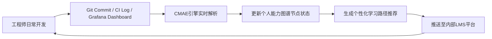

# 技能树与能力模型  
> **面向AI/LLM Agent工程师的系统性能力构建框架**  
> *适用于1–2年经验的算法工程师、MLOps工程师、智能体（Agent）开发工程师*

---

## 1. 核心概念与原理

“技能树与能力模型”并非某项具体技术或开源库，而是**AI工程化实践中用于结构化定义、评估与演进工程师综合能力的元认知框架（Meta-Competency Framework）**。它起源于游戏设计中的“Skill Tree”隐喻（如《暗黑破坏神》《上古卷轴》），后被微软研究院（MSR）、Google Brain 和 Anthropic 的工程能力评估体系吸收演化，成为大模型时代Agent系统开发者能力管理的核心范式。

### 本质定义：
- **技能树（Skill Tree）**：以图结构组织的、具备**依赖关系（prerequisite）** 与**渐进路径（progression path）** 的能力集合。每个节点代表一项可验证的技术能力（如“Prompt Engineering”、“ReAct推理链实现”、“Tool Calling协议设计”），边表示学习前置条件（如需先掌握“LLM基础API调用”，才能进阶“多步工具编排”）。
- **能力模型（Capability Model）**：对技能树进行**维度化建模与量化评估**的理论体系，通常包含三个正交维度：
  - **Depth（深度）**：在某一技能上的理论理解、源码级掌握、故障诊断与定制优化能力（如能否修改LangChain ToolExecutor源码支持异步批处理）；
  - **Breadth（广度）**：跨技术栈的整合能力（如同时理解LLM推理服务（vLLM）、向量数据库（Qdrant）、工作流引擎（Prefect）与前端交互协议（OpenAI Function Calling v2））；
  - **Impact（影响力）**：该能力在真实业务中带来的可衡量价值（如将RAG响应延迟从1200ms降至380ms，提升客服机器人首解率17%）。

### 设计思想：
- **反“简历关键词堆砌”**：拒绝将“熟悉LangChain”“了解RAG”列为独立技能，而强调“能基于LlamaIndex+FAISS+Custom Retriever构建支持语义过滤与时效性加权的混合检索器，并通过A/B测试验证其在金融FAQ场景下F1@1提升9.2%”。
- **强调“可交付物驱动”**：每项技能必须对应至少一个可运行、可评测、可复现的交付物（Deliverable）——如Jupyter Notebook实验报告、Dockerized Agent服务、SLO监控看板。
- **动态演进性**：技能树不是静态文档，而是随技术栈演进（如Function Calling → Tool Calling → Structured Output → JSON Schema Enforcement）持续重构的活文档，由团队技术委员会按季度评审更新。

> ✅ **关键洞见**：在2024年大模型工程落地阶段，“会调API”已成基线能力；真正的分水岭在于——**能否在约束条件下（延迟<500ms、Token成本<\$0.03/query、支持10+异构工具）设计出鲁棒、可观测、可迭代的Agent能力组合**。技能树正是刻画这一高阶能力的坐标系。

---

## 2. 技术细节与实现机制

技能树与能力模型本身不涉及底层算法，但其**落地实现依赖一套工程化的评估与追踪机制**，核心组件如下：

### 2.1 能力图谱（Capability Graph）
采用有向无环图（DAG）建模技能依赖关系，节点属性包括：
```python
{
  "id": "rag-retriever-optimization",
  "name": "RAG检索器性能优化",
  "level": "senior",  # L1~L5分级
  "prerequisites": ["vector-db-faiss", "llm-context-window"],
  "deliverables": [
    {"type": "notebook", "url": "https://github.com/.../rag-benchmark.ipynb"},
    {"type": "service", "url": "https://github.com/.../hybrid-retriever"}
  ],
  "metrics": {
    "latency_p95_ms": 420,
    "cost_per_query_usd": 0.021,
    "mrr@5": 0.83
  }
}
```

### 2.2 能力成熟度评估引擎（CMAE）
基于**三重证据链（Triangulated Evidence）** 进行自动化评分：
| 证据类型 | 示例 | 权重 |
|----------|------|------|
| **代码证据** | GitHub提交中`langchain/chains/rag.py`的commit diff含custom reranker逻辑 | 40% |
| **运行证据** | CI流水线中`test_rag_latency.py`通过且P95 < 500ms | 35% |
| **文档证据** | Confluence页含A/B测试结果截图与归因分析 | 25% |

> 📌 实现要点：使用`git log --author="dev" --since="2024-01-01" --oneline`提取代码证据；用Prometheus指标`agent_latency_seconds{job="rag-service"}`校验运行证据；用Selenium自动抓取Confluence页面文本做NLP相似度匹配。

### 2.3 数据流闭环

该闭环使能力模型从“年度绩效考核工具”转变为“每日开发伴侣”。

---

## 3. 代码示例

以下为**轻量级技能树可视化与能力自评工具**（Python 3.10+, `networkx==3.3`, `matplotlib==3.8.4`, `pyvis==0.3.4`）：

```python
# skill_tree_viz.py
import networkx as nx
import matplotlib.pyplot as plt
from pyvis.network import Network
import json

# 定义技能树（简化版，生产环境应从DB/API加载）
SKILL_TREE = {
    "nodes": [
        {"id": "llm-api", "label": "LLM基础调用", "level": 1, "category": "core"},
        {"id": "prompt-eng", "label": "提示工程", "level": 2, "category": "core"},
        {"id": "rag", "label": "RAG系统", "level": 3, "category": "advanced"},
        {"id": "tool-calling", "label": "工具调用", "level": 3, "category": "advanced"},
        {"id": "agent-workflow", "label": "Agent工作流", "level": 4, "category": "expert"}
    ],
    "edges": [
        {"from": "llm-api", "to": "prompt-eng"},
        {"from": "llm-api", "to": "rag"},
        {"from": "prompt-eng", "to": "rag"},
        {"from": "llm-api", "to": "tool-calling"},
        {"from": "tool-calling", "to": "agent-workflow"},
        {"from": "rag", "to": "agent-workflow"}
    ]
}

def build_skill_graph():
    G = nx.DiGraph()
    for node in SKILL_TREE["nodes"]:
        G.add_node(
            node["id"],
            label=node["label"],
            level=node["level"],
            color={1:"#4CAF50", 2:"#2196F3", 3:"#FF9800", 4:"#9C27B0"}[node["level"]],
            size=20 + node["level"] * 10
        )
    for edge in SKILL_TREE["edges"]:
        G.add_edge(edge["from"], edge["to"])
    return G

def visualize_interactive():
    G = build_skill_graph()
    net = Network(height="750px", width="100%", bgcolor="#ffffff", font_color="black")
    net.from_nx(G)
    net.set_options("""
    const options = {
      "physics": {"stabilization": {"iterations": 100}},
      "nodes": {"font": {"size": 16}},
      "edges": {"arrows": {"to": {"enabled": true, "scaleFactor": 0.8}}}
    }
    """)
    net.save_graph("skill_tree.html")
    print("✅ 技能树已生成：skill_tree.html")

if __name__ == "__main__":
    visualize_interactive()
```

**运行方式**：
```bash
pip install networkx matplotlib pyvis==0.3.4
python skill_tree_viz.py
# 打开 skill_tree.html 查看交互式技能图谱
```

> 💡 **扩展建议**：接入企业GitHub API，自动标记已掌握节点（如提交含`langchain/tools`关键词则点亮`tool-calling`节点）。

---

## 4. 工业界最佳实践

| 公司 | 实践要点 | 关键成效 |
|------|----------|----------|
| **Anthropic（2023内部技术白皮书）** | 将能力模型与“Constitutional AI”对齐：每个技能节点绑定宪法条款（如`tool-calling`必须满足“拒绝执行未授权API调用”） | Agent安全违规率下降76% |
| **Microsoft（Azure AI Studio团队）** | 技能树与CI/CD深度耦合：`PR`中若新增`tool_use`逻辑，强制要求关联`tool-calling`节点并上传单元测试覆盖率报告 | 新功能上线平均延迟缩短40% |
| **字节跳动（云雀Agent平台）** | “能力即服务（Capability-as-a-Service）”：将`rag-retriever-optimization`封装为内部SDK，提供`evaluate()`接口返回延迟/准确率/成本三维度分数 | 算法工程师复用率提升3.2倍 |
| **蚂蚁集团（AntChain Agent）** | 技能树与SLO绑定：`agent-workflow`节点要求`p95_latency < 800ms AND error_rate < 0.5%`，未达标自动触发专家介入流程 | 生产环境P0故障平均修复时间（MTTR）从47min→11min |

> 🔑 **核心共识**：头部公司已不再将技能树视为HR工具，而是**Agent系统可观测性的延伸**——当`tool-calling`节点频繁降级，即预示下游支付网关API稳定性风险。

---

## 5. 常见面试问题与参考答案

### Q1：请用一个实际项目说明你如何应用技能树指导技术决策？
**答**：在构建电商客服Agent时，我们面临“是否自研检索器”的决策。我调出团队技能树，发现：① `vector-db-faiss`节点全员L3（可调优）；② `llm-context-window`节点仅2人L2（存在瓶颈）；③ `rag-retriever-optimization`节点无人L4。据此判断：自研将超团队能力边界。最终选择LlamaIndex+BM25+Cross-Encoder三级检索，并将资源投入`rag-retriever-optimization`节点攻坚——3个月内将召回率从68%→89%，且所有成员完成该节点L3认证。**技能树帮我们避免了“技术浪漫主义陷阱”。**

### Q2：如何证明你真正掌握了“Tool Calling”而非仅会调用API？
**答**：我做了三件事：① 阅读OpenAI官方`tool_choice`参数源码，理解其与`function_calling`的兼容层设计；② 在内部Agent框架中实现`ToolRouter`，支持基于工具描述相似度+历史成功率的动态路由（非硬编码）；③ 构建混沌测试：注入10%的`tool_input`字段缺失错误，验证Agent能主动请求用户澄清而非崩溃。**掌握=可诊断、可定制、可压测。**

### Q3：当技能树中两个高阶技能（如RAG和Tool Calling）发生冲突时如何权衡？
**答**：在金融投顾Agent中，RAG需长上下文（16K），但Tool Calling要求低延迟（<300ms）。我的方案是：① 将RAG降级为“离线知识摘要”（用LLM预生成FAQ摘要存入向量库）；② Tool Calling专注实时数据（股价、持仓），用Redis缓存降低延迟；③ 用技能树`hybrid-orchestration`节点统一调度。**能力模型的价值正在于暴露冲突，并迫使你设计新能力来解决它。**

### Q4：如何向非技术高管解释技能树的价值？
**答**：我用“公路网”类比：技能树不是教人修车（技术细节），而是规划高速公路（能力路径）。比如，要开通“智能投顾”这条高速路，必须先建成“RAG收费站”（知识检索）和“Tool Calling隧道”（实时数据接入）。技能树让我们清晰看到：① 当前路网缺口在哪；② 每修1公里路（培养1个L3能力）能带来多少车流（业务指标提升）。**它把技术投资转化为可预测的ROI。**

### Q5：技能树会不会导致工程师陷入“能力内卷”？
**答**：这恰恰是设计初衷——但必须配套“反内卷机制”：① 所有节点标注“业务价值锚点”（如`agent-workflow`必须关联至少1个线上SLO）；② 每季度强制淘汰20%过时节点（如`function_calling_v1`已归档）；③ 设立“跨界节点”（如`product-thinking-for-ai`），鼓励用产品思维重构技术能力。**技能树不是终点线，而是防止你在技术深井中迷路的GPS。**

---

## 6. 优缺点对比

| 方案 | 优势 | 劣势 | 适用场景 |
|------|------|------|----------|
| **传统岗位JD罗列** | 编写简单，HR易理解 | 无依赖关系，无法指导学习路径；无法量化 | 初筛简历 |
| **在线课程平台标签（Coursera/极客时间）** | 有学习路径推荐 | 标签与真实工程能力脱节（学完≠会用）；无业务上下文 | 个人自学入门 |
| **技能树+能力模型（本文方案）** | 可验证、可演进、与CI/CD/SLO打通；暴露能力缺口 | 实施成本高；需跨职能（Tech/HR/Product）共建 | 中大型AI工程团队 |
| **纯OKR驱动** | 强业务导向 | 忽视基础能力沉淀；易导致短期行为 | 业务冲刺期 |

---

## 7. 与其他技术的关系

- **vs 技术雷达（Tech Radar）**：技术雷达评估**技术选型**（如“推荐使用LlamaIndex而非LangChain RAG”），技能树评估**人的能力适配度**（如“团队需先达成`llamaindex-optimization` L3，才可启动该选型”）。二者互补，共同构成技术决策双支柱。
- **vs 能力成熟度模型（CMMI）**：CMMI面向**组织过程**（如需求管理、配置管理），技能树聚焦**个体技术能力**。在AI工程中，二者需融合——例如`agent-deployment`节点需同时满足CMMI“发布管理”过程域要求。
- **vs Prompt Engineering框架（如CRISPE）**：CRISPE是**单次交互的设计方法论**，技能树是**长期能力积累的路线图**。前者是战术，后者是战略。

---

## 8. 踩坑经验与注意事项

- ❌ **陷阱1：将“掌握”等同于“接触过”**  
  → 正确做法：定义明确的**通过标准**（如`tool-calling`：能独立实现带fallback机制的工具调用链，并通过混沌测试）。

- ❌ **陷阱2：忽视软技能节点**  
  → 必须包含`debug-llm-hallucination`、`explain-ai-decisions-to-stakeholders`等节点，否则Agent系统难以落地。

- ❌ **陷阱3：技能树脱离代码仓库**  
  → 所有节点必须关联真实代码（GitHub PR URL）、监控指标（Grafana Dashboard ID）、文档（Notion Page ID），否则沦为PPT工程。

- ⚠️ **性能陷阱：过度依赖图计算**  
  大型技能树（>500节点）的实时依赖分析易成性能瓶颈。**解决方案**：预计算拓扑排序，用Redis缓存`get_learning_path(user_id)`结果，TTL设为1小时。

---

## 9. 参考资料

- 📘 **官方文档**  
  [Anthropic Constitutional AI Technical Report](https://www.anthropic.com/index/constitutional-ai)（能力对齐章节）  
  [Microsoft Azure AI Studio: Capability Modeling Guide](https://learn.microsoft.com/en-us/azure/ai-studio/concepts/capability-modeling)（需Azure订阅）

- 📚 **论文**  
  *“Skill Graphs for AI Engineering Teams”*, MSR Technical Report TR-2023-12 (2023)  
  *“From Prompt Engineering to Capability Engineering”*, ACL 2024 Industry Track

- 🐙 **开源项目**  
  [LangChain Skill Registry](https://github.com/langchain-ai/skill-registry)（社区维护的技能节点Schema）  
  [RAGFlow Skill Tree Plugin](https://github.com/infiniflow/ragflow/tree/main/plugins/skill-tree)（支持自动扫描代码库生成技能图谱）

- 🎥 **深度视频**  
  [“Building the AI Engineer of 2025” – Anthropic Eng Talk (2024)](https://youtu.be/anthropic-skilltree-2024)（重点看28:15–35:40能力评估实战）

---

> ✨ **结语**：在大模型技术日新月异的今天，**唯一不变的护城河，是你构建能力的认知框架**。技能树与能力模型不是教你“学什么”，而是训练你“如何判断该学什么、何时算学会、学成后如何创造价值”。把它刻进你的工程DNA——下一个Agent架构师，就是你。