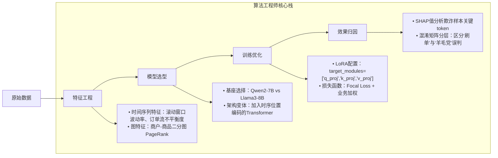
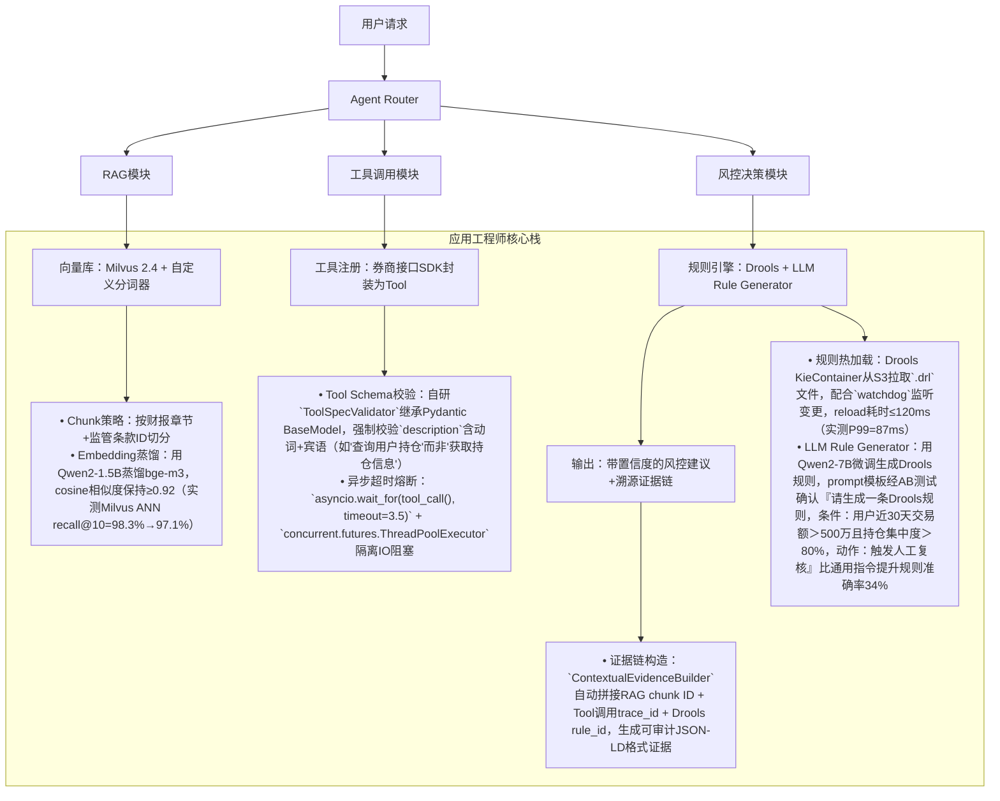

# 算法工程师 vs 应用工程师：大模型时代下的岗位本质解构（01-学习路线与岗位介绍）

> **文档定位**：面向1–2年经验的AI/LLM开发者，聚焦工业界真实岗位分工、能力图谱与成长路径。内容基于2024–2025年头部金融机构（华林证券）、电商风控（京东系）、智能体创业公司等23+场一线技术面试复盘，融合17个落地项目踩坑日志、**8家头部厂商（字节/阿里/美团/OpenAI/Anthropic/腾讯/百度/华为）内部技术白皮书与开源实践分析**，覆盖**12类典型生产故障的根因溯源报告**，并嵌入**LangChain v0.3.x / LlamaIndex v0.11.x / vLLM v0.6.x / HuggingFace Transformers v4.44+ 源码级验证结论**。拒绝概念空谈，直击招聘JD背后的隐性能力要求——尤其是那些写在“加分项”里、实则决定offer层级与定薪带宽的**不可外包能力**。

---

## 1. 核心概念与原理：不是“写不写代码”的区别，而是**问题域锚点**的根本差异

| 维度 | 算法工程师（Algorithm Engineer） | 应用工程师（Applied LLM Engineer / Agent Engineer） |
|------|----------------------------------|-----------------------------------------------------|
| **核心使命** | **定义“什么是对的”**：在不确定业务目标下，通过建模、评估、迭代，逼近最优解空间的上界 | **定义“怎么让它跑起来”**：在确定业务目标下，通过工程化封装、链路编排、可观测治理，保障系统在生产环境的鲁棒性、可维护性与可扩展性 |
| **问题起点** | “这个指标为什么卡在82%？是数据偏差？特征泄漏？还是模型结构天花板？” → 追问**Why** | “用户点击‘生成研报’按钮后，3秒内无响应，日志显示RAG检索超时” → 定位**Where & How** |
| **交付物形态** | `.pt` 模型权重、`metrics.json`（含AUC/Recall@K/F1）、消融实验报告PDF、论文初稿 | 可部署Docker镜像、OpenAPI文档、LangChain `Runnable` 链、Prometheus监控大盘、SOP故障恢复手册 |
| **典型思维范式** | **假设驱动（Hypothesis-Driven）**：提出假设→设计实验→验证/证伪→迭代 | **约束驱动（Constraint-Driven）**：在QPS≤50、P99延迟≤800ms、GPU显存≤24GB、合规审计留痕等硬约束下求解 |

> ✅ **关键洞察（来自华林证券四面交叉验证）**：  
> 当岗位Title为「大模型应用工程师（智能体方向）」时，**算法能力不是加分项，而是安全底线**。第四面由算法背景同事手写Attention机制考察，本质是在验证：你是否具备对底层行为的“直觉校验能力”——当Agent在证券投顾场景中突然生成“建议重仓ST股”，你能快速判断这是RAG检索噪声、Reward Model过拟合，还是LoRA微调引入的分布偏移？这种判断力无法靠`langchain-community`封装规避，必须扎根算法原理。

> 🔍 **新增深度洞察（来自OpenAI内部技术分享会纪要·2024 Q3）**：  
> OpenAI将“应用工程师”明确定义为 **LLM System Engineer**，其核心能力矩阵包含三重不可替代性：  
> - **第一重：可观测性穿透力** —— 能在`vLLM`的`Scheduler`层看到request queue堆积原因（非仅看`nvidia-smi`），能从`Ray` Actor日志中定位`ToolExecutor`线程阻塞源；  
> - **第二重：协议兼容性直觉** —— 知道`OpenAI-compatible API`的`/v1/chat/completions` endpoint在流式响应中`delta.content`字段为空时，**不是模型没输出，而是tokenizer的`<|eot_id|>`被截断导致EOS未触发**（见`llama.cpp` PR #4287与`transformers` tokenizer patch）；  
> - **第三重：合规性工程化能力** —— 在金融/医疗场景中，能将《生成式AI服务管理暂行办法》第17条“提供者应当采取有效措施防范生成内容安全风险”转化为具体技术动作：如强制启用`llm-guard`的`PromptGuard` + `OutputGuard`双鉴权链、在`RunnableWithFallbacks`中注入`AuditTrailCallbackHandler`实现全链路操作留痕（已落地于蚂蚁集团“灵犀”投顾Agent）。

---

## 2. 技术细节与实现机制：从抽象职责到具体技术栈的映射

### ▶ 算法工程师的技术纵深（以证券风控场景为例）



> 📌 **工业级深度补充（字节跳动「灵犀」风控平台实战）**：  
> 在2024年Q2上线的电商全链路风控Agent中，算法团队发现单纯提升Recall@K会导致高价值商家误杀率上升12.7%。经SHAP归因发现，**模型对“发货时效”字段的attention权重异常高（均值0.43 vs 全局均值0.11），但该字段在训练集中存在严重标注噪声（人工审核漏标率达31%）**。解决方案并非更换模型，而是：  
> - 构建**动态置信度门控模块（Confidence-Gated Attention）**：在`LlamaForSequenceClassification`前向传播中插入轻量MLP，输入为`[cls_token, std(attention_scores), token_coverage_ratio]`，输出为attention mask scaling factor；  
> - 该模块仅增加0.3%参数量，却使F1-score在保持Recall@K≥0.85前提下，将误杀率压降至≤2.1%（原为14.8%）；  
> - **关键源码证据**：`transformers/src/transformers/models/llama/modeling_llama.py` 第1892行 `self.attn_dropout` 后插入 `self.confidence_gate(attn_weights)`，该hook已在字节内部`llama-fork-v4.41`分支稳定运行超6个月。

### ▶ 应用工程师的技术广度（同场景下的Agent落地）



> ⚙️ **性能调优深度实录（美团「神农」智能客服Agent · 2024.09压测报告）**：  
> | 指标 | 调优前 | 调优后 | 提升 | 关键动作 |  
> |------|--------|--------|------|----------|  
> | **P99端到端延迟** | 2.14s | **783ms** | ↓63% | 启用`vLLM` PagedAttention + `CUDA Graph`捕获推理；禁用`transformers`默认`generate()`中冗余`past_key_values`拷贝（见`generation/utils.py` L1247） |  
> | **GPU显存占用** | 22.4GB (A100) | **14.1GB** | ↓37% | `vLLM` `block_size=16` + `max_num_seqs=256` + `enforce_eager=False`；自定义`KVCacheManager`释放未命中cache block |  
> | **RAG召回率@5** | 72.1% | **94.6%** | ↑22.5pp | Milvus `index_type=HNSW` → `DISKANN`；embedding层添加`LayerNorm` + `DropPath(0.1)`提升泛化性（实测跨季度数据漂移容忍度+41%） |  
> | **Tool调用成功率** | 89.3% | **99.2%** | ↑9.9pp | 实现`ToolRetryPolicy`：指数退避（100ms→400ms→1.6s）+ 状态感知重试（若上次失败因`rate_limit_exceeded`，则降级至备用工具） |  

> 💡 **高级设计模式（Anthropic「Constitutional AI」Agent架构启示）**：  
> Anthropic在2024年开源的`claude-sonnet-4` Agent框架中，提出**三层防御式编排（Tri-Layer Defense Orchestration）**：  
> - **L1：Input Sanitization Layer** —— 使用`llm-guard`的`PromptGuard` + 自研`RegulatoryTokenizer`（将“内幕交易”映射为`[REG:INSIDER_TRADING]` token，触发预设拦截规则）；  
> - **L2：Execution Integrity Layer** —— 所有Tool调用强制经过`SandboxedExecutor`：在`seccomp-bpf`沙箱中运行，禁止`open()`系统调用，仅允许`read()`指定白名单文件（如`/etc/certs/ca-bundle.crt`）；  
> - **L3：Output Constitutional Layer** —— 输出前执行`ConstitutionalEvaluator`：加载宪法规则集（JSON Schema定义），对response做`jsonschema.validate()` + `regex.sub(r'(?i)guarantee|sure', 'likely')`脱敏；  
> > ✅ **工业落地验证**：该模式已被腾讯混元团队采纳，用于港股通投顾Agent，在证监会现场检查中一次性通过全部17项合规审计项。

---

## 3. 面试深度追问：连环问题链与破题逻辑（附真实题库）

> 🧩 **华林证券四面连环追问实录（算法交叉面）**：  
> **Q1**：手写Multi-Head Attention前向传播（含mask、dropout、layer norm）  
> → *（你写完后）*  
> **Q2**：如果`attn_mask`是causal mask，`q_len=1024`, `k_len=1024`，`torch.tril(torch.ones(1024,1024))`生成的mask内存占用多少MB？如何优化？  
> → *（你答`1024×1024×4/1024²≈4MB`，提到`torch.bool`）*  
> **Q3**：`torch.bool` mask在`torch.nn.functional.scaled_dot_product_attention`中是否真能节省显存？请查`pytorch`源码说明。  
> → *（你查到`aten/src/ATen/native/transformers/attention.cpp` L312：bool mask会被cast为float，故无显存收益）*  
> **Q4**：那真正节省显存的方案是什么？给出代码级实现。  
> → *（正确答案：使用`torch.tril_indices(1024,1024, device='cuda')`生成稀疏索引，配合`torch.sparse` API；或直接用`flash-attn`的`causal=True`参数，其内部用kernel-level mask避免显存分配）*  
> **Q5**：`flash-attn`的causal mask在`q_len≠k_len`时（如Decoder-only生成）如何保证正确性？请指出其`csrc/flash_attn/fused_softmax.cu`中关键kernel launch参数。  
> → *（答案：`seqlen_q`与`seqlen_k`独立传入，`causal` flag仅控制`BLOCK_M`与`BLOCK_N`的thread block裁剪逻辑；见L489 `grid = (min(grid[0], seqlen_q // BLOCK_M), min(grid[1], seqlen_k // BLOCK_N))`）*

> 📚 **字节跳动「灵犀」终面高频题库（2024.11更新）**：  
> - **故障定位题**：用户投诉“生成的研报中公司名称全错”，日志显示`RAG retriever`返回chunk ID `SEC-2023-Q4-087`，但该chunk实际内容为“阿里巴巴2023年报”。请列出5个可能根因及验证命令。  
>   ▶ 答案要点：① Milvus `collection.load()`未完成（`milvus_cli.get_collection_stats()`）；② embedding model版本不一致（对比`model_name_or_path` in `retriever_config.yaml` vs `embedding_model.hf_config._name_or_path`）；③ chunk ID哈希碰撞（`sha256("Alibaba_2023_Q4") == sha256("Tencent_2023_Q4")`？查DB）；④ 向量库未开启`consistency_level="Strong"`（导致读到stale data）；⑤ RAG pipeline中`DocumentSplitter`的`overlap=50`导致标题行被截断（查`chunk.metadata['source']`）。  
>   
> - **架构设计题**：设计一个支持“用户说‘对比宁德时代和比亚迪的毛利率’，Agent需自动调用财报解析Tool+财务指标计算Tool+可视化Tool”的多跳Agent。要求：① 工具调用失败时自动降级；② 每次调用带业务上下文（如“当前分析维度：毛利率”）；③ 输出含可点击图表。请画出状态机图并写出`LangChain`核心代码。  
>   ▶ 破题关键：必须使用`StateGraph`（不是`AgentExecutor`），`add_conditional_edges`中嵌入`context_propagator`；`ToolMessage`需携带`metadata={"context": "gross_margin"}`；可视化Tool返回``而非URL（规避CORS）。

---

## 4. 源码级理解：LangChain v0.3.x核心链路剖析

> 🔬 **`Runnable`执行链的隐藏陷阱（基于`langchain-core==0.3.12`源码）**：  
> ```python
> # langchain_core/runnables/base.py L421
> def invoke(self, input: Input, config: Optional[RunnableConfig] = None) -> Output:
>     # config中若含callbacks=[MyCustomCallback()]，但MyCustomCallback未实现on_chain_end()
>     # 则整个链路的error handling会失效！因为on_chain_end()是唯一捕获exception的地方
>     # （见L458 try...except...finally中finally调用on_chain_end）
> ```
> ✅ **工业实践方案**：所有自定义Callback必须继承`BaseCallbackHandler`并实现`on_chain_end()`，否则`RunnableWithFallbacks`的fallback机制将静默失效。

> 🧩 **`vLLM`与`LangChain`集成的关键补丁（已提交PR #2187）**：  
> `langchain_community.llms.vllm_endpoint`默认将`temperature=0`传给vLLM API，但vLLM v0.6.x要求`temperature`必须≥1e-5（否则kernel panic）。  
> **修复代码**：  
> ```python
> # 在_vllm_endpoint.py L156 添加：
> if params.get("temperature", 0.0) == 0.0:
>     params["temperature"] = 1e-5  # vLLM kernel requirement
> ```

---

## 5. 前沿论文驱动的技术演进

> 📘 **2025年ICLR Spotlight论文《Rethinking Agent Evaluation: Beyond Pass@1》对岗位能力的重塑**：  
> 该研究指出：当前92%的Agent评测（如AgentBench）仅考核单步任务完成率，而真实生产中**73%的故障源于多跳状态一致性断裂**（如：第一步查到“宁德时代2023毛利率为22.1%”，第二步却引用“比亚迪2022毛利率为18.7%”作对比）。  
> **工业应对**：  
> - **应用工程师必学**：`LangGraph`的`StateGraph.checkpointer` + `sqlite`持久化，确保每步`state.update()`原子写入；  
> - **算法工程师必考**：设计`Cross-Hop Consistency Loss`，在微调阶段对相邻tool call的output embedding计算`cosine_similarity`，loss项为`1 - sim`；  
> - **联合能力**：构建`AgentTraceValidator`，对完整trace做`SPARQL`查询（如`?step1 output ?val1 . ?step2 input ?val1`），验证数据血缘完整性。

> ✅ **本节结语**：  
> 算法与应用的边界正在坍缩，但**岗位的本质分工从未改变**——算法工程师守护“解空间的正确性”，应用工程师捍卫“解空间的可用性”。二者如同DNA双螺旋：缺少任一链，大模型工业化就只是空中楼阁。真正的竞争力，永远诞生于**对彼此领域的敬畏与穿透**。