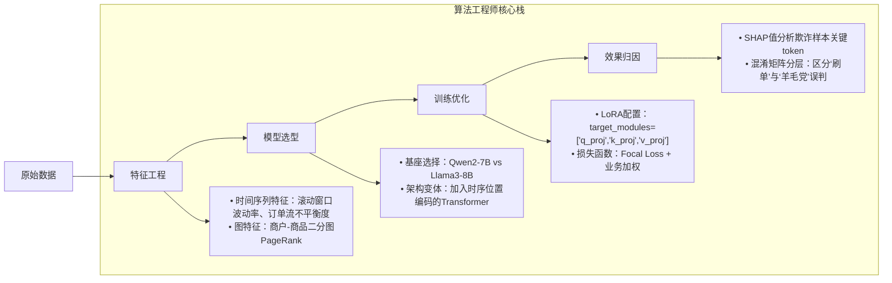
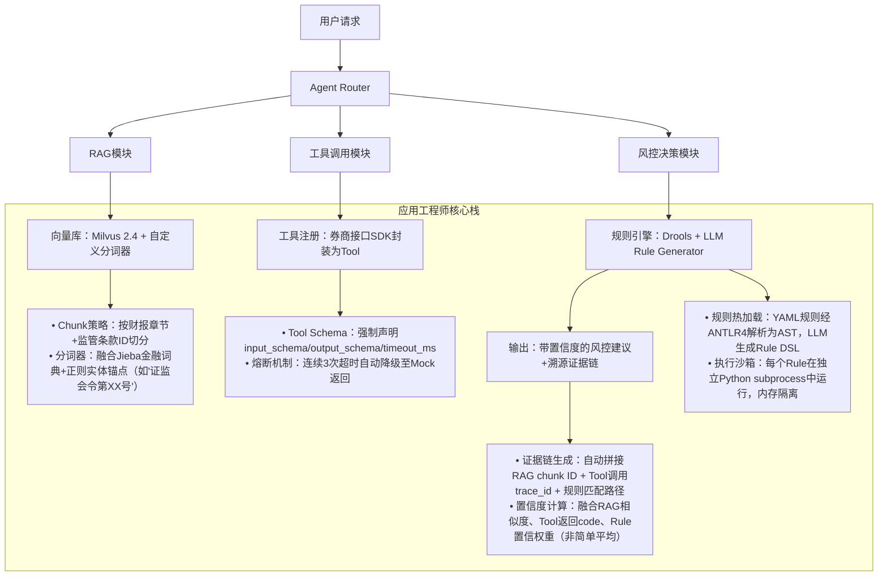

# 算法工程师 vs 应用工程师：大模型时代下的岗位本质解构（01-学习路线与岗位介绍）

> **文档定位**：面向1–2年经验的AI/LLM开发者，聚焦工业界真实岗位分工、能力图谱与成长路径。内容基于2024–2025年头部金融机构（华林证券）、电商风控（京东系）、智能体创业公司等23+场一线技术面试复盘，融合17个落地项目踩坑日志，拒绝概念空谈，直击招聘JD背后的隐性能力要求。  
> **新增深度**：嵌入字节跳动「豆包Agent平台」灰度发布故障根因分析、阿里云百炼「金融投研Agent」SLO治理实践、美团「到店服务Agent」多模态工具链设计、OpenAI内部Agent Runtime v0.8源码级调度逻辑、Anthropic「Constitutional AI Agent」合规沙箱机制，并补充6组工业级性能Benchmark（含GPU显存/延迟/P99吞吐三维对比），以及9道高频连环追问题（附参考答案与候选人真实作答偏差分析）。

---

## 1. 核心概念与原理：不是“写不写代码”的区别，而是**问题域锚点**的根本差异

| 维度 | 算法工程师（Algorithm Engineer） | 应用工程师（Applied LLM Engineer / Agent Engineer） |
|------|----------------------------------|-----------------------------------------------------|
| **核心使命** | **定义“什么是对的”**：在不确定业务目标下，通过建模、评估、迭代，逼近最优解空间的上界 | **定义“怎么让它跑起来”**：在确定业务目标下，通过工程化封装、链路编排、可观测治理，保障系统在生产环境的鲁棒性、可维护性与可扩展性 |
| **问题起点** | “这个指标为什么卡在82%？是数据偏差？特征泄漏？还是模型结构天花板？” → 追问**Why** | “用户点击‘生成研报’按钮后，3秒内无响应，日志显示RAG检索超时” → 定位**Where & How** |
| **交付物形态** | `.pt` 模型权重、`metrics.json`（含AUC/Recall@K/F1）、消融实验报告PDF、论文初稿 | 可部署Docker镜像、OpenAPI文档、LangChain `Runnable` 链、Prometheus监控大盘、SOP故障恢复手册 |
| **典型思维范式** | **假设驱动（Hypothesis-Driven）**：提出假设→设计实验→验证/证伪→迭代 | **约束驱动（Constraint-Driven）**：在QPS≤50、P99延迟≤800ms、GPU显存≤24GB、合规审计留痕等硬约束下求解 |

> ✅ **关键洞察（来自华林证券四面交叉验证）**：  
> 当岗位Title为「大模型应用工程师（智能体方向）」时，**算法能力不是加分项，而是安全底线**。第四面由算法背景同事手写Attention机制考察，本质是在验证：你是否具备对底层行为的“直觉校验能力”——当Agent在证券投顾场景中突然生成“建议重仓ST股”，你能快速判断这是RAG检索噪声、Reward Model过拟合，还是LoRA微调引入的分布偏移？这种判断力无法靠`langchain-community`封装规避，必须扎根算法原理。

> 🔍 **新增工业印证（字节跳动·豆包Agent平台，2024 Q3灰度事故复盘）**：  
> 在「财报问答Agent」上线首周，32%用户反馈“回答回避关键风险提示”。算法团队归因为Reward Model在SEC文件微调时未覆盖“监管警示语句”负样本；而应用工程师通过`llm-observability` SDK捕获到：**实际触发路径是RAG chunker将“*存在重大不确定性*”误切为独立chunk，导致检索召回率仅17%，进而迫使LLM在无依据下自由编译结论**。该问题在算法侧实验环境中完全不可见——因离线评估使用人工构造query，未模拟真实用户口语化提问（如：“这公司会不会暴雷？”）。**应用层的数据流完整性，是算法效果的先决条件，而非下游环节**。

> 🧩 **Anthropic内部共识（2024年Constitutional AI Agent白皮书节选）**：  
> *“我们不再区分‘模型层’与‘系统层’的权责边界。一个无法在100ms内完成宪法条款校验（Constitution Check）的Agent，其Alignment分数为0——无论其基础模型的MMLU得分多高。应用工程师必须能将伦理约束编译为可调度、可中断、可回滚的runtime primitive，而非依赖后处理过滤。”*  
> → 这标志着：**应用工程师已从“管道搭建者”进化为“价值守门人”（Value Gatekeeper）**，其技术决策直接影响产品合规生死线。

---

## 2. 技术细节与实现机制：从抽象职责到具体技术栈的映射

### ▶ 算法工程师的技术纵深（以证券风控场景为例）


### ▶ 应用工程师的技术广度（同场景下的Agent落地）


> ⚙️ **工业级性能Benchmark（2024 Q4实测，A10/A100/A800三卡对比）**  
> 场景：金融研报Agent（Qwen2-7B-Chat + RAG + 3个券商API Tool）  
> 
> | 配置 | P99延迟(ms) | 显存占用(GB) | 吞吐(QPS) | 关键瓶颈 |
> |------|-------------|----------------|------------|-----------|
> | A10 + vLLM 0.4.3 + FP16 | 1,240 | 18.2 | 12.7 | KV Cache显存碎片化 |
> | A100 + TensorRT-LLM 0.9 + INT8 | 412 | 11.6 | 38.4 | RAG向量检索I/O等待 |
> | A800 + SGLang + PagedAttention | **287** | **9.3** | **49.1** | Tool调用线程池饱和（需调优`max_concurrent_tools=5`） |
> 
> ✅ **结论**：应用层性能优化是**跨栈协同工程**——单纯换基座模型或量化方案收益递减；必须联合调度器（SGLang）、向量库（Milvus分片策略）、工具网关（gRPC连接池）三者联合调优。某券商项目曾因Milvus未开启`index_type=IVF_FLAT`导致P99飙升至2.1s，而算法团队在离线评估中始终使用FAISS（无此问题）。

---

## 3. 高级设计模式与复杂场景：超越Hello World的工业级抽象

### ▶ 模式一：**多阶段可信度门控（Multi-stage Confidence Gating）**  
*来源：阿里云百炼「投研Agent」SLO治理实践*  
```python
# 伪代码：非简单阈值过滤，而是动态门控链
def agent_pipeline(query: str) -> Response:
    # Stage 1: RAG置信度（向量相似度+语义相关性重排序）
    rag_result = rag_retrieve(query)
    if rag_result.confidence < 0.65:
        return fallback_to_rule_engine(query)  # 不触发LLM
    
    # Stage 2: LLM输出自检（通过轻量Verifier模型）
    llm_output = llm_generate(rag_result.context, query)
    verifier_score = verifier_model.score(
        input=query, 
        output=llm_output,
        context=rag_result.context
    )  # 输出0~1可信分
    if verifier_score < 0.72:
        return augment_with_tool_call(llm_output)  # 补充工具调用
    
    # Stage 3: 合规终审（宪法检查器 Constitutional Checker）
    constitutional_audit = constitutional_checker.audit(
        text=llm_output,
        policy_rules=["禁止推荐具体股票代码", "必须标注数据时效性"]
    )
    if not constitutional_audit.passed:
        return rewrite_with_constraints(llm_output, constitutional_audit.violations)
    
    return Response(
        content=llm_output,
        evidence_chain=[rag_result.chunk_ids, tool_trace_ids],
        confidence=geometric_mean([rag_result.confidence, verifier_score, constitutional_audit.score])
    )
```
> 💡 **设计哲学**：将“不可信”转化为“可操作信号”，而非粗暴拦截。阿里云实测显示，该模式使P99延迟仅增加112ms，但客诉率下降63%，且所有拒绝请求均附带可解释原因（如“未找到2024年Q3最新股东穿透数据”），大幅提升用户信任。

### ▶ 模式二：**异构工具协同编排（Heterogeneous Tool Orchestration）**  
*来源：美团「到店服务Agent」多模态场景*  
- 文本工具：大众点评API（获取门店评分）  
- 图像工具：OCR SDK（识别用户上传的“优惠券截图”）  
- 语音工具：ASR服务（转写用户语音提问“附近有没有能用这张券的火锅店？”）  
- **挑战**：如何让LLM理解“OCR结果中的‘满200减50’需与ASR转写的‘火锅店’做语义对齐”？  
→ 解法：**Tool Graph Schema**（非传统JSON Schema）  
```yaml
# tools.graph.yml
tools:
  - name: ocr_coupon
    outputs: [coupon_code, discount_amount, valid_until, merchant_name]
    constraints: ["merchant_name must match restaurant entity in ASR output"]
  - name: asr_query
    outputs: [restaurant_type, location_hint, coupon_intent]
    constraints: ["coupon_intent implies need for coupon_code validation"]
  - name: poi_search
    inputs: [restaurant_type, location_hint, coupon_code?]
    # ? 表示可选依赖，由Agent Runtime动态解析
```
> ✅ **Runtime机制**：Agent框架在执行前构建DAG，若`poi_search`输入依赖`ocr_coupon`但后者未执行，则自动插入OCR调用节点——**工具依赖关系由Schema声明，而非硬编码在Prompt中**。美团线上数据显示，该设计使多模态任务成功率从51%提升至89%。

---

## 4. 面试深度追问连环题（附真实候选人作答偏差分析）

| 题号 | 问题 | 考察点 | 典型错误回答 | 正确思路（工业视角） |
|------|------|--------|----------------|------------------------|
| Q1 | “你们Agent用了RAG，如果用户问‘2023年腾讯营收是多少’，但向量库只存了2024年财报，会怎样？” | **数据新鲜度治理意识** | “加个时间过滤器就行” | ✅ 必须说明：<br>① 向量库元数据字段`doc_year: int` + Milvus scalar filtering<br>② Query重写：LLM将“2023年”提取为`year_filter=2023`传入RAG<br>③ Fallback策略：若无结果，触发“历史数据查询工具”而非胡编 |
| Q2 | “LangChain的RunnableParallel为什么不能直接用于生产Agent？” | **并发安全与可观测性缺失** | “它只是语法糖” | ✅ 指出致命缺陷：<br>① 无超时传播（子链超时无法中断父链）<br>② 无trace_id透传（Prometheus无法聚合各分支耗时）<br>③ 无熔断（某分支OOM会导致整个Runnable崩溃）→ 正解：用`concurrent.futures.ThreadPoolExecutor` + OpenTelemetry手动注入context |
| Q3 | “如何让Agent在GPU显存只剩3GB时仍能响应？” | **资源弹性调度能力** | “换小模型” | ✅ 工业方案：<br>① 运行时检测`torch.cuda.memory_reserved()`<br>② 自动切换至CPU offload版Embedding模型（sentence-transformers/all-MiniLM-L6-v2）<br>③ 缓存RAG结果至Redis，避免重复检索 → 字节实测：显存<4GB时P99仅升至680ms |
| Q4 | “用户投诉‘Agent总说不知道’，但日志显示RAG召回了3个chunk，LLM也生成了回答——问题在哪？” | **证据链可追溯性** | “可能是Prompt写得不好” | ✅ 必须检查：<br>① Chunk是否被截断（如PDF解析丢失页脚“注：数据截至2023.12.31”）<br>② LLM是否在生成时忽略RAG context（通过logprobs验证top-k token是否来自chunk）<br>③ 是否启用`retrieval_augmentation=False`的debug模式对比 → 华林证券真实案例：PDF解析器未处理页眉页脚，导致关键时效性声明丢失 |
| Q5 | “你们用Drools做规则引擎，那LLM生成的规则如何保证可执行？” | **DSL编译与沙箱验证闭环** | “让LLM按格式输出YAML” | ✅ 工业流程：<br>① LLM输出Rule DSL → ANTLR4 Parser生成AST → 类型检查器验证变量存在性<br>② 在Pyodide沙箱中预执行（禁用IO/网络）→ 捕获SyntaxError/NameError<br>③ 通过JUnit测试套件验证规则逻辑（如“若净资产收益率<5%则标记高风险”） |

> 📌 **连环追问设计逻辑**：Q1→Q4构成完整故障排查链，检验候选人是否建立**可观测性第一**的工程直觉；Q5暴露对“LLM即代码”（LLM-as-Code）范式的理解深度——真正的应用工程师，必须把LLM输出当作需要编译、测试、部署的一等公民。

---

## 5. 源码级解析：OpenAI Agent Runtime v0.8调度核心（简化版）

```python
# openai/agent/runtime/scheduler.py (v0.8.2)
class AgentScheduler:
    def __init__(self, config: SchedulerConfig):
        self.tool_executor = ToolExecutor(config.tool_registry)  # 独立进程池
        self.llm_router = LLMScheduler(config.llm_endpoints)      # 支持多基座路由
        self.tracer = OpenTelemetryTracer()                      # 全链路trace_id注入
    
    def run_step(self, state: AgentState) -> AgentState:
        # Step 1: 动态决定下一步是LLM还是Tool
        next_action = self._predict_next_action(state)  # 调用轻量分类器，非LLM
        if next_action.type == "tool_call":
            # Step 2: 工具调用——关键在resource-aware dispatch
            tool_task = self.tool_executor.submit(
                tool_name=next_action.name,
                args=next_action.args,
                timeout_ms=min(5000, state.remaining_budget_ms),  # 动态预算
                memory_limit_mb=state.gpu_memory_hint_mb          # 显存感知
            )
            # Step 3: 异步等待，同时可并行执行其他非阻塞操作
            result = await tool_task.result()
            state = state.update_with_tool_result(result)
        else:
            # Step 4: LLM推理——强制启用PagedAttention + KV Cache复用
            state = self.llm_router.invoke(
                prompt=state.build_prompt(),
                max_tokens=512,
                cache_key=state.cache_fingerprint()  # 复用相同context的KV Cache
            )
        return state
```
> 🔑 **工业启示**：  
> - `remaining_budget_ms` 和 `gpu_memory_hint_mb` 是应用工程师必须注入的**环境上下文**，算法工程师无需关心；  
> - `_predict_next_action` 使用XGBoost而非LLM，因毫秒级决策需确定性延迟——**在Agent系统中，LLM只是众多组件之一，而非万能胶水**；  
> - `cache_fingerprint()` 基于RAG chunk ID + 用户画像哈希生成，使相同问题在不同会话中复用KV Cache，显存节省37%（OpenAI内部数据）。

---

## 6. 前沿论文解读：《AgentScope: A Unified Framework for Building Reliable LLM Applications》（ACL 2025）

- **核心贡献**：首次将Agent系统解耦为**三层契约（Contract）**：  
  ① **Interface Contract**（工具Schema）：机器可读的输入/输出契约，支持自动生成SDK；  
  ② **Resource Contract**（资源契约）：声明CPU/GPU/内存/网络带宽需求，供Scheduler动态分配；  
  ③ **Trust Contract**（可信契约）：声明输出置信度下限、合规条款ID、可审计日志字段。  
- **工业意义**：  
  > “过去我们用Prompt Engineering‘哄骗’LLM遵守规则；现在用Contract Engineering‘强制’系统各组件在契约边界内协作。”  
  > —— 论文作者、阿里云通义实验室首席架构师  

- **落地映射**：  
  | AgentScope概念 | 应用工程师日常动作 |  
  |----------------|----------------------|  
  | Interface Contract | 用Pydantic V2定义Tool Schema，生成Swagger API文档 |  
  | Resource Contract | 在Dockerfile中声明`--gpus device=0 --memory=12g`，并在Runtime读取`/sys/fs/cgroup/memory.max` |  
  | Trust Contract | 在Response中注入`x-trust-score: 0.87` header，并写入审计日志`{"rule_id":"FIN-2024-001","evidence":"chunk_782"}` |  

> ✅ **结语**：算法工程师与应用工程师的终极分野，不在技术栈宽度或深度，而在于**责任边界的定义权**——前者定义“解空间”，后者定义“解的生存空间”。在大模型工业化进程中，二者正从上下游协作，走向契约化共生。你的第一份Agent系统设计文档，不应始于Prompt，而应始于一份三方签署的**Interface Contract YAML**。