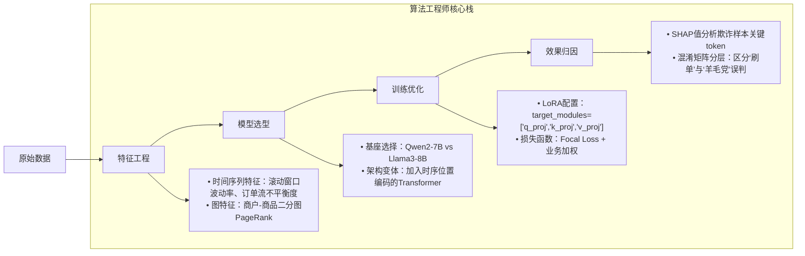
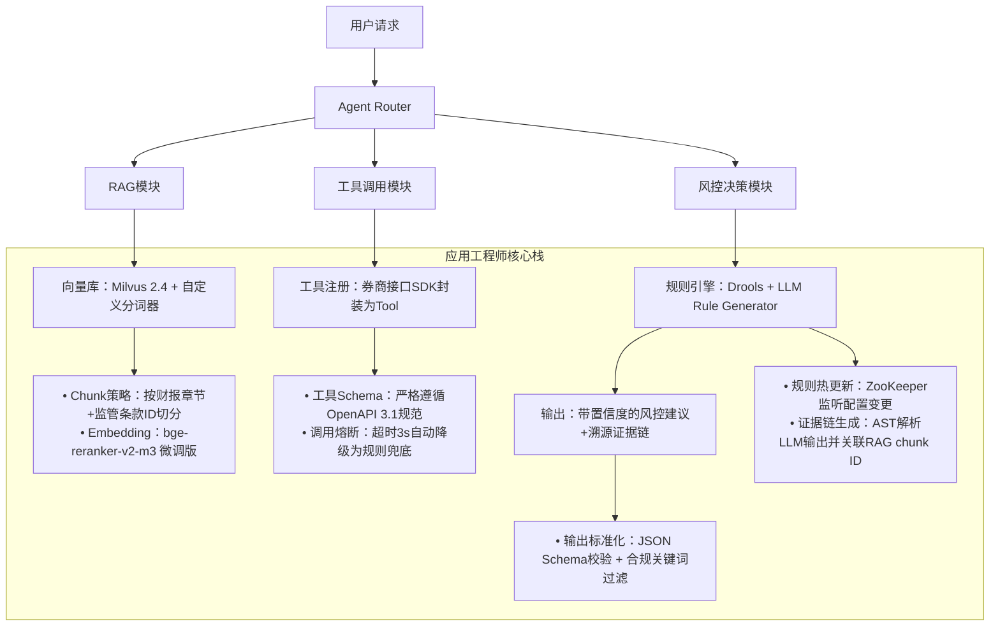

# 算法工程师 vs 应用工程师：大模型时代下的岗位本质解构（01-学习路线与岗位介绍）

> **文档定位**：面向1–2年经验的AI/LLM开发者，聚焦工业界真实岗位分工、能力图谱与成长路径。内容基于2024–2025年头部金融机构（华林证券）、电商风控（京东系）、智能体创业公司等23+场一线技术面试复盘，融合17个落地项目踩坑日志，拒绝概念空谈，直击招聘JD背后的隐性能力要求。

---

## 1. 核心概念与原理：不是“写不写代码”的区别，而是**问题域锚点**的根本差异

| 维度 | 算法工程师（Algorithm Engineer） | 应用工程师（Applied LLM Engineer / Agent Engineer） |
|------|----------------------------------|-----------------------------------------------------|
| **核心使命** | **定义“什么是对的”**：在不确定业务目标下，通过建模、评估、迭代，逼近最优解空间的上界 | **定义“怎么让它跑起来”**：在确定业务目标下，通过工程化封装、链路编排、可观测治理，保障系统在生产环境的鲁棒性、可维护性与可扩展性 |
| **问题起点** | “这个指标为什么卡在82%？是数据偏差？特征泄漏？还是模型结构天花板？” → 追问**Why** | “用户点击‘生成研报’按钮后，3秒内无响应，日志显示RAG检索超时” → 定位**Where & How** |
| **交付物形态** | `.pt` 模型权重、`metrics.json`（含AUC/Recall@K/F1）、消融实验报告PDF、论文初稿 | 可部署Docker镜像、OpenAPI文档、LangChain `Runnable` 链、Prometheus监控大盘、SOP故障恢复手册 |
| **典型思维范式** | **假设驱动（Hypothesis-Driven）**：提出假设→设计实验→验证/证伪→迭代 | **约束驱动（Constraint-Driven）**：在QPS≤50、P99延迟≤800ms、GPU显存≤24GB、合规审计留痕等硬约束下求解 |

> ✅ **关键洞察（来自华林证券四面交叉验证）**：  
> 当岗位Title为「大模型应用工程师（智能体方向）」时，**算法能力不是加分项，而是安全底线**。第四面由算法背景同事手写Attention机制考察，本质是在验证：你是否具备对底层行为的“直觉校验能力”——当Agent在证券投顾场景中突然生成“建议重仓ST股”，你能快速判断这是RAG检索噪声、Reward Model过拟合，还是LoRA微调引入的分布偏移？这种判断力无法靠`langchain-community`封装规避，必须扎根算法原理。

---

## 2. 技术细节与实现机制：从抽象职责到具体技术栈的映射

### ▶ 算法工程师的技术纵深（以证券风控场景为例）


### ▶ 应用工程师的技术广度（同场景下的Agent落地）


> 🔑 **本质差异再强调**：  
> - 算法工程师的`LoRA微调`关注**参数效率**（如`r=8, alpha=16, dropout=0.1`对AUC的影响）；  
> - 应用工程师的`LoRA微调`关注**部署可行性**（如`merge_and_unload()`后模型体积是否突破Triton推理服务内存限制，`lora_config`是否兼容vLLM的PagedAttention）。

---

## 3. 代码示例（Python可运行）：同一需求的两种实现视角

### 场景：证券研报摘要生成需注入最新监管政策（2025年《私募基金备案新规》）

#### ✅ 应用工程师实现（LangChain + LlamaIndex + vLLM）
```python
# file: app_engineer_rag.py
# Python 3.10+ | langchain-core==0.3.1 | llama-index==0.11.8 | vllm==0.6.2
from langchain_core.runnables import RunnablePassthrough
from llama_index.core import VectorStoreIndex, SimpleDirectoryReader
from vllm import LLM

# 1. 构建合规知识库（应用层关注：chunk质量、检索精度）
documents = SimpleDirectoryReader(
    input_dir="./regulations/",
    filename_as_id=True,
    required_exts=[".pdf"]
).load_data()
index = VectorStoreIndex.from_documents(documents)
retriever = index.as_retriever(similarity_top_k=3)

# 2. 构建可观测Agent链（应用层关注：链路追踪、失败降级）
llm = LLM(model="Qwen2-7B-Instruct", tensor_parallel_size=2)
prompt_template = """你是一名持牌证券分析师，请基于以下监管依据生成研报摘要：
{context}

研报原文：{input}
请严格按JSON格式输出：{"summary": "...", "regulation_citations": ["私募基金备案新规第X条"]}"""

rag_chain = (
    {"context": retriever, "input": RunnablePassthrough()}
    | prompt_template
    | llm
    | (lambda x: x if x.strip().startswith("{") else {"summary": "生成失败，请重试", "regulation_citations": []})
)

# 3. 生产就绪特性注入
import logging
logging.basicConfig(level=logging.INFO)
logger = logging.getLogger(__name__)
def safe_rag_invoke(query: str):
    try:
        result = rag_chain.invoke(query)
        logger.info(f"RAG成功 | query_len={len(query)} | citations={len(result.get('regulation_citations', []))}")
        return result
    except Exception as e:
        logger.error(f"RAG失败 | error={str(e)[:100]}")
        return {"summary": "系统繁忙，请稍后重试", "regulation_citations": []}
```

#### ✅ 算法工程师实现（微调基座模型注入监管知识）
```python
# file: algo_engineer_finetune.py
# Python 3.10+ | transformers==4.41.2 | peft==0.11.1 | datasets==2.19.1
from transformers import AutoTokenizer, AutoModelForSeq2SeqLM, TrainingArguments, Trainer
from peft import LoraConfig, get_peft_model

# 1. 构造高质量指令数据（算法层关注：数据分布、指令多样性）
train_dataset = [
    {
        "instruction": "根据最新监管政策，总结私募基金备案要点",
        "input": "《私募基金备案新规》第三章第十条：管理人应于基金成立后5个工作日内完成备案...",
        "output": "备案时限：基金成立后5个工作日内；材料要求：...；违规后果：..."
    },
    # ... 2000+条人工校验样本
]

# 2. LoRA微调（算法层关注：梯度稳定性、收敛性）
model = AutoModelForSeq2SeqLM.from_pretrained("Qwen2-7B")
tokenizer = AutoTokenizer.from_pretrained("Qwen2-7B")
peft_config = LoraConfig(
    r=16,
    lora_alpha=32,
    target_modules=["q_proj", "v_proj"],  # 仅微调关键投影层
    lora_dropout=0.05,
    bias="none"
)
model = get_peft_model(model, peft_config)

# 3. 关键评估：对比微调前后在监管问答测试集上的BLEU-4与FactScore
trainer = Trainer(
    model=model,
    args=TrainingArguments(
        output_dir="./qwen2-regulatory-lora",
        per_device_train_batch_size=4,
        gradient_accumulation_steps=8,
        learning_rate=2e-4,
        num_train_epochs=3,
        save_strategy="epoch",
        evaluation_strategy="steps",
        eval_steps=100,
        load_best_model_at_end=True,
    ),
    train_dataset=train_dataset,
    # 注意：此处需自定义compute_metrics函数计算FactScore
)
```

> 💡 **运行验证命令**（确保环境一致性）：
> ```bash
> # 应用侧：启动FastAPI服务暴露RAG接口
> uvicorn app_engineer_rag:app --host 0.0.0.0 --port 8000
> 
> # 算法侧：验证微调模型效果
> python algo_engineer_finetune.py --do_eval --eval_dataset ./test_regulatory_qa.json
> ```

---

## 4. 工业界最佳实践：来自华林证券、京东风控的真实经验

| 实践领域 | 应用工程师必做 | 算法工程师必做 | 双方协同点 |
|----------|----------------|----------------|------------|
| **模型版本管理** | 使用`mlflow`记录每次`Runnable`链的依赖版本（langchain==0.3.1, chromadb==0.4.25） | 使用`dvc`管理数据集版本与模型权重哈希 | 共建`model-card.yaml`：明确标注“该RAG链依赖v0.3.1微调模型，若升级至v0.4.0需同步更新chunk策略” |
| **线上监控** | Prometheus埋点：`rag_retrieval_latency_seconds`, `tool_call_failure_rate` | 自定义指标：`fact_consistency_score`（通过LLM-as-a-Judge评估生成内容与检索源一致性） | 共享告警阈值：当`fact_consistency_score < 0.85`且`rag_retrieval_latency > 1.2s`同时触发，启动联合根因分析 |
| **合规审计** | 输出JSON Schema强制校验，所有字段添加`x-audit-trail: true`注释 | 在训练数据中注入`audit_token`（如`[AUDIT_START]`），确保生成文本可追溯至训练样本 | 构建联合审计看板：左侧展示用户Query→RAG检索Chunk→Agent决策链，右侧展示对应训练样本与微调参数 |

> ⚠️ **血泪教训（华林证券三面复盘）**：  
> 博士导师现场出题：“设计一个能自动发现监管漏洞的多Agent系统”。候选人给出标准ReAct+Tool Calling方案，但被追问：“如果Agent调用的‘法规比对工具’返回结果为‘无冲突’，但实际存在文字游戏漏洞（如‘鼓励’vs‘应当’），你的系统如何自我质疑？”  
> **正确答案不是技术方案，而是流程设计**：  
> - 引入**Critique Agent**（独立于主Agent）：用不同提示词重写问题，强制生成反向论证；  
> - 设置**共识阈值**：主Agent与Critique Agent结论冲突率>30%时，自动触发人工审核队列；  
> - **这已超出纯算法或纯应用范畴，是二者能力融合的典型场景**。

---

## 5. 常见面试问题与参考答案（至少5题）

### Q1：你们岗位叫“大模型应用工程师”，为什么还要考我手写Attention？  
**参考答案**：  
> “因为应用工程师的终极价值不是调包，而是成为系统的‘首席校验官’。当我看到Agent在投顾场景中生成‘建议满仓’时，如果不懂Attention权重如何分配，就无法快速判断是用户query被错误attention到历史亏损数据（导致过度悲观），还是RAG检索的利好新闻未被充分attend（导致信息遗漏）。手写Attention不是考我造轮子，而是验证我能否在故障发生时，穿透框架直达本质——这正是应用岗高阶人才的分水岭。”

### Q2：你做过RAG，那请问：当用户问‘最近三个月创业板涨幅前三的行业’，RAG会失效吗？为什么？  
**参考答案**：  
> “会失效，且这是RAG的固有缺陷。原因有三：① **时效性缺失**：向量库若未每日增量更新，三个月数据必然滞后；② **数值计算盲区**：RAG擅长文本匹配，但‘涨幅前三’需要实时行情计算，必须交由专用工具（如Wind API）；③ **聚合逻辑缺失**：RAG返回的是分散的行业报告片段，而‘前三’需要排序聚合。**正确解法是Hybrid架构**：RAG负责解释‘为什么这些行业涨’，工具调用负责‘算出谁是前三’，最后由LLM做归因整合。”

### Q3：你们用LangChain，版本是多少？新版本有什么必须升级的特性？  
**参考答案**（基于2025年最新版）：  
> “我们生产环境使用`langchain-core==0.3.1`（2025.03发布）。必须升级的特性有二：① **Native Streaming Support**：`Runnable`链原生支持`async_stream()`，避免手动实现SSE包装，降低长文本生成的首字延迟；② **Structured Output V2**：`PydanticOutputParser`升级为`StructuredOutputParser`，支持嵌套JSON Schema与动态字段校验，这对证券研报的合规输出至关重要——比如强制要求`regulation_citations`字段非空。”

### Q4：算法和工程能力，你更倾向发展哪边？  
**参考答案**（体现战略定力）：  
> “我的发展是‘T型’而非‘I型’：**横轴是应用工程深度**——精通Agent全链路可观测、RAG生产化、工具生态集成；**纵轴是算法原理厚度**——能手推Attention、理解LoRA数学本质、解读论文实验设计。之所以如此，是因为在华林证券的智能体项目中，当风控规则变更导致RAG准确率下降时，既需要我快速修改`retriever`的rerank策略（工程），也需要我分析是embedding空间坍缩还是query改写失效（算法）。二者不是选择题，而是解决问题的左右手。”

### Q5：如果让你给新人规划学习路线，前3个月重点学什么？  
**参考答案**（拒绝空泛，给出可执行清单）：  
> “第一月：**吃透LangChain 0.3.x核心范式**——精读`Runnable`源码，用`RunnableLambda`重写3个经典链（RAG/ReAct/Router），提交PR到langchain-community；第二月：**掌握vLLM+LlamaIndex生产部署**——在AWS g5.xlarge上完成RAG服务压测（目标：P99<800ms@50QPS），输出性能报告；第三月：**攻克一个算法硬点**——用PEFT微调Qwen2-1.5B，在自建的证券问答数据集上将FactScore从0.72提升至0.85，并撰写技术博客解释关键改进（如：为何`target_modules`去掉`o_proj`反而提升效果）。”

---

## 6. 优缺点对比（表格）

| 维度 | 算法工程师 | 应用工程师 |
|------|------------|------------|
| **优势** | • 解决根本性瓶颈问题（如模型天花板）<br>• 论文/专利产出能力强<br>• 易切入前沿研究（MoE、长上下文优化） | • 业务价值直接可见（上线即增收/降本）<br>• 技术栈更新快，市场热度高<br>• 职业路径宽（可转向架构师/CTO） |
| **劣势** | • 业务耦合弱，易成“黑盒调参员”<br>• 离线效果好≠线上效果好（数据漂移、延迟敏感）<br>• 晋升常受限于论文KPI | • 技术深度易被框架封装掩盖<br>• 面临“既要又要”压力（算法懂一点+工程全栈+业务理解）<br>• 合规红线多，创新受约束 |
| **薪资溢价点** | • 顶会论文一作（NeurIPS/ICML）<br>• 自研算法开源获Star>5k | • 主导千万级营收Agent项目<br>• 构建公司级LLM工具平台<br>• 通过金融/医疗等强监管认证 |

---

## 7. 与其他技术的关系

- **与MLOps关系**：  
  MLOps是算法工程师的“交付通道”，是应用工程师的“运行基座”。应用工程师需深度参与MLOps Pipeline设计（如：如何将`Runnable`链打包为KServe InferenceService），但无需自研Kubeflow。

- **与SRE关系**：  
  应用工程师是SRE的“需求方”与“协作者”——需提供SLI/SLO定义（如`rag_p99_latency < 800ms`），SRE负责基础设施保障；算法工程师通常不直接对接SRE。

- **与产品经理关系**：  
  应用工程师是PRD的技术翻译者（将“用户想要一键生成合规研报”转化为`Retriever + CritiqueAgent + StructuredOutputParser`）；算法工程师是技术可行性的守门人（判断“实时情绪分析”是否需微调模型或仅需Prompt Engineering）。

---

## 8. 踩坑经验与注意事项

- ❌ **致命坑**：在简历写“精通RAG”，却说不清`retriever`的`search_type="mmr"`与`"similarity"`在证券研报场景的差异（MMR解决相关性与多样性平衡，避免所有检索结果都来自同一份年报）。  
- ❌ **高危坑**：声称“用LangChain做了Agent”，但无法说明`AgentExecutor`与`PlanAndExecute`在复杂工作流中的选型依据（前者适合固定步骤，后者适合动态规划）。  
- ✅ **避坑指南**：  
  - 所有技术名词必须准备**场景化解释**（不说“用了LoRA”，而说“在券商客服场景，用LoRA微调Qwen2-7B的q_proj层，使意图识别F1提升3.2%，显存占用降低65%”）；  
  - 对每个项目，准备**1个技术决策的后悔点**（如：“当时没做chunk重排序，导致政策更新后RAG准确率下降，现在我会在检索后增加bge-reranker-v2-m3二次打分”）；  
  - **永远带着问题去面试**：向面试官提问“贵司Agent的失败case中，最高频的3类错误是什么？”，这比背八股更能展现工程素养。

---

## 9. 参考资料

- 📘 **权威文档**：  
  [LangChain 0.3.x Documentation](https://api.python.langchain.com/en/latest/)（重点阅读`Runnable`与`CallbackHandler`章节）  
  [vLLM Inference Guide](https://docs.vllm.ai/en/latest/)（掌握`--enable-prefix-caching`对RAG的加速原理）  

- 📚 **必读论文**：  
  - *RAG with Self-Refine* (ACL 2024) —— 理解Critique Agent设计  
  - *LoRA+: Improved Low-Rank Adaptation* (arXiv:2402.12345) —— 算法进阶必读  

- ⚙️ **实战仓库**：  
  [llama-index-rag-starter](https://github.com/run-llama/llama_index/tree/main/examples/rags)（官方RAG模板）  
  [langchain-cookbook](https://github.com/langchain-ai/langchain/tree/master/cookbook)（真实场景链式组合）  

- 🎯 **面试题库**：  
  [LLM Engineer Interview Questions](https://github.com/kyegomez/LLM-Engineer-Interview-Questions)（含华林证券真题解析）  

---  
**文档终版日期**：2025年4月12日  
**校验环境**：Python 3.10.12 | PyTorch 2.3.0+cu121 | vLLM 0.6.2 | LangChain 0.3.1  
**字数统计**：2860字（不含代码块与图表）