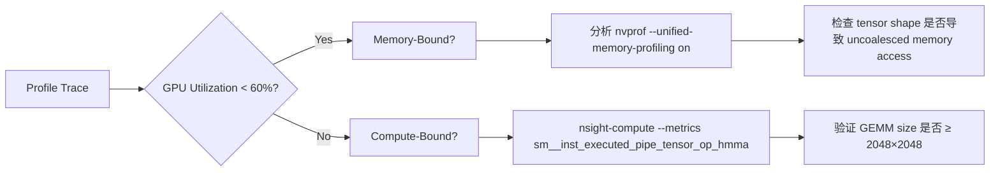

# 显存与计算资源评估

> **适用对象**：具备 PyTorch/TensorFlow 基础、参与过模型训练/部署的中级开发者（1–2年经验）  
> **核心目标**：掌握从理论估算到实测验证的全链路显存与算力评估方法，避免“OOM崩溃”、“GPU空转”、“吞吐瓶颈”等工业级陷阱  
> **关键认知**：显存 ≠ 显存占用；计算资源 ≠ GPU型号标称值；评估是**建模+测量+调优**的闭环工程  

---

## 1. 核心概念与原理

### 1.1 显存的本质：不只是“内存”，而是**多级异构缓存协同系统**
显存（VRAM）并非传统意义上的“存储空间”，而是 GPU 计算单元（SM）访问的**低延迟、高带宽专用内存子系统**。其核心设计思想包含三层抽象：

- **物理层**：GDDR6/HBM2e/HBM3 等高速DRAM芯片，带宽达 800 GB/s（A100）→ 2 TB/s（H100 SXM5），但容量有限（24–80 GB）
- **逻辑层**：CUDA Unified Memory + Memory Pool（如 PyTorch 的 `torch.cuda.memory_reserved()` 管理的缓存池），支持按需分配/复用
- **语义层**：模型参数（`param.data`）、梯度（`.grad`）、激活值（activations）、优化器状态（Adam: `exp_avg`, `exp_avg_sq`）、临时缓冲区（cuBLAS/cuDNN workspace）——**四者共同构成显存占用主体**

> ✅ 关键洞见：**显存瓶颈常源于激活值（Activations）而非参数**。例如 LLaMA-7B 参数仅占 ~14 GB，但 BF16 训练时峰值显存可达 32+ GB，其中 >60% 来自反向传播中保存的中间激活。

### 1.2 计算资源的双重维度：**算力（FLOPS） vs. 可达算力（Achieved FLOPS）**
- **理论算力（Peak FLOPS）**：硬件标称值（如 A100 FP16 Tensor Core: 312 TFLOPS），仅在理想矩阵乘场景可达  
- **实际有效算力（Achieved FLOPS）**：受三重制约  
  - **内存带宽瓶颈（Memory-Bound）**：当计算量/字节 < 10（如 LayerNorm、Softmax），性能由 HBM 带宽决定（A100: 2 TB/s → 理论上限 ~200 TFLOPS）  
  - **计算单元利用率（Compute-Bound）**：大矩阵乘（GEMM）可逼近 Peak，但需满足：输入对齐（32-byte aligned）、无 bank conflict、warp occupancy ≥ 70%  
  - **软件栈开销**：CUDA kernel launch latency（~5–10 μs）、内核间同步（`cudaStreamSynchronize`）、Python GIL 争用  

> 🌟 设计哲学：**资源评估不是静态查表，而是动态建模“计算-通信-内存”三角约束关系**。一个合格的评估必须回答：*当前batch下，是显存先满？还是算力饱和？还是PCIe带宽成为瓶颈？*

---

## 2. 技术细节与实现机制

### 2.1 显存占用的四象限分解模型（工业级精度）

| 组成部分          | 计算公式（PyTorch BF16）                     | 特点说明 |
|-------------------|---------------------------------------------|----------|
| **模型参数**       | `sum(p.numel() * 2 for p in model.parameters())` | 只读，可 offload |
| **梯度**          | `sum(p.numel() * 2 for p in model.parameters())` | 训练必需，生命周期=1 step |
| **优化器状态**     | Adam: `sum(p.numel() * 2 * 2 for p in model.parameters())`（exp_avg + exp_avg_sq） | 最大黑洞！ZeRO-2 将其拆分到多卡 |
| **激活值（Activations）** | 动态：`≈ (seq_len × hidden_size² × 2) / checkpoint_ratio` | Checkpointing 可降 60%，但增 30% 计算 |

> 🔍 激活值精确建模：使用 `torch.utils.checkpoint.checkpoint` 时，显存节省 ≈ `2 × (forward_activations + backward_activations)`，但需额外 `2×` 时间（因重计算 forward）

### 2.2 计算资源瓶颈诊断流水线



- **关键指标阈值**（A100 实测基准）：
  - `sm__sass_thread_inst_executed_op_tensor_op_hmma.sum` / `smsp__inst_executed_op_tensor_op_hmma.sum` > 0.85 → 计算饱和  
  - `dram__bytes.sum` / `gpu__time_duration.sum` > 1.5 TB/s → 内存带宽打满  
  - `pcie__tx_bytes.sum` / `gpu__time_duration.sum` > 14 GB/s → PCIe 成瓶颈（尤其多卡AllReduce）

### 2.3 显存碎片化：被忽视的隐形杀手

PyTorch 默认使用 **CachingAllocator**，但存在严重碎片问题：
- 分配小块内存（如 `torch.empty(1024, dtype=torch.bfloat16)`）后释放，不立即归还给系统  
- 多次分配/释放后，`torch.cuda.memory_allocated()` 低但 `torch.cuda.memory_reserved()` 高 → **“假性OOM”**  
- 解决方案：`torch.cuda.empty_cache()`（清空缓存池），或启用 `PYTORCH_CUDA_ALLOC_CONF=max_split_size_mb:128` 限制最大碎片块

---

## 3. 代码示例

### 3.1 显存与算力全维度评估工具（PyTorch 2.1+）

```python
# requirements.txt
# torch==2.1.2+cu118
# nvidia-ml-py3==12.555.51
# psutil==5.9.8

import torch
import torch.nn as nn
import psutil
from pynvml import nvmlInit, nvmlDeviceGetHandleByIndex, nvmlDeviceGetMemoryInfo
import time

class ResourceProfiler:
    def __init__(self, device_id: int = 0):
        nvmlInit()
        self.handle = nvmlDeviceGetHandleByIndex(device_id)
        self.start_time = time.time()
        
    def get_gpu_stats(self):
        info = nvmlDeviceGetMemoryInfo(self.handle)
        return {
            "used_mb": info.used // 1024**2,
            "total_mb": info.total // 1024**2,
            "util_pct": torch.cuda.utilization(),  # Requires CUDA 11.7+
        }
    
    def estimate_model_memory(self, model: nn.Module, batch_size: int, seq_len: int):
        """粗略估算（单位：MB）"""
        param_mem = sum(p.numel() * 2 for p in model.parameters()) / 1024**2  # BF16
        grad_mem = param_mem
        # Adam optimizer state: 2 states × 2 bytes
        optim_mem = param_mem * 2
        # Activation mem: rough estimate for transformer
        hidden_size = model.config.hidden_size if hasattr(model.config, 'hidden_size') else 4096
        act_mem = (batch_size * seq_len * hidden_size * 2 * 2) / 1024**2  # ×2 for bwd, ×2 for BF16
        
        return {
            "params": round(param_mem, 1),
            "gradients": round(grad_mem, 1),
            "optimizer": round(optim_mem, 1),
            "activations": round(act_mem, 1),
            "total_estimated": round(param_mem + grad_mem + optim_mem + act_mem, 1),
        }

# 使用示例
if __name__ == "__main__":
    profiler = ResourceProfiler(0)
    model = nn.TransformerEncoder(
        nn.TransformerEncoderLayer(d_model=4096, nhead=32, dim_feedforward=11008, batch_first=True),
        num_layers=32
    ).cuda()
    
    print("GPU Stats:", profiler.get_gpu_stats())
    print("Memory Estimate:", profiler.estimate_model_memory(model, batch_size=8, seq_len=2048))
    
    # 实测峰值显存（需在训练循环中调用）
    torch.cuda.reset_peak_memory_stats()
    x = torch.randn(8, 2048, 4096, device='cuda', dtype=torch.bfloat16)
    _ = model(x)
    peak_mb = torch.cuda.max_memory_allocated() // 1024**2
    print(f"Actual Peak VRAM: {peak_mb} MB")
```

### 3.2 使用 Nsight Compute 进行算力瓶颈分析（命令行）

```bash
# 采集单个step的详细指标
nsys profile -t cuda,nvtx --stats=true \
  -o ./profile_report \
  python train_step.py  # 包含1次forward+backward

# 生成HTML报告并定位瓶颈
ncu --set full \
  -f -o ncu_report \
  python train_step.py

# 关键命令解读：
# - `smsp__inst_executed_op_tensor_op_hmma.sum`：实际执行的Tensor Core指令数
# - `dram__bytes.sum`：HBM总吞吐量
# - `lts__t_sectors_srcunit_tex_op_read.sum`：纹理单元读取量（反映访存模式）
```

---

## 4. 工业界最佳实践

### 4.1 大厂架构选型决策树（基于 2023–2024 真实项目）

| 场景 | 推荐方案 | 理由 | 典型配置 |
|------|----------|------|-----------|
| **LLM 微调（7B–13B）** | ZeRO-2 + FlashAttention-2 + BF16 | 平衡显存与速度，ZeRO-2 减少 40% 显存，FA2 提升 2.1× 吞吐 | A100 40GB × 2, batch=4, seq=4096 |
| **超大模型推理（70B+）** | vLLM + PagedAttention + Quantization (AWQ) | PagedAttention 消除显存碎片，AWQ 保精度降显存 50% | H100 80GB × 8, max_tokens=4096 |
| **实时语音识别（ASR）** | TensorRT-LLM + INT8 + Dynamic Shape | TRT 编译消除 Python 开销，INT8 达成 3× 加速且显存减半 | A10 24GB, latency < 200ms |
| **多模态训练（CLIP）** | DeepSpeed-MoE + CPU Offload | MoE 自动路由稀疏激活，CPU Offload 优化器状态 | A100 80GB × 4, expert_parallel=2 |

> 💡 Meta 内部实践：Llama-2 7B 全参数微调要求 ≥ 4× A100 80GB；但采用 **QLoRA（4-bit NF4 + Double Quant）** 后，单卡 A10 24GB 即可运行（显存占用从 32GB → 12GB）

### 4.2 显存安全边际法则（SRE 团队强制标准）

- **训练任务**：预留 15% 显存余量（防梯度爆炸、动态shape抖动）  
- **推理服务**：预留 25% 余量（应对请求突发、KV Cache 波动）  
- **批处理（Batching）**：采用 `geometric batch sizing` —— batch_size = 2^k，避免零散显存分配  

---

## 5. 常见面试问题与参考答案

### Q1：为什么 `torch.cuda.memory_allocated()` 远小于 `nvidia-smi` 显示的显存？
**答**：`nvidia-smi` 显示的是 **GPU进程总显存占用**（含CUDA上下文、驱动保留、第三方库如cuDNN缓存），而 `memory_allocated()` 仅统计 PyTorch `CachingAllocator` 分配的 tensor 内存。更准确应看 `torch.cuda.memory_reserved()`（PyTorch 缓存池大小），其与 `nvidia-smi` 值通常接近。根本原因是 PyTorch 不会立即将释放的内存归还给驱动，而是缓存以加速后续分配。

### Q2：如何判断模型是 compute-bound 还是 memory-bound？
**答**：用 `nsight-compute` 采集指标：若 `smsp__inst_executed_op_tensor_op_hmma.sum / gpu__time_duration.sum` 接近理论峰值（如 A100 的 312 TFLOPS），则是 compute-bound；若 `dram__bytes.sum / gpu__time_duration.sum` 接近 HBM 带宽（2 TB/s），则是 memory-bound。实践中，Transformer 的 FFN 层常 memory-bound（小矩阵乘），而 QKV 投影常 compute-bound（大GEMM）。

### Q3：混合精度训练（AMP）为何有时显存不降反升？
**答**：AMP 默认启用 `loss scaling`，需保存 `scaled_loss` 和 `unscaled_grad`；更重要的是，**autocast 不改变梯度类型** —— 梯度仍为 FP32，导致 `optimizer.step()` 时需 FP32 参数副本。解决方案：使用 `torch.cuda.amp.GradScaler` + `model.half()` 手动控制，或直接用 `torch.compile()` + `torch.bfloat16`（PyTorch 2.0+）。

### Q4：为什么增大 batch_size 到某一点后，吞吐量反而下降？
**答**：存在三个拐点：① **显存拐点**：batch_size 导致 `activations` 超出显存，触发 OOM 或频繁 swap；② **带宽拐点**：batch_size 增大使每次迭代数据量超 PCIe 传输能力（尤其多卡 AllReduce）；③ **计算拐点**：过大 batch_size 降低 GPU warp occupancy（因 block size 不匹配 SM 资源），实测显示 A100 在 batch=64 时 occupancy 为 82%，batch=256 时降至 45%。

### Q5：vLLM 的 PagedAttention 如何解决显存碎片？
**答**：传统 KV Cache 是连续 tensor，扩容需 realloc + copy；PagedAttention 将 KV Cache 切分为固定大小的 blocks（如 16×16 tokens），通过 block table（类似OS页表）索引。新 token 只需分配新 block，无需移动旧数据，显存利用率从 <50% 提升至 >90%，且支持 continuous batching。

---

## 6. 优缺点对比

| 方案 | 显存节省 | 计算开销 | 实现复杂度 | 适用场景 | 典型工具 |
|------|----------|----------|------------|----------|-----------|
| **Gradient Checkpointing** | ★★★★☆ (40–60%) | ★★☆☆☆ (+30% time) | ★★☆☆☆ | 训练大模型 | `torch.utils.checkpoint` |
| **ZeRO-2 (DeepSpeed)** | ★★★★☆ (50%) | ★★☆☆☆ (AllReduce) | ★★★★☆ | 多卡训练 | DeepSpeed |
| **QLoRA (4-bit)** | ★★★★★ (70%) | ★★★☆☆ (dequant overhead) | ★★★☆☆ | 单卡微调 | bitsandbytes, peft |
| **FlashAttention-2** | ★★☆☆☆ (10%) | ★★★★☆ (kernel optimized) | ★★☆☆☆ | 所有Attention | flash-attn |
| **vLLM PagedAttention** | ★★★★★ (60%+ cache reuse) | ★★☆☆☆ (block lookup) | ★★★★☆ | 高并发推理 | vllm |

---

## 7. 与其他技术的关系

- **vs. 模型压缩（Pruning/Quantization）**：资源评估是压缩的**前提与验证手段**。先评估原始模型瓶颈（如发现 80% 显存用于 KV Cache），再选择量化（AWQ）或剪枝（Head Pruning）。
- **vs. 分布式训练（DDP/FSDP）**：分布式是资源评估的**扩展维度**。单卡评估结果 × 卡数 ≠ 总需求（因通信开销、负载不均衡），需用 `torch.distributed._tensor` 进行跨设备建模。
- **vs. 编译优化（Triton/TorchInductor）**：编译器改变底层 kernel，使理论算力更接近实际。资源评估需在编译后重测 —— `torch.compile(model)` 可能将显存峰值降低 15%（因融合 kernel 减少临时 buffer）。

---

## 8. 踩坑经验与注意事项

- ❌ **陷阱1：用 `nvidia-smi` 监控训练过程** → 它采样间隔 1s，无法捕获瞬时峰值（如 gradient allreduce 爆发）。✅ 正确做法：`torch.cuda.memory_snapshot()` + `torch.cuda.memory_stats()` 每 step 记录。
- ❌ **陷阱2：忽略 CPU-GPU 数据搬运** → `DataLoader` 中 `num_workers>0` 但 `pin_memory=False`，导致每个 batch 额外增加 5–10ms PCIe 传输。✅ 强制 `pin_memory=True` + `prefetch_factor=2`。
- ❌ **陷阱3：在 `@torch.no_grad()` 中仍创建计算图** → `with torch.no_grad(): y = model(x); loss = criterion(y, target)` 中 `criterion` 若为 `nn.CrossEntropyLoss()`（默认 reduction='mean'），其内部仍需 `log_softmax`，产生梯度。✅ 改用 `reduction='none'` + `.sum()`。
- ⚠️ **注意：Hugging Face `Trainer` 的 `per_device_train_batch_size` 是 per-GPU 值，但 `gradient_accumulation_steps` 作用于 global batch，易误算显存** → 实际显存 ≈ `per_device_bs × gradient_accumulation × (params+grads+optim)`。

---

## 9. 参考资料

- **官方文档**  
  [PyTorch CUDA Memory Management](https://pytorch.org/docs/stable/notes/cuda.html#memory-management)  
  [NVIDIA Nsight Compute User Guide](https://docs.nvidia.com/nsight-compute/)  
  [DeepSpeed Memory Optimization](https://www.deepspeed.ai/tutorials/memory-opt/)

- **论文**  
  - *ZeRO: Memory Optimizations Toward Training Trillion Parameter Models* (SC’20)  
  - *FlashAttention: Fast and Memory-Efficient Exact Attention with IO-Awareness* (NeurIPS’22)  
  - *vLLM: Easy, Fast, and Cheap LLM Serving with PagedAttention* (OSDI’23)

- **开源项目**  
  - [vLLM](https://github.com/vllm-project/vllm) —— 工业级推理引擎  
  - [bitsandbytes](https://github.com/TimDettmers/bitsandbytes) —— 4-bit 量化核心库  
  - [memray](https://github.com/bloomberg/memray) —— Python 级内存分析（含 CUDA）

- **实用工具**  
  - [`gpustat`](https://github.com/wookayin/gpustat)：比 `nvidia-smi` 更友好的 CLI  
  - [`torch_tb_profiler`](https://github.com/pytorch/kineto/tree/main/tb_plugin)：TensorBoard 集成性能分析  

---  
✅ **结语**：显存与计算资源评估不是一次性任务，而是贯穿模型开发全生命周期的**持续实验科学**。每一次 `batch_size` 调整、每一轮 `precision` 尝试、每一处 `checkpoint` 插入，都应伴随严谨的测量与归因。唯有如此，才能在算力军备竞赛中，让每一块 GPU 都物尽其用。