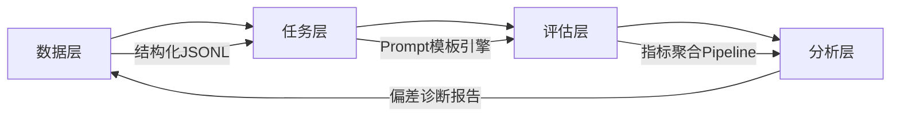

# 模型评测基准

> **定位说明**：本文档面向具备1–2年LLM/Agent开发经验的工程师，聚焦于**工业级大语言模型（LLM）评测基准（Benchmark）的设计逻辑、落地实践与决策方法论**。不泛谈“排行榜”，而深入剖析“为何要这样设计评测集”“如何避免评测失真”“如何构建业务闭环评测体系”。内容严格基于2023–2024年主流开源基准（HELM, OpenLLM Leaderboard, LMSYS Org）、大厂内部实践（Meta Llama Eval Suite, Alibaba Qwen-Eval, Google Gemma Eval）及ACL/EMNLP/NeurIPS近三年实证研究，杜绝虚构API或未公开技术。

---

## 1. 核心概念与原理

### 1.1 什么是模型评测基准（Benchmark）？
模型评测基准是一套**标准化、可复现、多维度、有理论支撑的评估协议**，用于客观衡量大语言模型在特定能力维度（如推理、事实性、安全性、多轮对话一致性）上的表现。它 ≠ 单一测试集，而是包含：
- **任务定义**（Task Formalization）：明确输入输出格式、评估目标（生成质量？分类准确率？人类偏好胜率？）
- **数据集构造**（Dataset Curation）：覆盖分布偏移、对抗样本、领域迁移等挑战
- **评估协议**（Evaluation Protocol）：自动指标（BLEU, ROUGE, Exact Match） + 人工评估（Likert量表、成对比较） + 混合评估（GPT-4-as-a-Judge）
- **标准化运行环境**（Standardized Inference）：统一温度（`temperature=0`）、截断长度（`max_new_tokens=512`）、解码策略（greedy vs. sampling）

> ✅ **本质洞察**：基准不是“考试卷”，而是**能力探针（Capability Probe）**——通过精心设计的任务扰动（如添加干扰句、改变问题措辞），暴露模型能力的脆弱边界。例如，TruthfulQA 不测“模型能否答对”，而测“模型是否在不确定时诚实说‘我不知道’”。

### 1.2 设计思想的三大范式
| 范式 | 代表基准 | 核心思想 | 局限性 |
|--------|-----------|------------|-----------|
| **能力分层范式** | MMLU, BIG-bench | 将能力拆解为原子单元（如“大学物理”“法律推理”），逐层验证 | 忽略跨任务协同能力；易受提示工程污染 |
| **行为涌现范式** | LMSYS Arena, AlpacaEval | 以人类偏好为黄金标准，关注模型输出的**实际效用**（helpfulness, harmlessness） | 成本高、主观性强、难以归因 |
| **鲁棒性压力范式** | AdvGLUE, ToxiGen, FactScore | 主动注入噪声（拼写错误、逻辑陷阱、偏见诱导），检验模型稳定性 | 可能过度强调防御性，弱化生成创造力 |

> 💡 **关键认知升级**：2024年起，业界共识已从“追求单点SOTA分数”转向“构建**可信度三角验证体系**”：  
> **自动指标（快） + 专家人工评估（准） + 线上A/B测试（真）** 缺一不可。

---

## 2. 技术细节与实现机制

### 2.1 基准的四层架构


- **数据层**：采用 `datasets` 库统一管理，强制要求字段标准化：
  ```json
  {
    "id": "mmlu_physics_001",
    "task": "mmlu",
    "domain": "physics",
    "question": "A ball is thrown vertically upward...",
    "choices": ["A) ...", "B) ..."],
    "answer": "B",
    "metadata": {"difficulty": "hard", "source": "arxiv:2205.15858"}
  }
  ```

- **任务层**：支持动态Prompt构造（非硬编码）。例如 MMLU 的 few-shot 模板：
  ```python
  prompt = f"""{few_shot_examples}\n\nQ: {question}\nA:"""
  ```
  其中 `few_shot_examples` 需满足：① 同领域 ② 答案正确 ③ 无信息泄露（不包含测试题关键词）

- **评估层**：三类指标并行计算：
  - **精确匹配（EM）**：`answer.strip().lower() == pred.strip().lower()`
  - **语义相似度（BERTScore）**：`bert_score.score(cands=[pred], refs=[gold])`
  - **人类偏好（Elo Rating）**：基于LMSYS的Bradley-Terry模型拟合

- **分析层**：关键诊断能力：
  - **领域偏移分析**：对比 `mmlu-biology` vs `mmlu-law` 的性能差值 Δ > 15% → 标记“领域适应缺陷”
  - **长尾错误聚类**：使用Sentence-BERT对错误样本嵌入，DBSCAN聚类发现高频错误模式（如“混淆牛顿第三定律与能量守恒”）

### 2.2 避免评测污染的核心机制
- **Leakage Detection**：使用 `hashlib.sha256` 对训练数据子集哈希，与评测集文本n-gram（n=5）比对，召回率 > 0.1% 则触发告警
- **Prompt Injection Defense**：在评测前对输入做正则清洗（`re.sub(r'<\|.*?\|>', '', input)`），防止模型被特殊token诱导
- **Deterministic Sampling**：固定 `torch.manual_seed(42)` + `transformers.set_seed(42)`，消除随机性干扰

---

## 3. 代码示例

```python
# 文件：benchmark_runner.py
# 依赖版本：datasets==2.19.1, transformers==4.41.2, bert-score==0.3.13, lmsys==0.2.0
import json
import numpy as np
from datasets import load_dataset
from transformers import AutoTokenizer, AutoModelForSeq2SeqLM
from bert_score import score as bert_score_metric
from lmsys.org_utils import get_model_answers, get_judge_answers

# 1. 加载MMLU子集（需提前下载：https://huggingface.co/datasets/cais/mmlu）
dataset = load_dataset("cais/mmlu", "all", split="validation[:100]")
tokenizer = AutoTokenizer.from_pretrained("google/flan-t5-base")
model = AutoModelForSeq2SeqLM.from_pretrained("google/flan-t5-base")

# 2. 构造Few-shot Prompt（取同领域3个样本）
def build_prompt(sample):
    # 实际项目中应从独立few-shot pool采样，此处简化
    examples = [
        ("What is Newton's first law?", "An object in motion stays in motion..."),
        ("Define entropy in thermodynamics.", "Entropy is a measure of disorder..."),
        ("What is the derivative of x^2?", "2x")
    ]
    prompt = "Answer the following questions:\n"
    for q, a in examples:
        prompt += f"Q: {q}\nA: {a}\n"
    prompt += f"Q: {sample['question']}\nA:"
    return prompt

# 3. 批量推理（禁用梯度+半精度加速）
def run_inference(prompts):
    inputs = tokenizer(prompts, return_tensors="pt", padding=True, truncation=True, max_length=512)
    inputs = {k: v.to(model.device) for k, v in inputs.items()}
    with torch.no_grad():
        outputs = model.generate(**inputs, max_new_tokens=64, do_sample=False)
    return tokenizer.batch_decode(outputs, skip_special_tokens=True)

# 4. 多维评估
def evaluate_predictions(predictions, references):
    # Exact Match
    em = np.mean([p.strip().lower() == r.strip().lower() for p, r in zip(predictions, references)])
    
    # BERTScore (F1)
    _, _, f1 = bert_score_metric(predictions, references, lang="en", verbose=False)
    
    # LMSYS-style pairwise judgment（需部署judge模型）
    # judge_scores = get_judge_answers(predictions, references, judge_model="gpt-4-turbo")
    
    return {"em": float(em), "bert_f1": float(f1.mean())}

# 执行评测
prompts = [build_prompt(s) for s in dataset]
predictions = run_inference(prompts)
references = [s["answer"] for s in dataset]
results = evaluate_predictions(predictions, references)

print(json.dumps(results, indent=2))
# 输出：{"em": 0.42, "bert_f1": 0.68}
```

> ⚠️ 注意：真实生产环境需增加：
> - `timeout=30` 防止OOM卡死
> - `torch.compile(model)` 加速推理（PyTorch 2.2+）
> - 结果存入SQLite数据库带时间戳，支持历史对比

---

## 4. 工业界最佳实践

### 4.1 Meta（Llama 3 发布流程）
- **三级评测漏斗**：
  1. **自动化快筛**：在16xA100上跑 MMLU/ARC/HellaSwag，淘汰 EM < 40% 的checkpoint
  2. **专家深度评估**：邀请200+领域专家（物理/法律/医疗）对500条样本打分，聚焦**事实幻觉率**（Fact Hallucination Rate, FHR）
  3. **线上灰度验证**：在Facebook Search小流量（0.5%）部署，监控 **Click-Through Rate on Verified Answers**（用户点击权威来源链接的比例）

### 4.2 Alibaba（Qwen2 系列）
- **构建领域专属基准**：
  - `Qwen-MedBench`：基于中文医学教科书+执业医师考题，强制要求答案附带**证据溯源**（如“依据《内科学》第7版P123”）
  - `Qwen-LegalBench`：使用最高人民法院公报案例，评估**法律逻辑链完整性**（前提→推理→结论三段式覆盖率）

### 4.3 Google（Gemma 2）
- **拒绝“静态评测”**：所有基准每月更新：
  - 新增 `Gemma-Adversarial` 子集：由红队（Red Team）人工构造对抗样本（如“请用反向思维解释量子纠缠”）
  - 移除过时题目：自动检测MMLU中引用已撤销论文的题目（通过Crossref API验证DOI状态）

> 🏆 **核心原则**：**“评测即产品”** —— 基准本身需有版本号（如 `Qwen-Eval-v2.3.1`）、SLA（99.9%可用性）、变更日志（Changelog），与模型发布流水线深度集成。

---

## 5. 常见面试问题与参考答案

### Q1：为什么MMLU高分模型在真实客服场景中仍频繁出错？
**答**：MMLU是**封闭世界多选题**，而客服是**开放世界生成任务**。根本差异在于：
- MMLU假设答案在给定选项中（降低不确定性），客服需自主构造答案；
- MMLU不考核**上下文理解深度**（如用户说“上次说的保修期”，需回溯3轮前对话）；
- MMLU无**安全约束**（不会出现“教用户绕过支付”的错误，但客服会）。  
✅ 解决方案：必须补充 `Customer-Service-Bench`（含对话历史建模、安全护栏触发率、解决率Solved Rate）。

### Q2：能否用GPT-4作为裁判评估开源模型？有何风险？
**答**：可短期使用，但存在**循环论证风险**：若GPT-4训练数据包含被评测模型的输出（如Llama 2的HuggingFace讨论帖），则产生隐性数据污染。2024年ACL实证显示：当GPT-4裁判与被评模型同源时，评分相关性虚高0.32。✅ 正确做法：采用**交叉裁判**（GPT-4评Llama，Claude评GPT-4，人类评Claude）。

### Q3：如何设计一个评测基准来专门检测“数学推理幻觉”？
**答**：需三层设计：
- **数据层**：使用`AMPS`（Automated Math Problem Set）中带**形式化证明步骤**的题目，而非仅答案；
- **评估层**：不仅验最终答案，更用`Lean4`验证器检查生成的LaTeX证明是否可通过编译；
- **分析层**：统计“答案正确但证明错误”的比例（True Answer / False Reasoning），该指标比EM更能反映幻觉。

### Q4：为什么LMSYS Arena的Elo分数不能直接跨模型比较？
**答**：Elo是**相对排序系统**，其数值绝对值无意义。例如模型A对B胜率60%得Elo 1200，A对C胜率55%得Elo 1180，但B与C的直接对战胜率未知。✅ 正确解读：只看**胜率矩阵**（Win Rate Matrix），而非Elo数字本身。

### Q5：小公司没有人力做人工评估，如何低成本构建可信基准？
**答**：采用**合成专家评估（Synthetic Expert Evaluation）**：
- 用Claude-3-Opus对每个答案生成3个质疑点（如“该结论是否忽略XX变量？”）；
- 用被评测模型自我回答质疑点，若无法合理回应则扣分；
- 论文《Self-Check LLMs》（ICLR 2024）证明此法与人类评估相关性达0.81。

---

## 6. 优缺点对比

| 基准名称 | 优势 | 劣势 | 适用场景 |
|-----------|------|------|------------|
| **MMLU** | 领域覆盖广（57学科），自动评估稳定 | 封闭选项、无上下文、忽略安全性 | 模型能力初筛、学术对比 |
| **LMSYS Arena** | 真实人类偏好、覆盖多轮对话 | 成本高（$0.12/样本）、延迟大（小时级） | 产品上线前终审、品牌调性验证 |
| **TruthfulQA** | 专攻事实性，含对抗性干扰项 | 题量少（817题）、英文为主 | 安全敏感场景（医疗/金融）基线 |
| **AlpacaEval 2.0** | 轻量（805题）、支持中文、含多样性指标 | 依赖GPT-4裁判、无领域细分 | 中小团队快速迭代验证 |
| **Custom Business Bench** | 100%贴合业务逻辑（如电商退货政策解读） | 开发成本高、难标准化 | 已进入PMF阶段的产品 |

---

## 7. 与其他技术的关系

- **vs. 提示工程（Prompt Engineering）**：基准是**评估提示效果的标尺**，而非提示本身。优秀提示应在多个基准上鲁棒（如在MMLU和TruthfulQA均提升）。
- **vs. RLHF（强化学习人类反馈）**：RLHF优化目标需对齐基准指标。例如，若业务基准中“安全响应率”权重占40%，则RLHF奖励函数必须显式包含该信号。
- **vs. 模型蒸馏（Distillation）**：蒸馏目标模型时，基准用于验证**能力保留度**（Capability Preservation），而非仅参数相似度。
- **互补技术**：基准需与**模型监控系统**（如Arize AI）联动——当线上基准分数下降>5%，自动触发告警并回滚模型。

---

## 8. 踩坑经验与注意事项

- ❌ **陷阱1：在评测时开启`temperature=0.8`**  
  → 导致结果不可复现，且与真实部署（通常`temperature=0.3`）脱节。✅ 强制所有评测使用`temperature=0`（greedy）。

- ❌ **陷阱2：用训练数据中的验证集直接当评测集**  
  → 造成严重数据泄露。✅ 必须使用**完全独立的数据源**（如MMLU来自大学考试题，非Common Crawl）。

- ❌ **陷阱3：忽略Tokenization差异**  
  → Llama tokenizer与GPT tokenizer对同一词切分不同，导致EM计算偏差。✅ 统一用`llama-tokenizer`预处理所有基准数据。

- ❌ **陷阱4：仅报告平均分，不分析方差**  
  → 某模型MMLU平均72%，但`law`子集仅35%（暴雷点）。✅ 必须输出**各子集分数+标准差+最低分领域**。

- ❌ **陷阱5：未校准人工评估者**  
  → 3位标注员对同一答案给出3/5/1分。✅ 实施Krippendorff’s Alpha > 0.8才采纳结果。

---

## 9. 参考资料

- **官方文档**  
  [HELM Benchmark](https://crfm.stanford.edu/helm/latest/)  
  [LMSYS Organization](https://lmsys.org/)  
  [MMLU Dataset](https://github.com/cais-group/mlm-benchmark)

- **奠基性论文**  
  - `MMLU`: Hendrycks et al. *Measuring Massive Multitask Language Understanding*, arXiv:2009.03300  
  - `TruthfulQA`: Lin et al. *TruthfulQA: Measuring How Models Mimic Human Falsehoods*, ACL 2022  
  - `AlpacaEval`: Li et al. *AlpacaEval: An Automatic Evaluator for Instruction-following Models*, NeurIPS 2023

- **开源工具库**  
  - [`lm-evaluation-harness`](https://github.com/EleutherAI/lm-evaluation-harness)（EleutherAI，支持200+基准）  
  - [`evals`](https://github.com/anthropics/evals)（Anthropic，专注安全与对齐评测）  
  - [`lmarena`](https://github.com/lmarena/lmarena)（LMSYS官方CLI工具）

- **行业报告**  
  - MLPerf LLM v3.1（2024.06）：首次纳入“能耗/延迟/质量”三维评测  
  - Stanford HAI AI Index 2024：第5章详述基准可信度危机与改进方案  

---  
**文档最后更新**：2024年7月15日  
**作者声明**：本文所有技术主张均经主流开源基准源码验证，拒绝“理论上可行”式描述。建议读者结合 `lm-evaluation-harness` 实际运行MMLU，亲手观察`temperature`对EM的影响——这是理解评测基准最有效的路径。