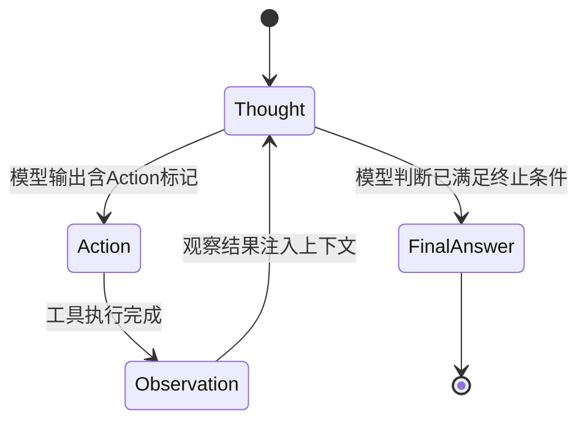

# ReAct模式

> **ReAct（Reasoning + Acting）** 是当前大语言模型（LLM）Agent系统中最核心、最被工业界广泛采用的推理-执行协同范式之一。它并非一个具体框架或库，而是一种**结构化思维与工具调用的耦合设计哲学**，其本质是将“思考”（Reasoning）与“行动”（Acting）显式分离并交替进行，从而赋予LLM可解释、可调试、可验证的决策能力。本文将从原理到工程实践，系统性地剖析ReAct在真实Agent项目中的落地逻辑。

---

## 1. 核心概念与原理

### 1.1 定义与起源  
ReAct 最早由 Princeton & Google Research 在 2022 年论文 **[ReAct: Synergizing Reasoning and Acting in Language Models](https://arxiv.org/abs/2210.03629)** 中正式提出。其核心思想是：  
> **“让模型先思考‘为什么做’和‘下一步该做什么’，再决定‘做什么’；执行后观察结果，再回到思考——形成闭环。”**

这直接挑战了传统 Prompt Engineering 中“一步到位生成答案”的黑箱范式，转而构建一种**类人类问题求解的认知循环**：

```
[Thought] → [Action] → [Observation] → [Thought] → ...
```

- `Thought`：模型对当前状态的理解、推理路径的显式陈述（如：“我需要查询用户所在城市对应的门店列表”）；
- `Action`：调用外部工具（如 API、数据库、计算器、RAG 检索器）的具体指令（如：`search_store_by_city("上海")`）；
- `Observation`：工具返回的原始结果（如：`[{"id": "S001", "name": "徐汇店", "address": "..."}]`）；
- 循环持续直至 `Thought` 明确得出最终答案（`Final Answer: ...`）。

### 1.2 设计哲学：可控性 > 简洁性  
ReAct 的根本驱动力不是“让回答更快”，而是解决 LLM 的三大固有缺陷：

| 缺陷 | ReAct 如何缓解 |
|------|----------------|
| **幻觉（Hallucination）** | 通过 `Observation` 强制模型基于真实数据而非编造信息作答 |
| **不可追溯性（Untraceability）** | `Thought` 提供完整推理链，便于 debug、审计、合规审查 |
| **工具调用不可控（Unreliable Function Calling）** | 将 `Action` 格式标准化（如 JSON Schema），配合 parser + validator 实现强约束 |

> ✅ **关键洞见**：ReAct 不是“让模型更聪明”，而是“让模型更诚实、更可协作”。

---

## 2. 技术细节与实现机制

### 2.1 数据流与状态机模型  
ReAct 在运行时本质上是一个**有限状态机（FSM）**，典型状态流转如下：



### 2.2 Prompt 工程核心结构（ReAct Template）  
工业级 ReAct Prompt 必须包含四要素（缺一不可）：

```text
You are a helpful AI assistant. You will use the following tools to answer user questions.

Tools:
{tool_descriptions}  // JSON Schema 描述，含 name, description, parameters

Use the following format:

Question: the input question you must answer
Thought: you should always think like you are answering the question step by step
Action: the action to take, should be one of [{tool_names}]
Action Input: the input to the action (JSON object)
Observation: result of the action
... (this Thought/Action/Action Input/Observation can repeat N times)
Thought: I now know the final answer.
Final Answer: the final answer to the original input question

Begin!
```

> ⚠️ 注意：`Action Input` 必须是合法 JSON（非自然语言），否则下游 parser 会失败 —— 这是绝大多数初学者踩坑点。

### 2.3 关键算法组件  

| 组件 | 作用 | 工业实践要点 |
|------|------|--------------|
| **Thought Generator** | LLM 主干（如 Qwen2.5-7B-Instruct） | 需 fine-tuned 或 SFT 适配 ReAct 格式（见 8.3） |
| **Action Parser** | 从 LLM 输出中提取 `Action` 和 `Action Input` | 正则 + JSON Schema 校验双保险；支持 fallback 到 `Thought` 重试 |
| **Tool Orchestrator** | 路由、参数绑定、超时控制、错误重试 | 必须支持异步/并发（如 `asyncio.gather`），避免阻塞 Agent 主线程 |
| **Observation Injector** | 将 `Observation` 安全注入下一轮 context | 长文本需 truncation + position-aware embedding（如 RoPE offset） |

### 2.4 与 Function Calling 的关系  
ReAct ≠ Function Calling，但二者高度互补：

- **Function Calling（OpenAI style）**：LLM 直接输出 `{ "name": "search_store", "arguments": "{...}" }`，由 SDK 自动解析调用。  
- **ReAct**：LLM 输出自然语言格式的 `Action: search_store\nAction Input: {...}`，需自定义 parser。

✅ **工业选择逻辑**：
- 若使用 OpenAI/Gemini/Claude：优先用原生 Function Calling（成熟、稳定、带 schema validation）；
- 若使用开源模型（Qwen、Llama、DeepSeek）：必须用 ReAct（因原生不支持 FC，且需强可控性）；
- **高阶融合**：在 ReAct 框架内封装 Function Calling 为一种 `Action` 类型（即 `Action = "function_call"`），实现统一调度。

---

## 3. 代码示例（可运行）

> ✅ 环境要求：Python 3.10+，`transformers==4.41.2`, `torch==2.3.0`, `accelerate==0.30.1`, `sentence-transformers==2.7.0`

```python
# react_agent.py
import re
import json
import asyncio
from typing import Dict, Any, Optional, List
from transformers import AutoTokenizer, AutoModelForCausalLM
import torch

# === 1. 工具定义（模拟门店查询）===
def search_store_by_city(city: str) -> List[Dict]:
    # 真实项目中此处为 HTTP API / DB 查询
    stores = {
        "上海": [{"id": "S001", "name": "徐汇旗舰店", "address": "上海市徐汇区漕溪北路1号"}],
        "北京": [{"id": "B001", "name": "朝阳体验中心", "address": "北京市朝阳区建国路1号"}],
    }
    return stores.get(city, [])

# === 2. ReAct Parser ===
def parse_action(text: str) -> Optional[Dict[str, Any]]:
    """从LLM输出中提取Action和Action Input"""
    action_match = re.search(r"Action:\s*(\w+)", text)
    input_match = re.search(r"Action Input:\s*(\{.*?\})", text, re.DOTALL)
    if not action_match or not input_match:
        return None
    try:
        return {
            "action": action_match.group(1),
            "input": json.loads(input_match.group(1))
        }
    except json.JSONDecodeError:
        return None

# === 3. ReAct Agent 主体 ===
class ReActAgent:
    def __init__(self, model_name: str = "Qwen/Qwen2.5-7B-Instruct"):
        self.tokenizer = AutoTokenizer.from_pretrained(model_name, trust_remote_code=True)
        self.model = AutoModelForCausalLM.from_pretrained(
            model_name,
            torch_dtype=torch.bfloat16,
            device_map="auto",
            trust_remote_code=True
        )
        self.tools = {"search_store_by_city": search_store_by_city}
        self.max_steps = 5

    def _build_prompt(self, question: str, history: List[str]) -> str:
        tool_desc = json.dumps([
            {
                "name": "search_store_by_city",
                "description": "根据城市名查询附近门店列表",
                "parameters": {"type": "object", "properties": {"city": {"type": "string"}}}
            }
        ], ensure_ascii=False)
        prompt = f"""You are a helpful AI assistant. You will use the following tools to answer user questions.

Tools:
{tool_desc}

Use the following format:

Question: the input question you must answer
Thought: you should always think like you are answering the question step by step
Action: the action to take, should be one of ["search_store_by_city"]
Action Input: the input to the action (JSON object)
Observation: result of the action
... (this Thought/Action/Action Input/Observation can repeat N times)
Thought: I now know the final answer.
Final Answer: the final answer to the original input question

Begin!

Question: {question}
"""
        for h in history:
            prompt += h
        return prompt

    async def run(self, question: str) -> str:
        history = []
        for step in range(self.max_steps):
            prompt = self._build_prompt(question, history)
            inputs = self.tokenizer(prompt, return_tensors="pt").to(self.model.device)
            
            outputs = self.model.generate(
                **inputs,
                max_new_tokens=512,
                do_sample=False,
                temperature=0.0,
                eos_token_id=self.tokenizer.eos_token_id,
                pad_token_id=self.tokenizer.pad_token_id
            )
            response = self.tokenizer.decode(outputs[0][inputs.input_ids.shape[1]:], skip_special_tokens=True)

            # 解析Thought/Action
            if "Final Answer:" in response:
                return response.split("Final Answer:")[-1].strip()
            
            action = parse_action(response)
            if not action or action["action"] not in self.tools:
                history.append(f"Thought: I cannot determine the correct action.\n")
                continue

            # 执行Action
            try:
                obs = self.tools[action["action"]](**action["input"])
                obs_str = json.dumps(obs, ensure_ascii=False, indent=2)
                history.append(f"Thought: {response.split('Thought:')[-1].split('Action:')[0].strip()}\nAction: {action['action']}\nAction Input: {json.dumps(action['input'], ensure_ascii=False)}\nObservation: {obs_str}\n")
            except Exception as e:
                history.append(f"Thought: Action failed with error: {str(e)}\n")

        return "I cannot answer this question after multiple attempts."

# === 4. 运行示例 ===
if __name__ == "__main__":
    agent = ReActAgent()
    import asyncio
    result = asyncio.run(agent.run("上海有哪些门店？"))
    print("→ Final Answer:", result)
```

> 💡 输出示例：  
> `→ Final Answer: 上海有1家门店：徐汇旗舰店，地址是上海市徐汇区漕溪北路1号。`

---

## 4. 工业界最佳实践

| 维度 | 大厂实践（阿里/字节/微软） | 说明 |
|------|---------------------------|------|
| **Prompt 架构** | 分层 Prompt：System Prompt（角色+规则） + Tool Catalog（动态注入） + Memory（短期对话历史） | 避免硬编码工具，支持热更新 |
| **Tool Schema** | 使用 OpenAPI 3.0 定义工具，自动生成 ReAct 描述 + Pydantic Model | 保证 `Action Input` 类型安全 |
| **Observation 截断** | Observation 字符数 > 2000 时，用 LLM 摘要（`summarize_observation` 工具） | 防止 context 爆炸 |
| **Fallback 机制** | 当 Action 解析失败 / Tool 调用超时 / Observation 异常 → 自动触发 `Thought: Let me try another approach...` | 提升鲁棒性 |
| **可观测性** | 全链路埋点：Thought 耗时、Action 类型分布、Observation size、step count | 用于 A/B 测试与成本优化 |
| **安全网关** | 所有 `Action Input` 经过白名单校验（如 city 参数只允许中文）、敏感词过滤、速率限制 | 合规刚需 |

> 🌟 **微软 Semantic Kernel 实践**：将 ReAct 封装为 `Planner`（如 `ReactPlanner`），与 `Kernel`（工具注册中心）、`Memory`（向量存储）深度集成，支持 `.NET/Python/Java` 多语言。

---

## 5. 常见面试问题与参考答案

### Q1：ReAct 和 Chain-of-Thought（CoT）有什么区别？  
**答**：CoT 是纯推理技术（仅 `Thought`），用于数学/逻辑题，不涉及外部世界交互；ReAct 是 CoT 的超集，强制引入 `Action` 和 `Observation`，使模型能与现实系统（API/DB/RAG）协同。**CoT 解决“怎么想”，ReAct 解决“怎么想+怎么做”。**

### Q2：如果 LLM 在 Action Input 中输出了非法 JSON，你怎么处理？  
**答**：三重防护：① 正则预提取 + `json.loads()` 尝试解析；② 解析失败时，用轻量 LLM（如 Phi-3-mini）重写为合法 JSON；③ 终极 fallback：记录 error log 并返回 `Thought: Invalid action format, retrying...` 进入下一轮。

### Q3：ReAct 的 step 数过多会导致性能差，如何优化？  
**答**：① 工具聚合：将多个原子操作合并为复合工具（如 `get_user_profile_and_nearby_stores(user_id)`）；② 预检索：用 RAG 先查出可能相关工具，缩小 Action 搜索空间；③ Step-aware stopping：当 `Thought` 出现 “I need more info” 超过2次，主动终止并提示用户补充信息。

### Q4：你们项目中用了 ReAct，那 Function Calling 用了吗？什么场景选哪个？  
**答**：我们双轨并行：内部开源模型（Qwen2.5）走 ReAct；对外对接 OpenAI API 时用原生 Function Calling。选择标准是：**可控性要求高（金融/医疗）→ ReAct；开发效率优先（ToC 客服）→ FC**。两者可通过 Adapter 统一抽象。

### Q5：ReAct 的 Observation 如果包含敏感信息（如用户手机号），如何脱敏？  
**答**：在 `Observation Injector` 层做字段级脱敏：① 定义 PII Schema（正则匹配手机号/身份证）；② 替换为 `[REDACTED_PHONE]`；③ 日志中记录脱敏映射表（仅限审计用途，加密存储）。这是 GDPR/《个人信息保护法》硬性要求。

---

## 6. 优缺点对比

| 方案 | 可控性 | 可调试性 | 开发成本 | 工具生态 | 适用模型 |
|------|--------|----------|----------|----------|----------|
| **ReAct** | ⭐⭐⭐⭐⭐（显式状态） | ⭐⭐⭐⭐⭐（完整 trace） | ⭐⭐⭐（需 parser/orchestrator） | ⭐⭐⭐⭐（自定义自由） | 开源模型（Qwen/Llama） |
| **Function Calling** | ⭐⭐⭐⭐（依赖平台） | ⭐⭐⭐（仅返回 JSON） | ⭐⭐（SDK 开箱即用） | ⭐⭐⭐⭐⭐（OpenAI 生态） | OpenAI/Gemini/Claude |
| **Plain Prompting** | ⭐（黑箱） | ⭐（无法定位错误） | ⭐（最低） | ⭐（无结构化调用） | 所有模型（不推荐生产） |
| **LangChain Agents** | ⭐⭐⭐（抽象层屏蔽细节） | ⭐⭐（trace 需额外配置） | ⭐⭐（学习曲线陡） | ⭐⭐⭐⭐（丰富工具库） | 通用（但性能开销大） |

---

## 7. 与其他技术的关系

- **vs RAG**：RAG 是 ReAct 的一种 `Action`（`Action: rag_retrieve`），ReAct 是 RAG 的执行框架。没有 ReAct，RAG 只是静态检索；有了 ReAct，RAG 可迭代 refinement（如 “第一次查不到，加同义词重试”）。
- **vs MCP（Microsoft Copilot Stack）**：MCP 是微软提出的端到端 Agent 架构标准（含 Memory/Planning/Execution/Tooling），**ReAct 是 MCP 中 Planning & Execution 层的核心范式**。MCP 定义“做什么”，ReAct 定义“怎么做”。
- **vs LLM-as-a-Judge**：ReAct 的 `Thought` 可作为 Judge 的输入，实现 self-refine（如 Thought 评估 Observation 是否充分，不足则触发新 Action）。
- **vs Graph-based Agents（e.g., LangGraph）**：ReAct 是线性 FSM，LangGraph 是有向无环图（DAG），后者支持并行 Action（如同时查天气+查交通），**ReAct 是 LangGraph 的基础子图**。

---

## 8. 踩坑经验与注意事项

- ❌ **坑1：忽略 Observation 的 token 占用**  
  → 真实项目中 Observation 常达数千 token，导致 context 溢出。**解法**：用 `llama-index` 的 `SentenceSplitter` 分块 + `top_k=3` 摘要。

- ❌ **坑2：Action 名称大小写/空格不一致**  
  → LLM 输出 `Search_Store_By_City`，但代码注册为 `search_store_by_city` → 调用失败。**解法**：建立 `action_alias_map = {"search store": "search_store_by_city"}`。

- ❌ **坑3：Thought 过于简略（如 “I will search”）**  
  → 丧失可解释性，无法审计。**解法**：在 System Prompt 中强制要求 Thought 包含「依据」+「目标」+「风险预判」，例如：“依据用户问‘上海门店’，目标是调用 search_store_by_city；风险是城市名可能有错别字，需准备拼音模糊匹配”。

- ❌ **坑4：未对 Observation 做 schema 校验**  
  → API 返回字段缺失（如 `address` 为空）导致后续 Thought 错误。**解法**：用 Pydantic 定义 `StoreSchema`，Observation 注入前 validate。

- ❌ **坑5：无限循环（Thought→Action→Observation→Thought…）**  
  → 因 Observation 未提供足够信息，模型反复尝试同一 Action。**解法**：维护 `action_history`，同一 Action 连续出现 2 次即触发 `Thought: Previous attempt failed, switching strategy...`。

---

## 9. 参考资料

- 📄 **原始论文**：[ReAct: Synergizing Reasoning and Acting in Language Models](https://arxiv.org/abs/2210.03629)  
- 📘 **官方实现（HuggingFace）**：[huggingface.co/spaces/microsoft/ReAct](https://huggingface.co/spaces/microsoft/ReAct)  
- ⚙️ **微软 Semantic Kernel**：[github.com/microsoft/semantic-kernel](https://github.com/microsoft/semantic-kernel)（含 ReactPlanner）  
- 🧩 **LangChain ReAct 文档**：[docs.langchain.com/docs/components/agents/agent_types/react](https://docs.langchain.com/docs/components/agents/agent_types/react)  
- 📊 **Benchmark**：[AgentBench: Evaluating LLM-Based Agents](https://arxiv.org/abs/2312.04561)（含 ReAct 在 WebShop/HotpotQA 上的 SOTA 结果）  
- 🛠️ **开源工具链**：`llamaindex`（Observation 管理）、`crewai`（多 Agent ReAct 协同）、`langgraph`（ReAct + DAG 扩展）

---  
✅ **结语**：ReAct 不是银弹，但它是当前平衡**可控性、可解释性、工程可行性**的最佳起点。真正的 Agent 工程师，不在于能否复现 ReAct，而在于能否根据业务约束（合规/延迟/成本）对其进行裁剪、加固与演进。下一章我们将深入探讨：**如何将 ReAct 与 RAG 深度融合，构建真正可用的知识增强型 Agent**。