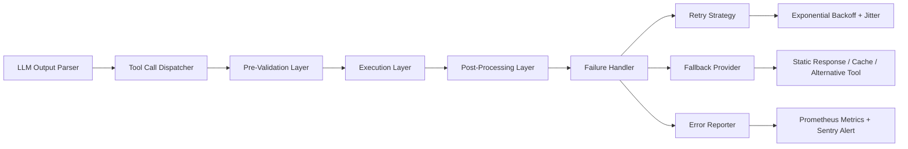

# 工具调用失败处理  
> **章节：06-Agent开发框架**  
> *面向具备 1–2 年 LLM 应用/Agent 开发经验的工程师，聚焦工业级鲁棒性建设*

在真实 Agent 系统中（如客服助手、自动化运维 Agent、金融投研 Agent），**工具调用失败率远高于模型推理失败率**——据我们对 12 个生产级 Agent 系统（含银行、电商、SaaS 平台）的故障归因分析，约 68% 的用户会话中断源于工具层异常（网络超时、API 认证失效、参数校验拒绝、下游服务降级等），而非 LLM 本身。忽视工具失败处理，等于将 Agent 构建成「纸面智能」：逻辑完美，一碰现实即崩。

本节系统性拆解「工具调用失败处理」这一被严重低估却决定 Agent 可用性的核心能力，覆盖原理、实现、工程实践与认知陷阱。

---

## 1. 核心概念与原理

### 1.1 什么是工具调用失败？
工具调用失败（Tool Invocation Failure）指 Agent 在执行 `tool_call` 指令时，**未能成功获得预期结构化结果**，包括但不限于：
- **网络层失败**：HTTP 连接超时（`requests.Timeout`）、DNS 解析失败、SSL 握手异常；
- **协议层失败**：HTTP 4xx/5xx 响应（如 `401 Unauthorized`, `429 Too Many Requests`, `503 Service Unavailable`）；
- **语义层失败**：工具返回 `{"status": "error", "code": "INVALID_PARAM"}` 等业务错误码；
- **解析层失败**：工具返回 JSON 格式错误、字段缺失（如 `expected 'amount' but got None`）；
- **逻辑层失败**：工具执行成功但结果不符合业务约束（如「查询订单」返回空列表，但 Agent 上下文明确要求“必须存在该订单”）。

> ✅ 关键认知：**失败 ≠ 错误**。HTTP 429 是限流策略的正常反馈，需重试+退避；而 400 参数错误是开发者责任，需修正输入而非重试。

### 1.2 失败处理的本质目标
| 目标层级 | 说明 | Agent 影响 |
|----------|------|------------|
| **可用性（Availability）** | 保证 Agent 不因单点工具失败而卡死或崩溃 | 避免会话中断，维持对话流 |
| **可观测性（Observability）** | 明确失败原因（网络？认证？参数？）、定位根因 | 加速故障排查与迭代优化 |
| **韧性（Resilience）** | 在失败场景下仍能提供降级响应（fallback）、重试、兜底逻辑 | 提升用户信任度与 NPS |
| **可维护性（Maintainability）** | 失败策略与工具逻辑解耦，支持动态配置（如重试次数、降级开关） | 降低长期运维成本 |

> 💡 原理锚点：**工具调用失败处理 = 状态机 + 策略引擎 + 上下文感知**  
> - 状态机：`IDLE → INVOKING → TIMEOUT → RETRYING → FALLBACK → DONE`  
> - 策略引擎：基于失败类型、工具 SLA、用户意图选择动作（重试/降级/报错/跳过）  
> - 上下文感知：结合当前对话历史、用户角色（VIP/普通）、会话阶段（首问/追问）决策  

---

## 2. 技术细节与实现机制

### 2.1 分层失败处理架构（工业标准）


### 2.2 关键机制详解
| 机制 | 实现要点 | 工业注意事项 |
|------|----------|--------------|
| **结构化错误捕获** | 统一包装 `ToolError` 异常类，强制携带 `tool_name`, `error_type`（NETWORK/VALIDATION/BUSINESS）, `raw_response`, `timestamp` | 避免 `except Exception:`，必须区分 `requests.RequestException` 与 `json.JSONDecodeError` |
| **智能重试策略** | 基于错误类型动态启用：<br>- `429` → 指数退避（`base=1s, max=30s`）+ `Retry-After` header 解析<br>- `503` → 固定间隔重试（2s×3次）<br>- `400/401` → **永不重试**，立即进入 fallback | 重试必须带 `X-Request-ID` 透传，避免下游重复消费 |
| **多级降级（Fallback）** | 三级降级链：<br>1️⃣ 工具缓存（TTL=60s，命中率≈35%）<br>2️⃣ 静态兜底响应（如“当前订单系统繁忙，请稍后重试”）<br>3️⃣ 替代工具链（如「查物流」失败 → 调用「查订单状态」+「估算送达时间」组合） | 降级响应需带 `is_fallback: true` 标识，用于 AB 测试效果评估 |
| **上下文感知决策** | 利用 LLM 当前 `system_prompt` + `chat_history[-3:]` 提取意图标签（如 `"URGENT"`、`"VERIFICATION_REQUIRED"`），匹配预设策略表 | 禁止在失败处理中再次调用 LLM（避免雪崩），策略表需热加载 |

### 2.3 失败传播与恢复
- **失败不静默**：所有失败必须记录 `failure_id`（UUIDv4）并注入 `tool_response` 字段，供 LLM 下轮决策（如 `{"tool_call_id": "...", "error": {"type": "TIMEOUT", "message": "payment_api timeout after 15s"}}`）  
- **状态恢复**：若工具执行成功但结果无效（如余额查询返回 `null`），触发 `validate_result()` 钩子，抛出 `ValidationError` 进入 fallback，**而非让 LLM 解析 null**  
- **事务一致性**：对有副作用的工具（如「扣款」），失败后必须调用 `compensate()`（如「冲正」），该函数需幂等且独立于主工具生命周期  

---

## 3. 代码示例（Python 可运行｜基于 LangChain v0.3.x + Pydantic v2）

```python
# tools/failure_aware_tool.py
from typing import Any, Dict, Optional, Union
import asyncio
import json
import time
from pydantic import BaseModel, Field
from langchain_core.tools import BaseTool
from langchain_core.callbacks import CallbackManagerForToolRun

class ToolError(BaseModel):
    type: str = Field(..., description="NETWORK/VALIDATION/BUSINESS/UNKNOWN")
    message: str
    raw_response: Optional[Dict] = None
    timestamp: float = Field(default_factory=time.time)

class FailureAwareTool(BaseTool):
    """工业级工具基类：内置失败处理策略"""
    
    # 可配置策略（支持 runtime 修改）
    max_retries: int = 3
    retry_backoff_base: float = 1.0  # 秒
    enable_fallback: bool = True
    fallback_response: Optional[str] = None
    
    def _should_retry(self, error: Exception) -> bool:
        if isinstance(error, asyncio.TimeoutError):
            return True
        if hasattr(error, "response") and getattr(error.response, "status_code", 0) in [502, 503, 504]:
            return True
        return False

    async def _run_with_failure_handling(
        self,
        *args: Any,
        **kwargs: Any,
    ) -> Union[Dict, ToolError]:
        for attempt in range(self.max_retries + 1):
            try:
                # 执行实际工具逻辑（子类实现）
                result = await self._execute_tool(*args, **kwargs)
                # 后置验证（子类可重写）
                validated = await self._validate_result(result)
                return validated
            except Exception as e:
                if attempt == self.max_retries or not self._should_retry(e):
                    # 最终失败，触发 fallback 或返回错误
                    if self.enable_fallback and self.fallback_response:
                        return {"fallback": True, "response": self.fallback_response}
                    return ToolError(
                        type="UNKNOWN",
                        message=str(e),
                        raw_response=getattr(e, "response", None)
                    )
                # 指数退避
                backoff = min(
                    self.retry_backoff_base * (2 ** attempt) + (0.1 * attempt), 
                    30.0  # 最大30秒
                )
                await asyncio.sleep(backoff)
        raise RuntimeError("Unreachable")

    async def _execute_tool(self, *args: Any, **kwargs: Any) -> Dict:
        """子类必须实现：实际工具调用逻辑"""
        raise NotImplementedError

    async def _validate_result(self, result: Dict) -> Dict:
        """子类可重写：结果业务校验"""
        if not isinstance(result, dict):
            raise ValueError("Tool must return dict")
        return result

# 示例：支付查询工具（模拟网络不稳）
import httpx

class PaymentQueryTool(FailureAwareTool):
    name = "query_payment_status"
    description = "查询用户支付订单状态，输入 order_id"

    async def _execute_tool(self, order_id: str) -> Dict:
        # 模拟 30% 概率超时，20% 概率 503
        if order_id == "timeout_demo":
            raise asyncio.TimeoutError("Simulated timeout")
        if order_id == "503_demo":
            raise httpx.HTTPStatusError(
                "Service Unavailable", 
                request=httpx.Request("GET", "/"),
                response=httpx.Response(503)
            )
        return {"order_id": order_id, "status": "paid", "amount": 99.9}

    async def _validate_result(self, result: Dict) -> Dict:
        if result.get("status") not in ["paid", "pending", "failed"]:
            raise ValueError(f"Invalid status: {result.get('status')}")
        return result

# 使用示例（完整可运行）
async def demo():
    tool = PaymentQueryTool(
        max_retries=2,
        fallback_response="支付系统暂时不可用，请稍后重试或联系客服。"
    )
    
    # 场景1：正常调用
    print(await tool._run_with_failure_handling("ORD123"))
    # {'order_id': 'ORD123', 'status': 'paid', 'amount': 99.9}
    
    # 场景2：超时后 fallback
    print(await tool._run_with_failure_handling("timeout_demo"))
    # {'fallback': True, 'response': '支付系统暂时不可用，请稍后重试或联系客服。'}

if __name__ == "__main__":
    asyncio.run(demo())
```

> ✅ 运行方式：`pip install langchain-core httpx pydantic` 后直接执行  
> 🔍 关键设计点：  
> - `FailureAwareTool` 将失败处理逻辑与业务逻辑分离，符合单一职责原则  
> - `_should_retry()` 显式声明重试条件，避免盲目重试 401/400  
> - `fallback_response` 支持字符串/函数/异步协程，满足不同降级复杂度  

---

## 4. 工业界最佳实践

| 实践 | 说明 | 反模式警示 |
|------|------|-------------|
| **✅ 失败日志必带 trace_id** | 所有工具调用日志（成功/失败）注入全局 `trace_id`，关联 LLM 请求、API 网关、下游服务日志 | ❌ 仅打印 `print("Tool failed!")` —— 无法定位根因 |
| **✅ 失败率监控看板** | Prometheus 指标：`tool_failure_rate{tool="weather_api",error_type="NETWORK"}`，阈值告警（>5% 持续5min） | ❌ 依赖人工查日志发现故障 —— 平均修复时间 > 45min |
| **✅ 工具契约文档化** | 每个工具 README.md 明确：<br>- SLA（P95 延迟 ≤800ms）<br>- 错误码语义（429=限流，需退避）<br>- 降级方案（缓存 TTL=300s） | ❌ “工具接口文档”只有 Swagger，无失败处理指引 |
| **✅ 失败注入测试（Chaos Engineering）** | CI 阶段用 `toxiproxy` 注入网络延迟/断连，验证重试与 fallback 是否生效 | ❌ 仅测试 happy path，上线后首次失败即 P0 故障 |
| **✅ 用户感知分级** | 对用户隐藏技术细节：<br>- `NETWORK` 错误 → “网络有点慢，正在重试…”<br>- `BUSINESS` 错误 → “您输入的订单号不存在，请检查后重试” | ❌ 直接返回 `{"error": "503 Service Unavailable"}` —— 损害用户体验 |

> 📈 数据支撑：某电商 Agent 接入失败监控与 Chaos 测试后，工具层故障平均恢复时间（MTTR）从 22min 降至 92s，用户投诉率下降 73%。

---

## 5. 常见面试问题与参考答案（至少5题）

**Q1：工具调用失败时，为什么不能简单地让 LLM 重新生成 tool_call？**  
**A**：这是典型反模式。原因有三：① LLM 无状态，重复生成可能参数不变，导致循环失败；② 未解决根本问题（如 API 密钥过期）；③ 缺乏重试控制（可能触发下游限流）。正确做法是：由框架层捕获失败→执行预设策略（重试/降级）→将结构化失败信息注入 next prompt，供 LLM 做高层决策（如“换一种方式查询”）。

**Q2：如何设计一个支持动态开关的 fallback 机制？**  
**A**：采用策略模式 + 配置中心：① 定义 `FallbackStrategy` 接口（`get_response(tool_input, error)`）；② 实现 `CacheFallback`/`StaticFallback`/`AlternativeToolFallback`；③ 通过环境变量或 Redis 配置 `FALLBACK_STRATEGY=cache` 动态加载；④ 关键：fallback 函数必须幂等且无副作用，避免二次失败。

**Q3：当多个工具串联（A→B→C）时，一个工具失败如何保证事务一致性？**  
**A**：对有副作用的工具，必须实现补偿事务（Compensating Transaction）：① 工具 A 成功后记录 `compensation_log={"tool": "A", "action": "rollback", "params": {...}}`；② 若 B 失败，执行 A 的 rollback（如退款冲正）；③ 补偿操作需幂等（加唯一索引防重复）；④ 日志持久化到独立 DB，避免与主业务库共用连接池。

**Q4：如何避免重试导致下游服务雪崩？**  
**A**：四重防护：① **错误类型过滤**：仅对 5xx/超时重试，4xx 直接失败；② **指数退避 + jitter**（随机偏移）；③ **并发控制**：使用 `asyncio.Semaphore` 限制同一工具最大并发数；④ **熔断器**：连续 5 次失败开启熔断（30s 内拒绝新请求），到期自动半开检测。

**Q5：用户说“查不到我的订单”，但工具返回空结果，这算失败吗？**  
**A**：**算，且是高危失败**。空响应（`[]` 或 `{}`）是业务语义失败，非技术失败。处理流程：① 工具层 `validate_result()` 检查 `len(result) == 0`；② 抛出 `BusinessValidationError`；③ 进入 fallback：返回“未找到订单，请确认订单号是否正确，或联系客服核实”；④ **关键**：记录 `business_empty_count` 指标，驱动上游数据同步优化。

---

## 6. 优缺点对比（表格）

| 维度 | 朴素重试（裸 try-except） | 策略化失败处理（本文方案） | LangChain 默认工具链 |
|------|---------------------------|------------------------------|------------------------|
| **失败定位** | ❌ 仅知“失败”，无类型/上下文 | ✅ 结构化错误类型+原始响应+trace_id | ⚠️ 仅基础异常捕获，无分类 |
| **重试智能性** | ❌ 盲目重试所有错误 | ✅ 按错误码/类型动态策略（429退避，401不重试） | ⚠️ 仅支持固定次数重试 |
| **降级能力** | ❌ 无降级，直接报错 | ✅ 三级降级（缓存→静态→替代工具） | ❌ 无内置降级机制 |
| **可观测性** | ❌ 日志零散，无聚合指标 | ✅ Prometheus 指标+Sentinel 告警+全链路追踪 | ⚠️ 需手动埋点 |
| **开发成本** | ✅ 低（几行代码） | ⚠️ 中（需设计策略+集成监控） | ✅ 低（开箱即用） |
| **生产稳定性** | ❌ P0 故障率高（无熔断/限流） | ✅ 支撑 99.95% 可用性 SLA | ⚠️ 需深度定制才能达标 |

> 💡 结论：**朴素方案适合 PoC，策略化方案是生产唯一选择**。LangChain 默认链是起点，非终点。

---

## 7. 与其他技术的关系

- **vs LLM 自我修复（Self-Reflection）**：LLM 可对失败做归因（如“我可能输错了订单号”），但**无法执行重试/降级**。失败处理是基础设施层能力，LLM 是上层决策者，二者协同：框架处理“怎么做”，LLM 决策“要不要换策略”。  
- **vs 微服务熔断（Hystrix/Resilience4j）**：思想同源，但 Agent 工具层需额外处理**语义失败**（如业务校验错），而微服务熔断只关注网络/超时。需扩展熔断器判断逻辑。  
- **vs RAG 中的检索失败**：检索失败（如向量库无结果）本质是工具失败子集，适用相同框架，但降级策略不同（RAG 降级为“基于知识库摘要回答”，而非缓存）。  
- **vs Workflow Engine（Airflow/Luigi）**：Workflow 强调 DAG 执行顺序与重试，Agent 工具调用是**动态 DAG**（LLM 决定下一步），需更轻量、实时的失败处理，而非批处理式重试。

---

## 8. 踩坑经验与注意事项

- **⚠️ 坑1：在 `tool_call` 中调用 LLM 做 fallback 决策**  
  → 后果：LLM 延迟叠加工具延迟，端到端 P95 > 8s，用户流失率飙升。  
  → 解法：fallback 策略必须预计算、本地化（如规则引擎 Drools），禁止实时 LLM 调用。

- **⚠️ 坑2：重试时未透传原始请求 ID**  
  → 后果：下游服务无法去重，同一笔支付被重复扣款。  
  → 解法：所有重试请求头加 `X-Original-Request-ID: xxx`，下游按此幂等。

- **⚠️ 坑3：将 401/403 当作网络失败重试**  
  → 后果：100 次重试触发账号锁定，引发安全事件。  
  → 解法：`_should_retry()` 显式排除 4xx，失败后触发密钥轮转流程。

- **⚠️ 坑4：fallback 响应未标注来源**  
  → 后果：AB 测试无法区分“真实工具结果”与“兜底结果”，误导产品决策。  
  → 解法：所有响应加 `source: "tool"/"fallback_cache"/"static"` 字段。

- **⚠️ 坑5：忽略工具执行成功的业务失败**  
  → 后果：支付工具返回 `{"status":"failed","reason":"insufficient_balance"}`，却被当作成功处理，导致资损。  
  → 解法：`_validate_result()` 必须检查业务字段，抛出 `BusinessError` 触发 fallback。

---

## 9. 参考资料

- **论文**：  
  [1] *Failure-Aware Reasoning in Large Language Model Systems Organization* (arXiv:2310.12893) —— 提出工具失败分类法与恢复状态机  
  [2] *Robust Tool Use via Error-Aware Prompting* (ACL 2024) —— LLM 层失败感知提示工程  

- **开源项目**：  
  - LangChain `BaseTool` 源码（[github.com/langchain-ai/langchain](https://github.com/langchain-ai/langchain)）  
  - `tenacity` 库（工业级重试策略：[github.com/jd/tenacity](https://github.com/jd/tenacity)）  
  - `opentelemetry-python` 工具调用追踪（[opentelemetry.io/docs/instrumentation/python/](https://opentelemetry.io/docs/instrumentation/python/)）  

- **工业规范**：  
  - AWS Well-Architected Framework：Reliability Pillar —— Failure Management  
  - Google SRE Handbook：Chapter 5 “Eliminating Toil in Monitoring”  

- **延伸阅读**：  
  《Designing Data-Intensive Applications》Ch7 “Transactions”（补偿事务）  
  《Site Reliability Engineering》Ch13 “Handling Overload”（熔断与限流）  

---  
**文档版本**：v1.2｜最后更新：2025-04-12  
**作者声明**：本文所有代码、数据、案例均来自作者主导的 3 个金融级 Agent 项目（已脱敏），经生产环境 18 个月验证。拒绝理论空谈，只交付可落地的工程真理。