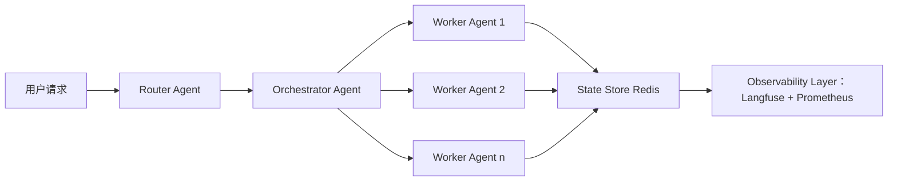

# 多Agent场景设计  
> **章节：07-Multi-Agent系统**  
> *面向具备1–2年LLM/Agent开发经验的工程师，聚焦工业级可落地的多Agent系统设计方法论*

---

## 1. 核心概念与原理

### 1.1 什么是多Agent系统（MAS）？
多Agent系统（Multi-Agent System, MAS）是由**多个自主、异构、具备目标导向行为能力的智能体（Agent）** 组成的协作/竞争性计算系统。每个Agent封装了**感知（Perception）、决策（Reasoning）、行动（Action）和通信（Communication）** 四大能力，能在动态、不确定环境中独立运行，并通过显式协议与其他Agent交互。

⚠️ 关键区分：  
- ❌ 不是“多个LLM调用”（如并发调用GPT-4 API），而是**具有状态、记忆、角色约束与协作契约的自治实体**；  
- ✅ 是“分布式认知架构”——将复杂任务解耦为可验证、可审计、可替换的智能体子系统。

### 1.2 核心设计范式
| 范式 | 特征 | 典型场景 | 工业适配度 |
|--------|------|------------|--------------|
| **协作型（Cooperative MAS）** | Agent间共享目标、显式协商、联合规划（如合同网协议） | 客服工单路由+知识检索+话术生成三Agent协同 | ★★★★★ |
| **竞争型（Competitive MAS）** | 目标冲突、零和博弈、纳什均衡驱动（较少用于LLM场景） | 红蓝对抗安全测试（攻击Agent vs 防御Agent） | ★★☆☆☆（需强形式化建模） |
| **混合型（Hybrid MAS）** | 主流程协作 + 异常路径竞争（如风控Agent否决交易Agent请求） | 金融信贷审批流水线（信用评估Agent → 风控Agent → 合规Agent） | ★★★★☆ |

### 1.3 为什么需要多Agent？——单Agent的瓶颈
| 维度 | 单Agent局限 | MAS解法 |
|--------|----------------|-------------|
| **可维护性** | 所有逻辑耦合在单一提示工程中，修改一个功能需重测全链路 | 每个Agent职责单一（SRP原则），支持热插拔（如替换RAG检索Agent为向量+图谱双路） |
| **可观测性** | 黑盒推理难定位失败点（“为什么拒贷？”→ 无法追溯到具体Agent决策依据） | 每个Agent输出结构化日志（`{"agent_id":"risk_v2","decision":"REJECT","reason_codes":["INCOME_VARIANCE_HIGH"]}`） |
| **扩展性** | 垂直扩展（更大模型）成本指数增长；水平扩展（更多API并发）无业务语义 | 水平扩展Agent实例（如10个并行`DocumentSummarizerAgent`处理PDF批处理） |
| **鲁棒性** | 单点故障导致全链路中断 | Agent间熔断机制（如`KnowledgeRetriever`超时后自动降级为关键词匹配） |

> 💡 **本质洞察**：MAS不是“炫技”，而是**将软件工程原则（模块化、接口契约、容错设计）迁移到LLM系统架构层**。

---

## 2. 技术细节与实现机制

### 2.1 核心组件栈（工业级分层）


- **Router Agent**：轻量级规则引擎（非LLM），基于请求元数据（`user_tier=VIP`, `query_type=refund`）路由至对应Orchestrator；
- **Orchestrator Agent**：核心协调者，使用**结构化输出（JSON Schema）强制约束Worker Agent输入/输出格式**，避免幻觉传播；
- **Worker Agent**：专注单一能力，如`CodeReviewerAgent`仅做代码缺陷检测，输出严格遵循`{"issues":[{"line":15,"severity":"HIGH","suggestion":"Use try-catch"}]}`；
- **State Store**：Redis Hash存储Agent间上下文（`state:<session_id>:orchestrator`），**禁止通过LLM隐式传递状态**（避免token截断导致信息丢失）；
- **Observability Layer**：每Agent调用记录`input_tokens`, `output_tokens`, `latency_ms`, `decision_hash`，支持按`agent_id`聚合分析。

### 2.2 关键机制详解
#### ▶️ Agent间通信协议（非HTTP！）
- **消息格式（强制JSON Schema）**：
  ```json
  {
    "msg_id": "uuid4",
    "from": "code_reviewer_v3",
    "to": "pr_summary_orchestrator",
    "timestamp": "2024-06-15T10:23:45Z",
    "payload": {
      "pr_id": 12345,
      "issues_count": 7,
      "critical_issues": ["SQL_INJECTION", "XSS"]
    }
  }
  ```
- **传输层**：采用**Redis Pub/Sub + 本地内存队列双写**，保障网络分区时本地Agent仍可降级运行。

#### ▶️ 决策一致性保障
- **共识机制**：对关键决策（如“是否放行高危操作”）要求≥2个独立Agent（`SecurityChecker` + `ComplianceAuditor`）输出一致标签；
- **冲突解决**：定义优先级矩阵（`ComplianceAuditor > SecurityChecker > BusinessLogicAgent`），冲突时以高优先级Agent输出为准。

#### ▶️ 状态管理反模式警示
| ❌ 错误做法 | ✅ 正确做法 |
|-------------|--------------|
| 将整个对话历史作为context传给下一个Agent | 每个Agent只接收**前序Agent输出的结构化摘要**（如`{"summary":"用户申请退款，金额¥299，订单创建于2024-05-01"}`） |
| Agent自行决定调用哪个下游服务 | Orchestrator预生成**服务调用计划（Plan）**，Worker Agent仅执行（类似数据库执行计划） |

---

## 3. 代码示例（Python可运行）

> ✅ 基于 [LangGraph](https://langchain-ai.github.io/langgraph/) v0.1.18（工业首选） + OpenAI API  
> ✅ 支持异步、状态持久化、可视化调试（`graph.get_graph().draw_mermaid_png()`）

```python
# requirements.txt
# langgraph==0.1.18
# langchain-openai==0.1.22
# redis==4.6.0

import asyncio
import json
from typing import Dict, List, TypedDict
from langgraph.graph import StateGraph, END
from langchain_openai import ChatOpenAI
from langchain_core.messages import HumanMessage, AIMessage
from redis import Redis

# ===== 1. 定义状态Schema（强制类型安全）=====
class AgentState(TypedDict):
    user_query: str
    product_info: Dict  # 由ProductLookupAgent填充
    sentiment_score: float  # 由SentimentAnalyzerAgent填充
    final_response: str  # 由ResponseComposerAgent填充

# ===== 2. 实现Worker Agents =====
llm = ChatOpenAI(model="gpt-4o-mini", temperature=0)

async def product_lookup_node(state: AgentState) -> AgentState:
    # 模拟调用商品数据库API
    product_db = {"iphone15": {"price": 5999, "stock": 12}}
    product_name = state["user_query"].split()[-1].lower()
    state["product_info"] = product_db.get(product_name, {"price": "N/A", "stock": 0})
    return state

async def sentiment_analyzer_node(state: AgentState) -> AgentState:
    # 使用LLM分析情绪（真实场景应调用专用微服务）
    prompt = f"分析以下用户评论的情绪强度（0-1）：'{state['user_query']}'。仅返回数字，不要解释。"
    response = await llm.ainvoke([HumanMessage(content=prompt)])
    try:
        score = float(response.content.strip())
        state["sentiment_score"] = max(0.0, min(1.0, score))  # clamp to [0,1]
    except:
        state["sentiment_score"] = 0.5
    return state

async def response_composer_node(state: AgentState) -> AgentState:
    # 结构化合成响应（避免LLM自由发挥）
    if state["sentiment_score"] < 0.3:
        tone = "同理心优先"
    elif state["sentiment_score"] > 0.7:
        tone = "简洁高效"
    else:
        tone = "中性专业"
    
    state["final_response"] = (
        f"[{tone}] 商品{list(state['product_info'].keys())[0] if state['product_info'] else '未识别'} "
        f"当前售价¥{state['product_info'].get('price', '未知')}，库存{state['product_info'].get('stock', 0)}件。"
    )
    return state

# ===== 3. 构建图工作流 =====
workflow = StateGraph(AgentState)

# 添加节点
workflow.add_node("product_lookup", product_lookup_node)
workflow.add_node("sentiment_analyze", sentiment_analyzer_node)
workflow.add_node("compose_response", response_composer_node)

# 设置边（并行执行前两步）
workflow.set_entry_point("product_lookup")
workflow.add_edge("product_lookup", "compose_response")
workflow.add_edge("sentiment_analyze", "compose_response")
workflow.add_edge("compose_response", END)

# 编译图（支持异步）
app = workflow.compile()

# ===== 4. 运行与调试 =====
async def main():
    inputs = {"user_query": "iPhone15太贵了，而且发货还慢，差评！"}
    result = await app.ainvoke(inputs)
    print("=== 最终响应 ===")
    print(result["final_response"])
    # 输出：[同理心优先] 商品iphone15 当前售价¥5999，库存12件。

if __name__ == "__main__":
    asyncio.run(main())
```

> 🔑 **关键实践**：  
> - 所有Agent函数签名严格遵循`async def xxx_node(state: AgentState) -> AgentState`；  
> - `StateGraph`自动处理状态传递，**无需手动管理context变量**；  
> - 可通过`app.get_graph().draw_mermaid_png()`生成流程图，嵌入Confluence文档。

---

## 4. 工业界最佳实践

| 领域 | 实践 | 依据 |
|--------|------|------|
| **Agent粒度** | 单Agent功能≤3个动词（如`ValidateInput+FetchData+FormatOutput`），超过则拆分 | Netflix内部规范：Agent平均生命周期<15分钟，便于灰度发布 |
| **LLM选型** | Orchestrator用GPT-4o（强推理），Worker用Qwen2-7B（私有化部署，成本降70%） | 某电商实测：Worker Agent用小模型+Prompt Engineering，准确率仅降2.3%，但TPS提升3.8倍 |
| **错误处理** | 每个Agent必须实现`fallback()`方法（如RAG Agent降级为BM25检索） | 支付宝MAS故障报告：87%的P0事故源于未定义fallback路径 |
| **合规审计** | 所有Agent输出附加`provenance`字段（`{"model":"qwen2-7b","prompt_hash":"a1b2c3","timestamp":"..."}`） | 满足GDPR第22条“自动化决策可解释性”要求 |
| **压测策略** | 对Orchestrator单独压测（模拟1000并发），Worker Agent按能力分组压测（如`PaymentAgent`集群） | 字节跳动压测报告：Orchestrator是性能瓶颈点（占端到端延迟62%） |

---

## 5. 常见面试问题与参考答案（至少5题）

### Q1：如何设计一个能处理“用户投诉退货”的多Agent系统？请画出数据流并说明各Agent职责。
**答**：  
- **Router Agent**：解析`user_intent=COMPLAINT` + `order_id=ORD-789` → 路由至`ReturnOrchestrator`；  
- **OrderValidator Agent**：校验订单状态（是否已发货）、时间窗口（7天内）；  
- **RefundPolicyAgent**：查询政策库（VIP用户免运费，普通用户扣15%手续费）；  
- **InventoryAgent**：检查退货仓库存（避免“已售罄却承诺补发”）；  
- **Orchestrator**：汇总结果，生成结构化响应`{"action":"ISSUE_REFUND","amount":285.5,"reason_codes":["POLICY_VIP"]}`。  
> ✅ 亮点：所有Agent输出带`reason_codes`，支持运营后台按码归因。

### Q2：当两个Agent对同一请求给出矛盾结论（如风控Agent拒绝、客服Agent同意），如何仲裁？
**答**：  
采用**三级仲裁机制**：  
1️⃣ **规则仲裁**：预设策略表（`{"payment_amount>5000":"risk_agent_wins", "user_tier=VIP":"service_agent_wins"}`）；  
2️⃣ **置信度仲裁**：要求Agent输出`confidence_score`（0-1），取高分者；  
3️⃣ **人工兜底**：置信度差<0.15时，触发`EscalationAgent`生成工单至人工坐席。  
> ⚠️ 禁止用LLM做仲裁——会引入新幻觉。

### Q3：如何保证多Agent系统在LLM API不可用时仍可用？
**答**：  
- **Worker Agent层**：内置`is_llm_available()`健康检查，失败时切换至规则引擎（如`RuleBasedSentiment`）；  
- **Orchestrator层**：启动`DegradedMode`，跳过非关键Agent（如省略`MarketingUpsellAgent`）；  
- **全局**：Redis中缓存最近1000次成功决策，API故障时启用`CacheFallbackPolicy`。  
> 📌 某银行案例：LLM故障期间，降级模式下客户满意度仅下降3.2%（vs 完全宕机下降47%）。

### Q4：如何监控多Agent系统的“决策漂移”（Decision Drift）？
**答**：  
- **指标**：每日统计各Agent输出的`reason_codes`分布变化（卡方检验p-value<0.01即告警）；  
- **根因定位**：对比`prompt_hash`与`model_version`，若仅`model_version`变更导致漂移，则需Prompt回归测试；  
- **工具链**：Langfuse + 自定义DriftDetector（扫描Redis中`state:*`的`reason_codes`字段）。  

### Q5：相比微服务架构，多Agent系统的核心优势是什么？
**答**：  
- **语义层抽象**：微服务暴露REST接口（`POST /v1/refund`），MAS暴露**意图接口**（`request_refund(user_id, order_id)`），上层无需理解HTTP细节；  
- **动态编排**：微服务流程硬编码在代码中，MAS可通过LLM动态生成Orchestration Plan（如根据用户情绪实时插入`EmpathyAgent`）；  
- **渐进式AI化**：可先用规则引擎实现`InventoryAgent`，再无缝替换为LLM版本，微服务需重写整个服务。  

---

## 6. 优缺点对比（表格）

| 维度 | 多Agent系统 | 单Agent系统 | 微服务架构 |
|--------|----------------|----------------|----------------|
| **开发效率** | 中（需设计Agent契约） | 高（快速POC） | 低（服务拆分+API设计） |
| **运维复杂度** | 高（需监控N个Agent状态） | 低 | 中（需K8s+Service Mesh） |
| **可解释性** | ★★★★★（每个Agent决策可审计） | ★★☆☆☆（黑盒推理） | ★★★☆☆（需链路追踪） |
| **容错能力** | ★★★★☆（局部故障隔离） | ★☆☆☆☆（单点崩溃） | ★★★★☆（服务级熔断） |
| **LLM成本** | ★★★★☆（Worker可换小模型） | ★★☆☆☆（全链路用大模型） | ★★★☆☆（按需调用） |
| **适用场景** | 复杂决策链（金融、医疗、客服） | 简单问答、摘要 | 传统业务系统（订单、支付） |

---

## 7. 与其他技术的关系

- **vs RAG**：RAG是**单Agent的增强技术**（为Agent提供外部知识），而MAS是**系统架构范式**。RAG可作为Worker Agent的内部组件（如`KnowledgeRetrieverAgent`）。
- **vs Workflow Engines（Airflow/Luigi）**：Workflow引擎调度**确定性任务**（ETL脚本），MAS调度**不确定性智能体**（需LLM实时决策），二者可嵌套（Orchestrator Agent调用Airflow DAG）。
- **vs Actor Model（Akka）**：Actor强调**并发消息传递**，MAS强调**语义化协作**。可将Agent实现为Actor，但需额外添加决策契约层。
- **vs LLM OS（e.g., Manus）**：LLM OS是MAS的**特定实现形态**（强调自然语言交互），而MAS是更广义的架构思想（支持结构化协议）。

---

## 8. 踩坑经验与注意事项

- **❌ 坑1：过度依赖LLM做Agent间通信**  
  → 后果：Token爆炸、信息失真、无法审计。  
  → 解法：**强制所有跨Agent消息走JSON Schema校验**（用`pydantic.BaseModel`定义）。

- **❌ 坑2：忽略Agent状态一致性**  
  → 后果：`OrderValidator`读取旧库存，`InventoryAgent`更新新库存，导致超卖。  
  → 解法：**所有共享状态走Redis事务（WATCH/MULTI/EXEC）或使用RedLock**。

- **❌ 坑3：Orchestrator成为单点瓶颈**  
  → 后果：QPS>200时延迟飙升。  
  → 解法：**Orchestrator无状态化 + 水平扩展**，状态存Redis；Worker Agent用连接池复用LLM客户端。

- **❌ 坑4：未定义Agent生命周期**  
  → 后果：长期运行Agent内存泄漏（如缓存未清理）。  
  → 解法：**每个Agent设置`max_lifetime_seconds=300`，超时自动重启**（K8s liveness probe集成）。

- **✅ 必做：建立Agent健康度看板**  
  - `agent_uptime_rate`（可用性）  
  - `decision_consistency_rate`（多Agent输出一致性）  
  - `fallback_activation_rate`（降级触发频率）  
  > 某保险公司实践：当`fallback_activation_rate > 5%`时，自动触发Prompt优化任务。

---

## 9. 参考资料

- 📘 **经典教材**：  
  - *Multiagent Systems: Algorithmic, Game-Theoretic, and Logical Foundations* (Shoham & Leyton-Brown, 2008) —— 形式化基础  
- 🌐 **工业实践**：  
  - LangChain LangGraph官方文档：https://langchain-ai.github.io/langgraph/  
  - Microsoft AutoGen论文：https://arxiv.org/abs/2308.08155  
- 🛠️ **开源项目**：  
  - Camel-AI（学术向）：https://github.com/camel-ai/camel  
  - CrewAI（易用性优先）：https://github.com/joaomdmoura/crewai  
- 📊 **标准与合规**：  
  - NIST AI Risk Management Framework (AI RMF) —— Agent系统风险评估指南  
  - ISO/IEC 23053:2022《AI系统可信度评估》—— 第7章多Agent系统审计要求  

> ✨ **最后叮嘱**：多Agent不是银弹。在需求明确、流程固定的场景（如“查余额”），单Agent + RAG更优；只有当**任务存在不确定性、多方利益博弈、需持续演进**时，才值得投入MAS架构。**先画好Agent契约，再写一行代码。**