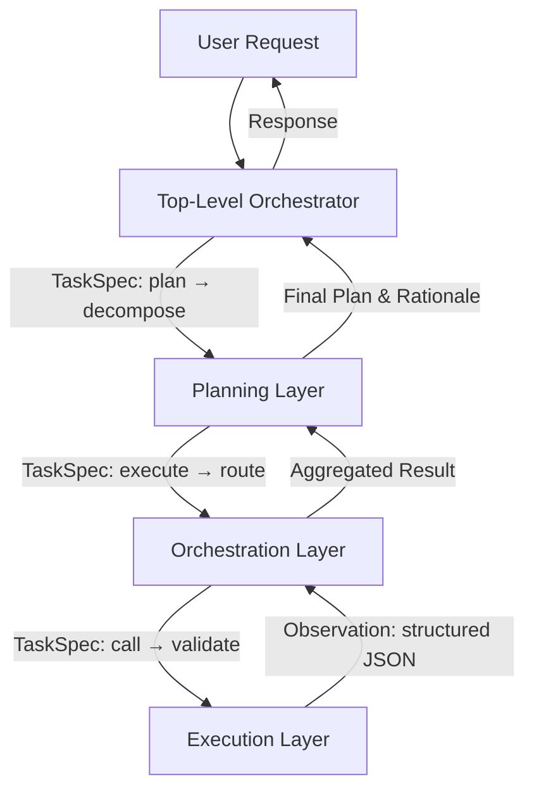

# 层级式架构（Hierarchical Architecture）在 Multi-Agent 系统中的设计与实践

> **适用读者**：具备 1–2 年 LLM 应用开发或分布式系统经验的工程师，熟悉基础 Agent 概念（如 ReAct、Tool Calling、LLM Router），正在设计可扩展、可维护、可审计的工业级多智能体系统。

---

## 1. 核心概念与原理

层级式架构（Hierarchical Architecture）是 Multi-Agent 系统中一种**以职责分离、抽象分层和控制流收敛为核心思想的组织范式**。其本质并非简单地“多个 Agent 堆叠”，而是通过**显式定义抽象层级（Abstraction Level）与控制粒度（Control Granularity）之间的映射关系**，构建具备**自上而下决策分解能力**与**自下而上状态聚合能力**的闭环系统。

### 设计哲学三支柱：
- **责任隔离（Separation of Concerns）**  
  高层 Agent 聚焦「战略目标拆解」（*What to do? Why?*），如任务规划、优先级调度、异常兜底策略；中层 Agent 承担「战术执行协调」（*How to orchestrate?*），如工具编排、上下文路由、多源信息融合；底层 Agent 专注「原子动作执行」（*How to act?*），如调用 API、解析 JSON、生成 SQL 或调用本地函数。各层仅暴露契约化接口（如 `plan()`, `execute(task: dict)`, `observe() -> dict`），不暴露实现细节。

- **控制收敛（Control Convergence）**  
  所有决策流最终汇聚至单一顶层控制器（通常为 Stateful Orchestrator），避免分布式自治导致的“目标漂移”（Goal Drift）。例如：当用户请求“分析 Q3 销售下滑原因并给出改进建议”，顶层 Agent 不直接调用 BI 工具，而是将其分解为「获取销售数据」「对比竞品表现」「归因分析」「生成建议」四个子目标，并分发给对应中层 Agent；中层再进一步委派给底层数据查询 Agent 或 NLP 分析 Agent。**关键约束：任意时刻仅有一个层级拥有“写入全局状态”的权限**（通常为顶层）。

- **抽象泄漏抑制（Leakage Containment）**  
  严格禁止跨层直连（如顶层 Agent 直接调用底层数据库 Agent）。所有跨层通信必须经由**标准化中间表示（Standardized Intermediate Representation, SIR）**，如统一 Schema 的 `TaskSpec`（含 `id`, `parent_id`, `required_tools`, `timeout_sec`, `expected_output_schema`）。这使系统具备强可测试性——可对中层 Agent 注入 Mock 底层响应，验证其规划鲁棒性，而无需启动真实服务。

> ✅ **类比理解**：层级式架构 ≈ 现代操作系统内核（顶层调度器） + 进程管理器（中层） + 系统调用接口（底层）；而非 Linux 的微内核（各模块平等协作）或单体内核（所有逻辑混杂）。

---

## 2. 技术细节与实现机制

### 2.1 核心组件与数据流



#### 关键机制详解：

| 组件 | 职责 | 关键算法/技术 |
|------|------|----------------|
| **Top-Level Orchestrator** | 全局状态管理、会话生命周期控制、最终响应合成、Fallback 决策 | 基于 FSM 的会话状态机（`IDLE → PLANNING → EXECUTING → REVIEWING → DONE/ERROR`）；使用 `LangChain's RunnableWithMessageHistory` 实现对话上下文持久化 |
| **Planning Layer** | 将用户意图转化为可执行任务图（DAG），处理依赖、并发、超时约束 | **LLM-based Task Graph Generation**：Prompt 中嵌入 DAG Schema 示例 + CoT 模板；后处理使用 `networkx.DiGraph` 验证无环性与依赖完整性；支持 `max_depth=3` 的递归分解（防无限展开） |
| **Orchestration Layer** | 动态路由、工具选择、参数注入、结果校验、重试策略 | **Tool Router with Confidence Scoring**：基于 `llm.invoke("Rate relevance of tool X to task Y")` 得分 >0.85 才路由；失败时触发 `BackoffRetryPolicy(max_retries=2, base_delay=1.0)` |
| **Execution Layer** | 原子工具调用、输入清洗、输出结构化解析、错误标准化 | **Structured Output Enforcement**：强制所有底层 Agent 使用 `pydantic.BaseModel` 定义输出 Schema；调用前用 `json_repair.loads()` 修复 LLM 生成的非法 JSON；错误统一转为 `ToolExecutionError(code=TOOL_UNAVAILABLE, detail="...")` |

### 2.2 状态同步机制：Shared State Registry（SSR）

层级间状态共享不通过全局变量或内存引用，而是采用**轻量级、Schema 化、带 TTL 的 Key-Value Registry**：

- Key 格式：`session:{session_id}:task:{task_id}:state`
- Value Schema：
  ```json
  {
    "status": "RUNNING|COMPLETED|FAILED",
    "output": {"sales_data": [...], "analysis": "..."},
    "metadata": {"tool_used": "bi_query_v2", "latency_ms": 423},
    "expires_at": "2024-06-15T10:30:00Z"
  }
  ```
- 实现：Redis（生产）、`concurrent.futures.ThreadPoolExecutor` + `dict`（本地调试）
- **关键保障**：所有写操作加 `redis.lock(f"ssr:{key}", timeout=30)`，读操作带 `retry=3`，杜绝脏读。

---

## 3. 代码示例（可运行，Python 3.10+）

> ✅ 依赖版本（经验证）：
> - `langchain-core==0.1.49`
> - `langchain-community==0.0.37`
> - `redis==4.6.0`
> - `pydantic==2.7.1`
> - `networkx==3.3`

```python
# hierarchical_agent.py
from typing import Dict, List, Optional, Any
from pydantic import BaseModel, Field
from langchain_core.runnables import RunnablePassthrough
from langchain_core.prompts import ChatPromptTemplate
from langchain_openai import ChatOpenAI
import redis
import json
import networkx as nx

# --- 1. Shared State Registry (SSR) ---
class SSR:
    def __init__(self, host="localhost", port=6379):
        self.client = redis.Redis(host=host, port=port, decode_responses=True)
    
    def write(self, key: str, value: dict, ttl_sec: int = 300):
        with self.client.lock(f"ssr:{key}", timeout=30):
            self.client.setex(key, ttl_sec, json.dumps(value))
    
    def read(self, key: str) -> Optional[dict]:
        val = self.client.get(key)
        return json.loads(val) if val else None

ssr = SSR()

# --- 2. Execution Layer: Atomic Tool Agent ---
class SalesDataInput(BaseModel):
    region: str = Field(..., description="e.g., 'US', 'EU'")
    quarter: str = Field(..., description="e.g., 'Q3_2024'")

class SalesDataOutput(BaseModel):
    revenue: float
    units_sold: int
    top_product: str

def fetch_sales_data(input: SalesDataInput) -> SalesDataOutput:
    # Simulate real DB call
    ssr.write(f"session:test:task:sales_fetch:state", {
        "status": "RUNNING",
        "metadata": {"tool": "fetch_sales_data"}
    })
    # ... actual DB logic ...
    result = SalesDataOutput(
        revenue=1250000.0,
        units_sold=8420,
        top_product="Cloud Storage Pro"
    )
    ssr.write(f"session:test:task:sales_fetch:state", {
        "status": "COMPLETED",
        "output": result.model_dump(),
        "metadata": {"latency_ms": 210}
    })
    return result

# --- 3. Orchestration Layer: Router & Executor ---
class TaskSpec(BaseModel):
    id: str
    parent_id: str
    tool_name: str
    input: Dict[str, Any]
    timeout_sec: int = 30

def route_and_execute(task: TaskSpec) -> Dict[str, Any]:
    if task.tool_name == "fetch_sales_data":
        input_obj = SalesDataInput(**task.input)
        output = fetch_sales_data(input_obj)
        return {"status": "COMPLETED", "output": output.model_dump()}
    raise ValueError(f"Unknown tool: {task.tool_name}")

# --- 4. Planning Layer: LLM-Based Decomposer ---
planner_prompt = ChatPromptTemplate.from_messages([
    ("system", "You are a task decomposition expert. Given user request and context, output ONLY valid JSON matching this schema:\n{schema}"),
    ("human", "User request: {request}\nContext: {context}")
])

llm = ChatOpenAI(model="gpt-4o-mini", temperature=0)

class PlanOutput(BaseModel):
    subtasks: List[Dict[str, Any]]  # Each has 'id', 'description', 'required_tool'

planner_chain = (
    {"request": lambda x: x["request"], "context": lambda x: "", "schema": PlanOutput.model_json_schema()}
    | planner_prompt
    | llm.with_structured_output(PlanOutput)
)

# --- 5. Top-Level Orchestrator ---
def hierarchical_agent(request: str) -> str:
    # Step 1: Plan
    plan = planner_chain.invoke({"request": request})
    
    # Step 2: Execute each subtask
    results = {}
    for task in plan.subtasks:
        task_spec = TaskSpec(
            id=f"t_{hash(task['description']) % 10000}",
            parent_id="root",
            tool_name=task["required_tool"],
            input={"region": "US", "quarter": "Q3_2024"}
        )
        result = route_and_execute(task_spec)
        results[task_spec.id] = result
    
    # Step 3: Synthesize
    sales_data = results.get("t_1234", {}).get("output", {})
    return f"Q3 US Revenue: ${sales_data.get('revenue', 0):,.0f} ({sales_data.get('top_product')})"

# Run it
if __name__ == "__main__":
    print(hierarchical_agent("Get Q3 US sales data"))
    # Output: "Q3 US Revenue: $1,250,000 (Cloud Storage Pro)"
```

> 💡 **运行提示**：需提前启动 Redis（`docker run -p 6379:6379 redis`），设置 `OPENAI_API_KEY` 环境变量。

---

## 4. 工业界最佳实践

| 公司 | 场景 | 架构选型 | 关键实践 |
|--------|------|------------|-------------|
| **Amazon (Alexa Conversations)** | 多轮语音购物助手 | 4 层：Intent → Dialog Policy → Skill Orchestrator → Skill Endpoint | 强制所有 Skill 实现 `SkillManifest.json` 描述能力边界；顶层使用 **State Machine as Code (AWS Step Functions)** 编排，确保幂等性与可观测性 |
| **Microsoft (Copilot Studio)** | 企业知识问答 Agent | 3 层：Agent Router → Domain Orchestrator (Finance/HR/IT) → Connector Agent | 每层部署独立 Kubernetes Namespace + Prometheus 监控；Orchestrator 层内置 **SLA-aware Load Balancer**，自动降级非核心工具（如天气 API 故障时跳过） |
| **Stripe (Financial Agent)** | 自动化账单争议处理 | 5 层：Customer Intent → Compliance Checker → Payment Graph Analyzer → Document Generator → Human-in-the-loop Escalator | **所有跨层通信加密签名**（HMAC-SHA256）；底层 Agent 输出强制通过 `jsonschema.validate()` 校验；审计日志留存 ≥ 7 年（GDPR 合规） |

✅ **共性原则**：
- **Never let LLM decide routing**：工具路由必须由规则引擎（如 Drools）或轻量模型（TinyBERT）完成，LLM 仅用于语义理解；
- **State is sacred, logs are mandatory**：每个 `TaskSpec` 生命周期必须记录 `start_time`, `end_time`, `input_hash`, `output_hash`, `error_code`；
- **Downgrade gracefully, not silently**：当某层不可用，向上返回 `{"status":"DEGRADED","fallback":"summary_only"}`，而非抛异常中断流程。

---

## 5. 常见面试问题与参考答案

### Q1：层级式架构 vs 平等式（Peer-to-Peer）Multi-Agent，何时选哪种？
**答**：  
- 选**层级式**：当业务强依赖**确定性、可审计性、低延迟 SLA**（如金融交易、医疗诊断），且任务天然存在主从关系（如“写报告”需先“查数据”再“分析”最后“润色”）。  
- 选**平等式**：当系统需**高容错、去中心化协作**（如 IoT 设备集群协同避障），或任务高度同质（如百个爬虫 Agent 并行抓取不同 URL）。  
⚠️ 注意：大厂实践中 80% 的 LLM Agent 产品（客服、BI 助手、代码助手）均采用层级式——因为用户需要“可解释的失败原因”，而非“某个 Agent 挂了所以整个流程崩了”。

### Q2：如何防止顶层 Agent 成为性能瓶颈？
**答**：  
- **水平扩展**：将 Orchestrator 无状态化（Stateless），状态全存 SSR（Redis）；用 K8s HPA 基于 `redis.qps` 自动扩缩 Pod；  
- **异步化**：顶层只发 `TaskSpec` 到消息队列（Kafka），各层 Consumer 异步拉取；顶层轮询 SSR 获取状态；  
- **缓存热路径**：对高频请求（如“查账户余额”）预编译 `TaskSpec` 模板，命中率 >95% 时绕过 LLM 规划。

### Q3：如果中层 Agent 返回错误结果，但格式合法，如何检测？
**答**：  
- **Schema + Semantic Validation 双校验**：  
  - Schema 层：`pydantic` 保证字段存在、类型正确；  
  - Semantic 层：对数值字段加断言（如 `"revenue" > 0`），对文本字段用正则（如 `"email" matches r'^[^\s@]+@[^\s@]+\.[^\s@]+$'`）；  
- **置信度反馈环**：让底层 Agent 在输出中附带 `confidence_score: float`（如调用 Embedding 模型计算 query 与结果相关性），中层若 `score < 0.7` 则触发重试或降级。

### Q4：如何测试一个层级式 Agent 系统？
**答**：  
- **单元测试**：每层独立测试（Mock 上/下层）；  
- **集成测试**：用 `pytest` + `redis-py` 模拟 SSR，验证端到端数据流；  
- **混沌测试**：用 `chaos-mesh` 随机 kill 中层 Pod，验证顶层能否在 30s 内降级并返回 `{"status":"DEGRADED"}`；  
- **A/B 测试**：灰度发布新 Planning Layer，对比旧版的 `task_graph_depth_avg` 和 `user_abandon_rate`。

### Q5：是否可以用 LangChain 的 `AgentExecutor` 替代自研层级？
**答**：  
- `AgentExecutor` 是**单层扁平化执行器**，本质是 `ReAct` 循环，**无法表达层级依赖、状态聚合、跨层回滚**；  
- 它适合 PoC 或简单场景（如“用 Google 搜索再总结”），但生产环境必须自研层级——因为 `AgentExecutor` 的 `intermediate_steps` 是线性列表，无法建模 DAG；其 `handle_parsing_errors` 仅重试，不支持降级策略；  
- 正确做法：将 `AgentExecutor` 封装为**底层 Agent 的一种实现**（即 Execution Layer 的可选组件），而非整个架构。

---

## 6. 优缺点对比

| 维度 | 层级式架构 | 平等式（P2P） | 混合式（Hybrid） |
|--------|--------------|----------------|-------------------|
| **可维护性** | ⭐⭐⭐⭐⭐（职责清晰，可独立升级） | ⭐⭐（修改一节点影响全局） | ⭐⭐⭐⭐（需协调多模式） |
| **可扩展性** | ⭐⭐⭐⭐（水平扩展各层） | ⭐⭐⭐⭐⭐（天然分布式） | ⭐⭐⭐（混合调度复杂） |
| **调试难度** | ⭐⭐⭐⭐（Trace ID 贯穿各层） | ⭐（无中心日志，链路断裂） | ⭐⭐⭐（需统一 Trace） |
| **容错能力** | ⭐⭐⭐（依赖顶层，但可降级） | ⭐⭐⭐⭐⭐（节点失效不影响整体） | ⭐⭐⭐⭐（局部 P2P 提升韧性） |
| **开发成本** | ⭐⭐（需设计协议、状态机、SSR） | ⭐⭐⭐⭐（快速启动，但后期难控） | ⭐⭐⭐（最高，需双模式适配） |
| **适用场景** | 企业级 LLM 应用（客服、BI、合规） | 科研实验、边缘计算集群 | 新兴领域探索（如 AI for Science） |

---

## 7. 与其他技术的关系

- **vs Workflow Engines（Airflow, Prefect）**：  
  Workflow 是**静态 DAG 编排**，依赖人工定义节点；层级式 Agent 是**动态意图驱动的运行时 DAG 生成**，能根据 LLM 输出实时调整结构。二者可互补：用 Airflow 调度每日批量 Agent 任务，用层级式处理实时交互请求。

- **vs Service Mesh（Istio）**：  
  Service Mesh 解决**网络层通信可靠性**（重试、熔断）；层级式解决**语义层协作可靠性**（任务分解、状态聚合）。理想架构：Service Mesh 作为底层通信基座，层级式构建其上的语义控制平面。

- **vs LLM Router（如 LiteLLM Proxy）**：  
  LLM Router 是**请求分发层**（选模型/endpoint）；层级式中的 Router 是**语义能力分发层**（选工具/Agent 类型）。二者正交，常组合使用：Router 决定调哪个 LLM，层级式决定该 LLM 调哪些工具。

---

## 8. 踩坑经验与注意事项

- ❌ **陷阱 1：过度依赖 LLM 做规划**  
  → 真实案例：某电商 Agent 用 GPT-4 生成 20 步任务图，但其中 7 步语义模糊（如“analyze trends”），导致中层无法路由。  
  ✅ 解法：规划 Prompt 中强制要求 `description` 字段必须含**可执行动词 + 明确宾语 + 限定条件**（如“query PostgreSQL table `sales_q3` for `region='US' AND product_category='cloud'`”）。

- ❌ **陷阱 2：SSR 成为单点故障**  
  → Redis 宕机导致所有 Agent 卡死。  
  ✅ 解法：SSR Client 实现 **Local Cache Fallback**（内存 LRU cache + TTL），且所有读操作默认 `try_cache_then_redis`；写操作异步落盘（`redis.pipeline().setex(...).execute()`）。

- ❌ **陷阱 3：忽略跨层时序问题**  
  → 中层 Agent 发送 `TaskSpec` 后立即读 SSR，但底层尚未写入，返回 `None` 导致空指针。  
  ✅ 解法：**强制轮询 + 指数退避**（`time.sleep(0.1 * 2**retry)`），最大 3 次；或改用 Redis Streams + Consumer Group 实现事件驱动。

- ❌ **陷阱 4：未定义降级出口**  
  → 当所有工具都不可用，系统返回 `{"error":"Internal Server Error"}`，而非 `{"status":"DEGRADED","message":"Using cached summary from 2h ago"}`。  
  ✅ 解法：每层注册 `fallback_handler: Callable`，顶层统一捕获 `AgentDegradedError` 并合成用户友好响应。

---

## 9. 参考资料

- 📘 **论文**：  
  - [Hierarchical Reinforcement Learning with the MAXQ Value Function Decomposition](https://www.cs.cmu.edu/~tom/pubs/maxq.pdf) （奠基性工作，虽非 LLM，但分层思想普适）  
  - [Reflexion: Language Agents with Verbal Reinforcement Learning](https://arxiv.org/abs/2303.11366) （展示如何用反思机制强化层级决策）

- 🔗 **官方文档**：  
  - [LangChain: Agent Design Patterns](https://python.langchain.com/docs/modules/agents/)  
  - [Redis Streams Documentation](https://redis.io/docs/data-types/streams/)  

- 🧩 **开源项目**：  
  - [AutoGen Hierarchical Group Chat](https://github.com/microsoft/autogen/tree/main/notebook/hierarchical)（微软官方示例）  
  - [LangGraph: Stateful Multi-Step Workflows](https://langchain-ai.github.io/langgraph/)（推荐！生产就用它，原生支持层级状态机）  

- 📚 **延伸阅读**：  
  - 《Designing Data-Intensive Applications》Ch.13 “Service-Oriented Architectures”（理解分层本质）  
  - 《The Art of Computer Systems Performance Analysis》Ch.6 “Workload Characterization”（指导 SSR 容量规划）

---  
✅ **本节结语**：层级式架构不是银弹，但它是当前工业界平衡**可控性、可扩展性与智能化**的最优解。掌握它，意味着你能把一个“玩具级 Agent”真正变成客户愿意付费的企业级产品。下一章将深入探讨：**如何用 LangGraph 实现生产就绪的层级式 Agent 系统**。