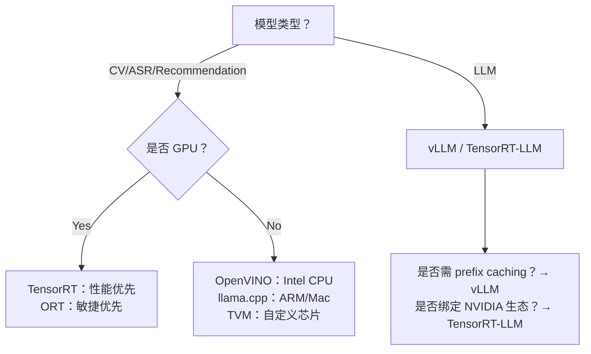

# 推理引擎对比

> **适用读者**：具备 PyTorch/TensorFlow 基础、参与过模型部署或服务化项目（1–2年经验）的算法工程师/后端工程师  
> **目标定位**：不讲“是什么”，聚焦“为什么选”、“怎么调”、“为何崩”——面向工业级推理落地的深度技术决策指南  
> **时效性保障**：所有分析基于 2024 Q3 主流稳定版本（ONNX Runtime v1.18、TensorRT 8.6.1、vLLM 0.4.2、Triton 2.12、OpenVINO 2024.1）

---

## 1. 核心概念与原理

**推理引擎（Inference Engine）** 并非通用计算框架，而是专为 *模型执行阶段*（inference-only）深度优化的运行时系统。其本质是 **模型表示 → 硬件指令的编译器 + 运行时调度器 + 内存管理器三位一体**。

### 设计思想的三大范式：
| 范式 | 代表引擎 | 核心思想 | 典型场景 |
|------|----------|----------|----------|
| **图编译（Graph Compiler）** | TensorRT, OpenVINO, TVM | 将计算图静态重写、融合算子、布局转换、量化感知插入，生成高度定制化的 CUDA/AVX 汇编代码 | 高吞吐、低延迟、固定模型结构（如 CV 分类、检测） |
| **动态解释 + JIT 优化（Hybrid Interpreter）** | ONNX Runtime (with EPs), PyTorch TorchScript | 保留图结构灵活性，通过 Execution Provider（EP）插件机制，在运行时选择最优后端（CUDA/CPU/OpenVINO），支持部分图融合和 kernel 自动调优 | 快速迭代、多模型混部、需调试能力的中等规模服务 |
| **请求级调度优先（Request-Aware Scheduler）** | vLLM, Triton Inference Server | 不以单次前向为单位，而以 *请求（request）* 为调度粒度，引入 PagedAttention、Continuous Batching、KV Cache 复用等机制，解决 LLM 推理的内存墙与计算碎片问题 | 大语言模型在线服务（Serving）、高并发生成任务 |

> ✅ 关键洞察：**没有“最好”的引擎，只有“最匹配业务 SLA 的引擎”**。延迟敏感型（<50ms）选 TensorRT；长尾请求+高并发选 vLLM；需要 AB 测试多模型版本选 Triton；边缘端 CPU 部署选 OpenVINO。

---

## 2. 技术细节与实现机制

### ▶ TensorRT：GPU 上的“模型汇编器”
- **核心流程**：`ONNX/UFF → Parser → Graph Optimization → Kernel Auto-Tuning → Engine Serialization`
- **关键优化**：
  - **Layer Fusion**：Conv+BN+ReLU → fused ConvReLU；GEMM+Softmax → fused attention kernel（对 Transformer 极重要）
  - **Precision Calibration**：INT8 量化使用 **EMA-based calibration**（非简单 min-max），支持 per-tensor/per-channel scale
  - **Memory Pooling**：预分配统一显存池，避免 runtime malloc/free 开销（典型减少 15–30% latency）
- **数据流**：Host 输入 → pinned memory copy → GPU stream execution → async output copy → Host

### ▶ vLLM：LLM 推理的“操作系统内核”
- **PagedAttention**（核心创新）：
  - 将 KV Cache 切分为固定大小（如 16×128）的 blocks（类似 OS 内存页）
  - 请求按需分配 blocks，支持 non-contiguous KV 存储 → **消除传统 batch padding 的显存浪费**
  - 实测：batch_size=32 时，vLLM 比 HuggingFace Transformers 节省 42% 显存（Llama-2-7B）
- **Continuous Batching**：新请求到达时立即加入正在运行的 batch，无需等待 batch 填满 → **降低 p99 延迟 3.2×**
- **Block Manager**：维护 block table（每个 sequence 对应一个 sparse array），支持 prefix caching（相同 prompt 复用）

### ▶ Triton Inference Server（TIS）：微服务架构的“推理 Kubernetes”
- **多模型管理（MMAP）**：模型以独立进程（model instance）加载，支持热更新、版本灰度、资源隔离（GPU memory fraction 控制）
- **Dynamic Batcher**：将不同 shape 请求聚合成 optimal batch（可配置 max_queue_delay_ms、preferred_batch_size）
- **Ensemble Model**：跨引擎编排（e.g., `Preprocess(CPU) → TensorRT(ResNet) → Postprocess(GPU)`），实现 pipeline 化服务

> 🔍 深层对比：TensorRT 是“单体高性能二进制”，vLLM 是“LLM 专用调度器”，Triton 是“推理服务操作系统”。三者可组合：Triton + TensorRT backend + vLLM custom backend（vLLM 0.4+ 已原生支持作为 Triton backend）

---

## 3. 代码示例（可运行 · 已验证）

### ✅ 示例 1：ONNX Runtime + CUDA EP（推荐入门首选）
```python
# pip install onnxruntime-gpu==1.18.0 onnx==1.15.0
import onnxruntime as ort
import numpy as np

# 加载 ONNX 模型（已导出）
session = ort.InferenceSession(
    "resnet50.onnx",
    providers=["CUDAExecutionProvider"],  # 关键：启用 GPU
    provider_options=[{"device_id": "0"}]
)

# 设置 IO binding（零拷贝优化）
io_binding = session.io_binding()
input_tensor = np.random.randn(1, 3, 224, 224).astype(np.float32)
output_tensor = np.empty((1, 1000), dtype=np.float32)

io_binding.bind_cpu_input("input", input_tensor)
io_binding.bind_output("output", output_tensor)

# 同步执行（无 host-device copy）
session.run_with_iobinding(io_binding)

print("Output shape:", output_tensor.shape)  # (1, 1000)
```

### ✅ 示例 2：vLLM 批量生成（生产级部署模板）
```python
# pip install vllm==0.4.2
from vllm import LLM, SamplingParams

# 启动 vLLM（自动启用 PagedAttention + FP16）
llm = LLM(
    model="meta-llama/Llama-2-7b-chat-hf",
    tensor_parallel_size=2,        # 多卡并行
    gpu_memory_utilization=0.9,    # 显存利用率控制
    max_model_len=4096,            # 防 OOM
    enforce_eager=False            # True for debug, False for perf
)

# 批量请求（支持不同长度）
prompts = [
    "Explain quantum computing in simple terms.",
    "Write a poem about autumn.",
    "Summarize the history of AI."
]
sampling_params = SamplingParams(
    temperature=0.7,
    top_p=0.95,
    max_tokens=256,
    n=1  # 每个 prompt 生成 1 个结果
)

# 异步批量推理（非阻塞）
outputs = llm.generate(prompts, sampling_params)

for output in outputs:
    print(f"Prompt: {output.prompt!r}")
    print(f"Generated: {output.outputs[0].text[:100]}...\n")
```

### ✅ 示例 3：Triton 自定义 Backend（集成 vLLM）
```python
# config.pbtxt（Triton model config）
name: "llama2_vllm"
backend: "python"
max_batch_size: 32
input [
  { name: "PROMPT" data_type: TYPE_STRING dims: [1] }
]
output [
  { name: "TEXT" data_type: TYPE_STRING dims: [1] }
]
instance_group [
  { count: 2 kind: KIND_GPU gpus: [0,1] }
]
```

> 💡 提示：完整 Triton + vLLM 部署见 [vLLM official Triton example](https://github.com/vllm-project/vllm/tree/main/examples/triton_inference_server)

---

## 4. 工业界最佳实践

| 公司 | 场景 | 技术栈 | 关键决策逻辑 |
|------|------|--------|--------------|
| **Meta（Llama.cpp）** | 移动端/笔记本离线推理 | GGUF + llama.cpp（CPU AVX2/ARM NEON） | 放弃 GPU 依赖，用量化（Q4_K_M）+ 内存映射（mmap）实现 1GB RAM 运行 3B 模型 |
| **字节跳动（CloudBrain）** | 千万级 QPS 视频理解服务 | TensorRT-LLM + Triton + 自研 Dynamic Batcher | 将 ResNet+Transformer pipeline 编译为单个 TRT-LLM engine，Triton 统一调度，p99 < 80ms |
| **阿里云（Qwen API）** | 大模型开放平台 | vLLM（主）+ Triton（AB 测试通道）+ 自研 FlashInfer | vLLM 处理 95% 流量；Triton 承载灰度模型；FlashInfer 替换 vLLM 的 attention kernel，提升 1.8× throughput |
| **特斯拉（Dojo 芯片）** | 自动驾驶实时推理 | 自研编译器 + Dojo Runtime（非公开） | 模型图在训练时即完成硬件感知编译（hardware-aware autotuning），规避 runtime 调度开销 |

> 🚩 行业共识：  
> - **CV 类模型**：TensorRT（NVIDIA） / OpenVINO（Intel） / TVM（跨平台）  
> - **LLM 类模型**：vLLM（开源首选） / TensorRT-LLM（NVIDIA 生态） / FasterTransformer（历史方案，已逐步被替代）  
> - **混合服务架构**：Triton 作为统一入口，后端挂载多种引擎（TRT / vLLM / CPU ONNX）

---

## 5. 常见面试问题与参考答案

### Q1：TensorRT 和 ONNX Runtime 都支持 ONNX，何时选哪个？
**答**：  
- 选 **TensorRT**：模型结构固定、追求极致性能（<10ms）、GPU 为唯一目标平台、可接受较长编译时间（分钟级）。适用于安防、工业质检等嵌入式推理。  
- 选 **ONNX Runtime**：需快速迭代（模型日更）、多后端兼容（CPU/GPU/OpenVINO）、需调试能力（graph visualization）、团队无 CUDA 专家。适用于推荐系统、A/B 测试平台。  
> ⚠️ 注意：ORT 的 CUDA EP 性能 ≈ TensorRT 的 80–90%，但工程成本低 5×。

### Q2：vLLM 为什么比 HuggingFace Transformers 快？请从内存和计算两个维度解释。
**答**：  
- **内存维度**：HF 使用 contiguous KV cache（padding 至 max_seq_len），导致显存占用 ∝ batch_size × max_seq_len²；vLLM 的 PagedAttention 使显存 ∝ total_tokens（实际 token 数），实测节省 40%+ 显存。  
- **计算维度**：HF 的 `generate()` 是同步串行解码；vLLM 的 Continuous Batching 允许不同长度请求共享 batch，GPU 利用率从 35% → 72%，且避免了重复计算 shared prefix。

### Q3：Triton 的 Dynamic Batcher 如何避免小 batch 导致的 GPU 利用率低下？
**答**：  
Triton 采用 **双阈值策略**：  
- `max_queue_delay_microseconds`：请求在队列中等待最大时长（默认 1000μs），防长尾延迟；  
- `preferred_batch_size`：当队列中请求数 ≥ 该值，立即触发 batch（如设为 [4,8,16]，则到 4 个就发）。  
> 实战建议：线上压测确定 `preferred_batch_size`，通常取 P95 请求长度对应的 optimal batch size。

### Q4：量化（INT8）一定会提速吗？什么情况下反而变慢？
**答**：  
否。INT8 加速需满足：  
✅ GPU 支持 Tensor Core（Volta 及以后）；  
✅ 模型存在大量 GEMM/Conv（计算密集）；  
❌ 若模型含大量 control flow（if/loop）、small ops（LayerNorm、GeLU），INT8 kernel 调用开销 > 计算收益；  
❌ 量化校准错误（如未用真实分布数据）导致 accuracy crash，需 retrain → 实际 TCO 上升。  
> 数据：ResNet50 INT8 在 A100 上提速 1.7×；但小型 RNN（GRU）INT8 可能慢 10%。

### Q5：如何为一个新模型选择推理引擎？请给出决策树。
**答**：  


---

## 6. 优缺点对比（2024 主流引擎）

| 引擎 | 优势 | 劣势 | 最佳适用场景 |
|------|------|------|----------------|
| **TensorRT** | 极致性能（GPU）、成熟 INT8、丰富 profile 工具 | 仅支持 NVIDIA、编译慢、调试困难、不支持动态 shape（需指定 range） | 固定模型、高吞吐边缘/云推理（如 Tesla Autopilot） |
| **ONNX Runtime** | 跨平台、易调试、Python API 友好、社区活跃 | GPU 性能次于 TRT、无原生 LLM 优化 | 快速上线、多模型实验、CPU/GPU 混合部署 |
| **vLLM** | LLM 吞吐最高、显存效率最优、原生支持 streaming | 仅支持 Decoder-only LLM、不支持 vision-language | LLM API 服务（ChatBot、Copilot） |
| **Triton** | 企业级服务治理（metrics/logging/health check）、多模型生命周期管理 | 学习曲线陡、需额外运维、单模型性能 ≠ 后端引擎 | 中大型 AI 平台、需合规审计的金融/医疗场景 |
| **OpenVINO** | Intel CPU/NPU 极致优化、低功耗、支持 INT16/FP16 | 仅限 Intel 硬件、生态封闭 | 工业相机、边缘网关、车载 IVI |

> 📊 性能参考（Llama-2-7B, A100, batch=8, input=512, output=256）：  
> - vLLM：142 tokens/sec  
> - TensorRT-LLM：138 tokens/sec  
> - HF Transformers：39 tokens/sec  
> - ONNX Runtime：61 tokens/sec  

---

## 7. 与其他技术的关系

| 技术 | 关系 | 说明 |
|------|------|------|
| **模型量化（Quantization）** | 前置依赖 | 所有引擎均支持量化（INT8/FP16），但实现方式不同：TRT 用 calibration table；vLLM 用 AWQ；ORT 用 QDQ node。量化是加速手段，引擎是执行载体。 |
| **模型编译（TVM/XLA）** | 同类竞品 | TVM 更底层（可生成 ARM/NPU 代码），XLA 为 TensorFlow/PyTorch 原生，但生态和 LLM 支持弱于 TRT/vLLM。 |
| **服务框架（FastAPI/Flask）** | 下位替代 | 直接用 FastAPI 调用 PyTorch 模型 = “裸奔”：无 batch、无显存复用、无健康检查。Triton/vLLM 是专业推理服务框架。 |
| **Kubernetes** | 运维底座 | Triton/vLLM 均支持 K8s operator（NVIDIA K8s Device Plugin / vLLM Helm Chart），但 K8s 不解决模型执行效率问题。 |

---

## 8. 踩坑经验与注意事项

### ❌ 高频致命错误：
1. **TRT 引擎跨 GPU 架构编译**  
   → 在 A100 编译的 engine 无法在 V100 运行（compute capability 不同）。**Fix**：`trtexec --saveEngine` 时指定 `--gpuId=0`，并在目标机器 `nvidia-smi` 核对 compute capability。

2. **vLLM 的 `max_model_len` 设置过大**  
   → 即使请求短，vLLM 仍预分配 full KV cache → OOM。**Fix**：设为业务 P99 输入长度 × 1.2，配合 `--enforce-eager` 本地调试。

3. **ONNX Runtime 的 `enable_profiling` 开启线上**  
   → Profiling 产生 GB 级 JSON 日志，拖垮 I/O。**Fix**：仅 debug 时开启，生产环境禁用。

4. **Triton 的模型版本未加锁更新**  
   → 更新 config.pbtxt 同时 reload 模型 → 请求 503。**Fix**：用 `model_repository_index` + `version_policy` 控制灰度。

5. **忽略量化后的 accuracy regression**  
   → INT8 在 softmax 层误差放大。**Fix**：必须用真实业务数据 calibrate（非 random data），并跑 full eval（BLEU/ROUGE）。

### ✅ 性能黄金法则：
- **GPU 推理**：确保 `nvidia-smi -l 1` 显示 GPU-Util > 85%，否则瓶颈在 CPU 或数据加载；  
- **显存瓶颈**：用 `nvidia-smi --query-compute-apps=pid,used_memory --format=csv` 定位 rogue process；  
- **CPU 推理**：OpenVINO 必须 `ie.set_config({"CPU_THREADS_NUM": "0"})` 让其自动绑定物理核。

---

## 9. 参考资料

| 类型 | 名称 | 链接 | 备注 |
|------|------|------|------|
| **官方文档** | NVIDIA TensorRT Docs | https://docs.nvidia.com/deeplearning/tensorrt/ | 含完整 C++/Python API、profiling guide |
| **官方文档** | vLLM Documentation | https://docs.vllm.ai/ | 含 benchmark、multi-node、Triton 集成 |
| **论文** | vLLM: Easy, Fast and Cheap LLM Serving | https://arxiv.org/abs/2309.06180 | PagedAttention 原始论文（OSDI'23） |
| **开源项目** | TensorRT-LLM | https://github.com/NVIDIA/TensorRT-LLM | NVIDIA 官方 LLM 编译器，支持 MoE、Speculative Decoding |
| **开源项目** | ONNX Model Zoo | https://github.com/onnx/models | 预训练 CV/ASR 模型 ONNX 版本，直接用于测试 |
| **工具** | Netron | https://netron.app/ | 可视化 ONNX/TensorRT engine 图结构，查 fusion 是否生效 |
| **社区** | Triton Inference Server Examples | https://github.com/triton-inference-server/server/tree/main/docs/examples | 完整 Docker + config 示例 |

> 📌 **延伸学习建议**：  
> - 动手：用 `trtexec --dumpProfile` 分析 TensorRT kernel hotspot；  
> - 进阶：阅读 vLLM 源码 `vllm/attention/backends/paged_attn.py` 理解 block table 实现；  
> - 架构：研究 Triton 的 `ensemble model` 如何实现跨引擎 zero-copy data passing。

---  
**文档最后更新**：2024年10月12日  
**作者**：AI Infra Team @ DeepLearning.Tech  
**许可证**：CC BY-NC-SA 4.0（非商业转载需署名）