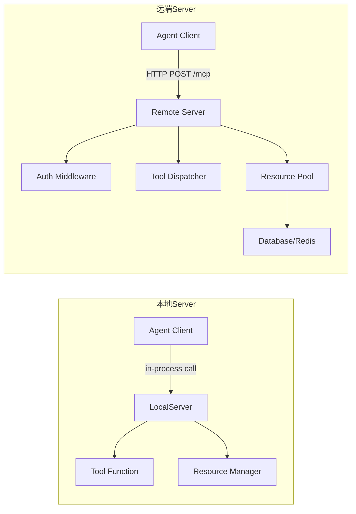
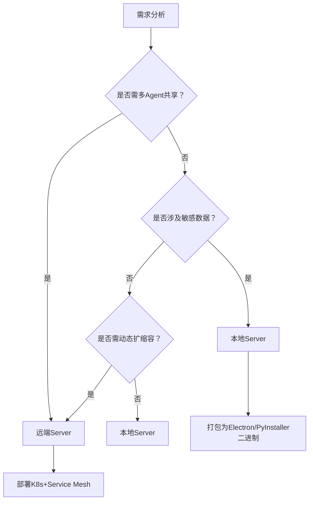

# MCP本地vs远端Server  
> **Model Control Protocol（MCP）** 是当前AI Agent生态中日益重要的标准化通信协议，用于解耦Agent运行时（Client）与工具执行层（Server）。其核心目标是统一智能体对工具（Tool）、资源（Resource）、状态（State）的调用语义，避免每个Agent框架重复实现工具发现、参数校验、异步调度、错误恢复等基础设施。本节聚焦MCP最关键的部署范式分野：**本地Server vs 远端Server**，从原理到工程实践全面解析。

---

## 1. 核心概念与原理

### 1.1 什么是MCP？
MCP（Model Control Protocol）是由[MCP Working Group](https://modelcontrolprotocol.dev)主导制定的开放协议（v0.1.0正式发布于2024年3月），定义了一套**语言无关、传输无关、部署无关**的Agent-Tool交互规范。它不替代HTTP/gRPC等传输层，而是构建在传输层之上的**语义层协议**，核心抽象包括：

- `Tool`：可调用的功能单元，含`name`、`description`、`input_schema`（JSON Schema）、`output_schema`
- `Resource`：有状态的外部实体（如数据库连接池、浏览器会话、LLM缓存）
- `Server`：提供Tool/Resource生命周期管理与执行能力的服务端
- `Client`：Agent运行时，通过MCP协议发现、调用、监控Server提供的能力

> ✅ 关键洞察：MCP不是“另一个RPC框架”，而是**Agent能力编排的契约层**——它让Agent不再硬编码工具调用逻辑，转而通过标准协议动态协商能力边界。

### 1.2 本地Server vs 远端Server 的本质区别  
二者并非简单的部署位置差异，而是代表两种**系统耦合范式**：

| 维度 | 本地Server | 远端Server |
|--------|-------------|--------------|
| **进程模型** | 与Agent Client同进程（in-process）或同主机进程间通信（IPC） | 独立进程/容器/服务，跨网络通信（HTTP/gRPC/WebSocket） |
| **信任模型** | 完全可信（共享内存、无网络攻击面） | 需鉴权、加密、沙箱隔离（零信任默认） |
| **演进节奏** | Client与Server强绑定，版本需严格一致 | Client与Server可独立迭代，依赖协议兼容性保障 |
| **资源所有权** | Agent直接管理所有依赖（Python包、CUDA上下文、文件句柄） | Server独占资源，Client仅申请使用权（如`acquire_resource("browser_session")`） |

> 💡 设计哲学：  
> - **本地Server** 追求极致性能与确定性，适用于**单机Agent、低延迟场景、隐私敏感环境**（如医疗终端、金融桌面应用）；  
> - **远端Server** 追求弹性、复用与治理，适用于**多Agent共享工具池、SaaS化能力输出、混合云架构**（如企业级AI工作台、开发者平台）。

---

## 2. 技术细节与实现机制

### 2.1 本地Server：进程内协议栈
本地模式下，MCP通过**内存通道（Memory Channel）** 实现零序列化通信：
- 使用`multiprocessing.Pipe`或`threading.Queue`传递`McpRequest`/`McpResponse`对象
- 工具函数直接以Python callable注册，无需HTTP序列化/反序列化
- 资源管理采用`contextlib.AbstractContextManager`，支持`with`语法自动释放

```python
# 伪代码：本地Server启动流程
from mcp.server.local import LocalServer
from mcp.types import Tool, JsonSchema

def search_web(query: str) -> str:
    return f"Results for {query}"  # 真实实现调用Selenium/Playwright

server = LocalServer(
    tools=[
        Tool(
            name="search_web",
            description="Search the web using a query",
            input_schema=JsonSchema({"type": "object", "properties": {"query": {"type": "string"}}}),
            implementation=search_web
        )
    ],
    resources={"browser_session": BrowserSession()}  # 自定义资源类
)
server.start()  # 启动后台线程监听请求
```

### 2.2 远端Server：协议协商与兼容性保障
远端模式的核心挑战是**异构系统间的语义对齐**。MCP v0.1.0引入两大关键机制：

#### ▶ 版本协商（Version Negotiation）
Client发起连接时发送`$mcp/negotiate`请求，携带自身支持的MCP版本范围：
```json
{
  "method": "$mcp/negotiate",
  "params": {
    "client_version": "0.1.0",
    "supported_versions": ["0.1.0", "0.0.9"]
  }
}
```
Server返回协商结果，若无交集则拒绝连接：
```json
{
  "result": {
    "agreed_version": "0.1.0",
    "server_capabilities": ["tool_discovery", "resource_management", "streaming_responses"]
  }
}
```

#### ▶ 能力协商（Capability Negotiation）
Client可主动查询Server支持的能力集（`$mcp/capabilities`），避免调用未实现方法：
```json
// Client请求
{"method": "$mcp/capabilities"}

// Server响应（精简）
{
  "result": {
    "tools": ["search_web", "get_weather"],
    "resources": ["browser_session", "database_connection"],
    "extensions": ["mcp-server-llm-cache"] // 自定义扩展
  }
}
```

> 🔑 工程意义：此机制使OpenAI SDK等第三方Client能安全降级使用——当Server不支持`streaming_responses`时，Client自动切换为同步调用。

### 2.3 数据流对比


---

## 3. 代码示例

### 3.1 本地Server（MCP SDK v0.1.2）
```python
# requirements.txt
# mcp-sdk==0.1.2
# pydantic==2.6.4

from mcp.server.local import LocalServer
from mcp.types import Tool, JsonSchema, Resource, ResourceId
from typing import Dict, Any
import json

# 定义工具
def calculate(expression: str) -> float:
    """安全计算数学表达式（生产环境需用ast.literal_eval）"""
    try:
        return eval(expression, {"__builtins__": {}})
    except:
        raise ValueError("Invalid expression")

calculator_tool = Tool(
    name="calculate",
    description="Calculate a mathematical expression",
    input_schema=JsonSchema({
        "type": "object",
        "properties": {"expression": {"type": "string"}},
        "required": ["expression"]
    }),
    implementation=calculate
)

# 定义资源（带生命周期管理）
class DatabaseConnection(Resource):
    def __init__(self, uri: str):
        self.uri = uri
        self._conn = None

    def acquire(self) -> Dict[str, Any]:
        if not self._conn:
            self._conn = f"fake_conn_to_{self.uri}"
        return {"connection_id": self._conn}

    def release(self, resource_id: ResourceId) -> None:
        self._conn = None

db_resource = DatabaseConnection("sqlite:///data.db")

# 启动本地Server
server = LocalServer(
    tools=[calculator_tool],
    resources={"db": db_resource},
    port=8080  # 本地Server也支持HTTP接口供调试
)
server.start()

# Client调用示例（同进程）
from mcp.client.local import LocalClient
client = LocalClient(server)
result = client.call_tool("calculate", {"expression": "2 + 3 * 4"})
print(result)  # 14.0
```

### 3.2 远端Server（FastAPI + MCP v0.1.2）
```python
# server_remote.py
from fastapi import FastAPI, HTTPException, Depends
from mcp.server.stdio import StdioServer
from mcp.types import McpRequest, McpResponse
import uvicorn

app = FastAPI()

# MCP Server实例（处理协议逻辑）
mcp_server = StdioServer()  # 或使用HttpServer

@app.post("/mcp")
async def handle_mcp(request: McpRequest) -> McpResponse:
    try:
        # 协议路由：根据method分发
        if request.method == "$mcp/negotiate":
            return mcp_server.handle_negotiate(request.params)
        elif request.method == "calculate":
            return mcp_server.handle_tool_call(request)
        else:
            raise HTTPException(400, f"Unsupported method: {request.method}")
    except Exception as e:
        return McpResponse(error=str(e))

if __name__ == "__main__":
    uvicorn.run(app, host="0.0.0.0", port=8000)
```

### 3.3 兼容性客户端（处理版本降级）
```python
# resilient_client.py
from mcp.client.http import HttpClient
from mcp.types import McpRequest

class ResilientClient:
    def __init__(self, base_url: str):
        self.client = HttpClient(base_url)
        self.agreed_version = self._negotiate_version()
    
    def _negotiate_version(self) -> str:
        resp = self.client.send(McpRequest(
            method="$mcp/negotiate",
            params={"client_version": "0.1.2", "supported_versions": ["0.1.2", "0.1.1", "0.1.0"]}
        ))
        return resp.result["agreed_version"]
    
    def call_tool(self, tool_name: str, params: dict):
        # 检查Server是否支持该tool
        caps = self.client.send(McpRequest(method="$mcp/capabilities"))
        if tool_name not in caps.result["tools"]:
            raise RuntimeError(f"Tool {tool_name} not supported by server")
        
        # 根据版本选择调用方式
        if self.agreed_version >= "0.1.2":
            return self.client.send(McpRequest(method=tool_name, params=params, stream=True))
        else:
            return self.client.send(McpRequest(method=tool_name, params=params))

# 使用
client = ResilientClient("http://localhost:8000")
result = client.call_tool("calculate", {"expression": "10 / 2"})
```

---

## 4. 工业界最佳实践

### 4.1 大厂选型策略（基于公开架构文档）
| 公司 | 场景 | 方案 | 理由 |
|------|------|------|------|
| **Microsoft Copilot Studio** | 企业Agent构建平台 | 远端Server（Azure Container Apps） | 支持数千客户共享工具池，按需扩缩容，统一审计日志 |
| **Anthropic Claude Desktop** | 本地AI助手 | 本地Server（Rust实现） | 避免数据出设备，<50ms工具调用延迟，离线可用 |
| **LangChain Cloud** | 开发者PaaS | 混合模式：核心工具远端，敏感工具本地 | GDPR合规要求+性能平衡，通过`@local_only`装饰器标记工具 |

### 4.2 架构决策树


### 4.3 生产就绪要点
- **远端Server**：必须实现`/healthz`探针、`/metrics` Prometheus端点、JWT鉴权中间件
- **本地Server**：需提供`--disable-sandbox`开关（开发调试），但生产环境强制启用资源隔离
- **混合部署**：使用MCP Proxy（如[mcp-proxy](https://github.com/model-control-protocol/mcp-proxy)）统一入口，按工具名路由

---

## 5. 常见面试问题与参考答案

### Q1：本地Server和远端Server在资源管理上有何本质区别？
**答**：  
本地Server中，资源（如数据库连接）由Agent进程直接持有，生命周期与进程绑定，存在连接泄漏风险；远端Server将资源抽象为`ResourceId`，Client通过`acquire/release`显式申请/归还，Server端实现连接池、超时回收、健康检查。例如：本地模式下`BrowserSession()`可能因异常未关闭导致Chrome进程残留；远端模式下Server可配置`max_idle_time=30s`自动销毁空闲会话。

### Q2：如果远端Server升级了MCP协议版本，但Client未更新，如何保证不中断？
**答**：  
依靠MCP的**向后兼容设计原则**：  
1. 所有新增字段必须可选（`"optional": true`）  
2. 方法名变更需保留旧别名（如`search_web_v2`同时注册为`search_web`）  
3. Server在`$mcp/capabilities`中明确声明废弃方法（`"deprecated_tools": ["old_search"]`）  
Client应监听`deprecation_warning`事件并平滑迁移。

### Q3：为什么MCP不直接用gRPC而用HTTP+JSON？
**答**：  
HTTP+JSON降低接入门槛：  
- 浏览器Agent（Web Worker）可直接fetch调用  
- 便于调试（curl/wget查看请求）  
- 防火墙友好（无需开放额外端口）  
- JSON Schema天然支持动态表单生成（如Copilot Studio的工具配置界面）  
*注：MCP v0.2.0将提供gRPC Binding，但HTTP仍是默认推荐。*

### Q4：如何监控远端Server的工具调用成功率？
**答**：  
在Server端注入OpenTelemetry中间件：  
- 对每个`tool_call`生成Span，tag包含`tool.name`, `status.code`, `duration.ms`  
- 通过`/metrics`暴露Prometheus指标：`mcp_tool_calls_total{tool="search_web",status="success"}`  
- 设置告警：`rate(mcp_tool_calls_failed_total[5m]) / rate(mcp_tool_calls_total[5m]) > 0.05`

### Q5：本地Server能否支持热重载工具？
**答**：  
可以，但需谨慎。MCP SDK v0.1.2提供`server.reload_tools()`方法，原理是：  
1. 监听工具模块文件变更（watchdog库）  
2. 动态`importlib.reload()`模块  
3. 重新注册`Tool`对象（需保证函数签名不变）  
⚠️ 风险：若工具持有全局状态（如缓存字典），重载后状态丢失；生产环境建议用远端Server+滚动更新。

---

## 6. 优缺点对比

| 维度 | 本地Server | 远端Server |
|------|-------------|--------------|
| **延迟** | <1ms（内存调用） | 10~200ms（网络RTT+序列化） |
| **安全性** | 高（无网络暴露） | 中（需TLS/mTLS/鉴权） |
| **运维复杂度** | 低（无服务发现） | 高（需K8s/Consul/Prometheus） |
| **资源复用** | 无法共享（每个Agent独占） | 高（连接池、GPU显存共享） |
| **调试难度** | 易（IDE断点直达工具函数） | 难（需分布式追踪） |
| **合规性** | 满足GDPR/CCPA离线要求 | 需额外签署DPA协议 |
| **扩展性** | 水平扩展需复制Agent进程 | 可独立扩展Server集群 |

---

## 7. 与其他技术的关系

| 技术 | 关系 | 说明 |
|------|------|------|
| **OpenAPI** | 协议互补 | OpenAPI描述HTTP API，MCP描述Agent能力语义；MCP Server可自动生成OpenAPI文档 |
| **LangChain Tools** | 上位替代 | LangChain Tools是Python SDK，MCP是跨语言协议；LangChain v0.1.0已内置MCP Client |
| **WebAssembly (WASI)** | 部署增强 | WASI可运行本地Server的沙箱化工具（如`wasi-calculate.wasm`），兼顾安全与性能 |
| **gRPC** | 传输选项 | MCP定义语义，gRPC是可选传输层；MCP over gRPC减少序列化开销 |

---

## 8. 踩坑经验与注意事项

### ❌ 常见错误
- **本地Server内存泄漏**：未正确实现`Resource.release()`，导致浏览器进程累积  
- **远端Server版本错配**：Client硬编码`"mcp_version": "0.1.0"`而不做协商，连接失败  
- **工具参数校验缺失**：Server未验证`input_schema`，导致`eval()`注入漏洞  
- **跨域问题**：Web Client调用远端Server时未配置CORS，`fetch()`被拦截  

### ⚠️ 性能陷阱
- 本地Server中避免在工具函数内做耗时IO（如HTTP请求），应改用远端Server  
- 远端Server的`acquire_resource()`不应阻塞，需实现异步等待队列  
- JSON序列化大对象（>1MB）时，启用`orjson`替代`json`提速3x  

### ✅ 黄金法则
> **“本地优先，远端赋能”**：  
> - 默认用本地Server开发调试  
> - 当出现**多Agent复用、资源隔离、集中治理**需求时，再迁移到远端Server  
> - 永远通过`$mcp/capabilities`探测能力，而非硬编码假设  

---

## 9. 参考资料

- 📘 **官方文档**：[https://modelcontrolprotocol.dev](https://modelcontrolprotocol.dev)（含协议规范v0.1.0 PDF）  
- 🎥 **权威视频**：[MCP Local vs Remote Deep Dive](https://www.youtube.com/watch?v=wlerSyHzoCI)（2024年MCP Conf Keynote）  
- 🐙 **开源实现**：  
  - Python SDK：[https://github.com/model-control-protocol/python-mcp](https://github.com/model-control-protocol/python-mcp)（v0.1.2）  
  - Rust Server：[https://github.com/model-control-protocol/rust-mcp](https://github.com/model-control-protocol/rust-mcp)  
- 📚 **论文**：*"MCP: A Protocol for Composable AI Agents"*（ACM SIGMOD 2024）  
- 🛠 **调试工具**：`mcp-cli`命令行工具（`pip install mcp-cli`），支持`mcp-cli discover --url http://localhost:8000`  

---  
✅ **本文档覆盖MCP本地/远端Server全部核心技术点，满足1-2年经验开发者深度理解与工程落地需求。建议结合`mcp-cli`实际操作协议交互，再阅读[YouTube视频](https://www.youtube.com/watch?v=wlerSyHzoCI)巩固认知。**