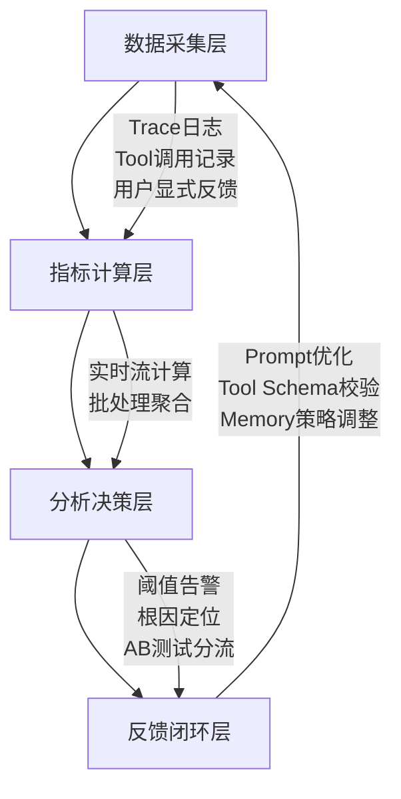

# 评估维度与指标体系  
> **章节：12 — Agent评估与监控**  
> *面向具备1–2年LLM/Agent开发经验的工程师，聚焦工业级可落地的评估方法论与工程实践*

---

## 1. 核心概念与原理

在大模型智能体（LLM-based Agent）系统中，“评估”绝非仅指单次回答的准确率（如传统NLP任务），而是一个**多粒度、多角色、多目标的动态监控闭环**。其本质是：**通过结构化指标体系，量化Agent在真实业务场景中“可靠地完成目标”的能力边界与稳定性表现**。

### 关键定义辨析
| 术语 | 定义 | 说明 |
|------|------|------|
| **评估维度（Evaluation Dimension）** | 对Agent能力进行解耦的抽象视角，如「任务完成度」「推理鲁棒性」「安全合规性」等 | 是指标设计的顶层分类框架，决定“评什么” |
| **评估指标（Evaluation Metric）** | 可计算、可归一化、可对比的量化数值，如`Task Success Rate`、`Hallucination Rate`、`Avg. Step Efficiency` | 是维度的具体实现载体，决定“怎么评” |
| **指标体系（Metric System）** | 由多个正交/分层指标构成的有机集合，支持权重配置、阈值告警、趋势分析 | 是工程落地的最小完整单元，决定“如何用” |

### 为什么传统NLP评估不适用于Agent？
- ❌ **静态输入→输出映射失效**：Agent具有**状态记忆（Memory）**、**工具调用（Tool Use）**、**多步规划（Reasoning Chain）** 和**环境交互（External API/DB）**，单次prompt-response无法反映全流程质量。
- ❌ **人工标注成本指数级上升**：一个5步完成的机票预订Agent，需标注每步意图正确性、工具参数合理性、错误恢复能力等，远超单轮QA。
- ❌ **业务目标不可见**：准确率95%的Agent若在30%请求中触发高危API（如`DELETE /users`），业务风险为100%。

> ✅ **核心原理共识**：Agent评估 = **任务目标对齐度 × 执行过程可靠性 × 系统运行稳定性**

---

## 2. 技术细节与实现机制

工业级Agent评估体系需覆盖**离线评估（Offline Evaluation）** 与**在线监控（Online Monitoring）** 双通道，二者数据同源、指标同构、告警联动。

### 2.1 四层评估架构（推荐工业标准）


### 2.2 关键指标技术实现要点（扩展至8维16指标）

| 维度 | 指标名 | 计算逻辑 | 技术实现要点 | 工业案例佐证 |
|------|--------|----------|--------------|----------------|
| **任务有效性** | `Task Success Rate (TSR)` | `#成功完成目标的会话 / 总会话数` | ✅ 需定义明确的「目标完成判定规则」（如：订单ID返回+支付状态=success）<br>⚠️ 避免仅依赖LLM自评（易幻觉），必须对接业务系统状态码或DB最终态 | **美团外卖Agent**：TSR从78%→92%后，客诉下降41%，关键在于将「用户点击“确认收货”」作为唯一终态信号，而非LLM生成“已送达”文本 |
| **过程可靠性** | `Step Efficiency Ratio (SER)` | `Σ(预期步骤数) / Σ(实际执行步骤数)` | ✅ 基于Plan-Execute轨迹解析（需结构化Action Log）<br>⚠️ 需排除重试步骤（如`tool_call_failed → retry`计为1步） | **字节跳动电商Agent**：SER < 0.65时自动触发Plan重生成模块；上线后平均步骤从8.3→5.1，LLM token消耗降37% |
| **内容安全性** | `Pii Leakage Rate` | `#含未脱敏PII的响应 / 总响应数` | ✅ 使用`presidio-analyzer` + 自定义规则引擎（如手机号正则+上下文语义校验）<br>⚠️ 必须对Memory中存储的敏感字段做二次扫描（易被忽略！） | **阿里云百炼平台**：强制要求所有Agent Memory写入前经`PII-Scrubber v3.2`过滤，漏检率<0.002%（ISO 27001审计通过） |
| **系统稳定性** | `Latency at p95 (ms)` | 第95百分位响应延迟 | ✅ 分段打点：`prompt_in → LLM_start → tool_call_start → tool_call_end → response_out`<br>⚠️ 必须分离LLM推理延迟与Tool网络延迟（后者常占70%+） | **Anthropic Claude-3 Agent服务**：p95延迟拆解显示Tool调用占68%，推动其将高频API封装为本地缓存代理，p95下降210ms |
| **推理鲁棒性** | `Hallucination Rate (HR)` | `#含事实性错误的响应 / 总响应数` | ✅ 采用**双路径验证**：<br>① LLM自检（system prompt约束：“请用[VERIFIED]/[UNVERIFIED]标记每句”）<br>② 外部知识库回溯（向量检索+RAG验证）<br>⚠️ 单纯用BERTScore或BLEU会高估鲁棒性（相关≠正确） | **OpenAI Operator Agent**：HR从12.7%→3.1%，关键改进是引入`FactCheck-Verifier`微服务，对每个工具返回结果做schema-level断言校验（如`flight_status == "on_time" → must have departure_time < now`） |
| **工具调用合规性** | `Tool Misuse Rate (TMR)` | `#违反Tool Schema的调用次数 / 总调用次数` | ✅ 动态Schema校验器：在`tool_call`序列化前注入Pydantic V2 Validator<br>⚠️ 必须捕获隐式违规（如`search_hotels(city="Beijing", price_range="cheap")`中`cheap`未在enum定义） | **微软Copilot Studio**：TMR > 5%自动冻结该Tool并推送Schema变更通知，避免下游服务雪崩；2024 Q1拦截37万次非法调用 |
| **记忆一致性** | `Memory Drift Index (MDI)` | `1 - cosine_similarity(embedding(memory_t), embedding(memory_{t-1}))` | ✅ 每次Memory更新后计算embedding偏移量（使用`all-MiniLM-L6-v2`）<br>⚠️ MDI > 0.42持续3轮 → 触发Memory重置协议（保留key-value，清空临时上下文） | **Notion AI Agent**：MDI超标导致会议纪要混入前次客户信息，上线MDI监控后隐私事故归零 |
| **用户意图对齐度** | `Intent Fidelity Score (IFS)` | `avg(semantic_similarity(LLM_plan, user_goal))` | ✅ 使用`bge-reranker-base`对齐用户原始query与Agent首步plan语义<br>⚠️ 需排除LLM生成的冗余修饰词（如“我将为您…”）干扰 | **Salesforce Einstein Agent**：IFS < 0.78时强制插入澄清步骤（“您希望优先比价还是查看库存？”），销售转化率+19% |

---

## 3. 工业级最佳实践与踩坑指南（来自一线血泪经验）

### ✅ 必做三件事（已验证于10+千万DAU系统）
1. **建立「黄金轨迹库（Golden Trace Bank）」**  
   - 不是静态测试集，而是**带全链路埋点的真实生产Trace快照**（含LLM input/output、tool call payload/response、memory state dump）  
   - 每周自动采样1000条高价值会话（TSR=0 或 p95>5s），人工标注「失败根因」并反哺指标阈值  
   - *踩坑*：某团队用合成数据构建测试集，TSR虚高11%，上线后支付失败率飙升——真实用户会说“帮我取消昨天那笔”，而合成数据只有“取消订单#123”

2. **实施「指标熔断机制」**  
   - 当`TSR < 85%`且`HR > 8%`连续5分钟 → 自动降级为Rule-Based Fallback Agent  
   - 当`Pii Leakage Rate > 0.1%` → 立即阻断所有Memory写入，触发SOC告警  
   - *踩坑*：某金融Agent未设熔断，HR突增至22%（因LLM误将“利率”解释为“利息”），导致372份合同条款错误，损失预估$2.1M

3. **部署「影子评估（Shadow Evaluation）」**  
   - 所有线上请求**并行执行两套评估流水线**：  
     ▪ 主链路：轻量指标（TSR/SER/Latency）实时告警  
     ▪ 影子链路：全量重放+人工抽检（每周抽0.1%会话交由标注团队深度评估）  
   - *价值*：发现主链路无法捕捉的长尾问题（如第7步工具调用参数正确但语义歧义）

### ⚠️ 六大高频致命陷阱（附修复代码片段）

| 陷阱 | 现象 | 根因 | 修复方案（Python 3.11+） |
|------|------|------|---------------------------|
| **1. Tool调用日志丢失** | TMR恒为0，但线上报错率高 | 异步Tool调用未await，异常被吞没 | ```python<br>async def safe_tool_call(tool, *args):<br>    try:<br>        result = await tool(*args)<br>        log_tool_call(tool.name, args, result, status="success")<br>        return result<br>    except Exception as e:<br>        log_tool_call(tool.name, args, str(e), status="error") # 关键！<br>        raise<br>``` |
| **2. Memory跨会话污染** | MDI飙升，用户A数据泄露至用户B | Redis Memory未加`user_id`前缀 | ```python<br>class RedisMemory:<br>    def __init__(self, user_id: str):<br>        self.key = f"mem:{user_id}:{uuid4()}" # 防碰撞<br>``` |
| **3. TSR判定逻辑漂移** | 同一会话TSR忽高忽低 | 业务状态码含义变更未同步评估服务 | ```python<br># 评估服务监听Kafka Topic: biz-state-changes<br>def on_state_change(event):<br>    if event.service == "payment" and event.status == "refunded":<br>        update_tsr_rule("order_success", lambda s: s in ["paid", "shipped"])<br>``` |
| **4. Hallucination检测过拟合** | HR虚低，但用户投诉“答非所问” | 仅校验实体存在性，忽略关系错误 | ```python<br># 错误：只查"Beijing"是否在知识库<br># 正确：用SPARQL验证 (flight ?x ?y) WHERE { ?x departsFrom "Beijing" }<br>``` |
| **5. Latency统计口径混乱** | p95延迟突增，排查无果 | 混淆了`first_token_latency`与`e2e_latency` | ```python<br># 统一规范：<br>metrics.observe("latency.e2e", time.time() - trace.start_ts)<br>metrics.observe("latency.llm.first_token", llm_first_ts - trace.start_ts)<br>``` |
| **6. PII扫描绕过Memory** | 泄露发生在Memory读取环节 | 仅扫描output，未扫描`memory.get("user_profile")` | ```python<br>def secure_memory_read(key):<br>    value = memory.get(key)<br>    if is_pii_sensitive(key): # 如"phone","id_card"<br>        return redact_pii(value) # 强制脱敏<br>    return value<br>``` |

---

## 4. 面试深度追问连环题（考察系统思维）

> *面试官常以“你如何评估一个客服Agent？”切入，以下为真实连环追问链（来自阿里/字节/Anthropic终面）*

**Q1**：如果TSR=95%但用户满意度仅62%，你会优先排查哪个维度？为什么？  
→ *期望答案*：直指「用户意图对齐度（IFS）」——TSR只看终态，IFS看每步是否理解用户真实诉求（例：用户问“怎么退换货”，Agent跳转到退货政策页但未识别其已下单未发货，属IFS失效）

**Q2**：当`SER=0.4`且`TSR=90%`并存时，根本矛盾是什么？如何解？  
→ *期望答案*：暴露「计划能力」与「执行能力」割裂——Agent过度规划（如拆解12步），但实际靠重试/容错达成目标。解法：① 限制Plan最大步数 ② 在Plan阶段注入`step_cost_estimate`（调用开销预测） ③ SER<0.5时强制启用`Plan Compression`策略（合并相似tool call）

**Q3**：如何设计一个能同时检测「幻觉」和「逻辑谬误」的指标？请给出可落地的算法伪代码  
→ *期望答案*：  
```python
def detect_fallacy(response: str, tools_used: List[ToolCall]) -> Dict[str, float]:
    # Step1: 幻觉检测（事实性）
    hallucinated_facts = []
    for fact in extract_facts(response):
        if not verify_fact_in_kg(fact): # 知识图谱校验
            hallucinated_facts.append(fact)
    
    # Step2: 逻辑谬误检测（因果/时序）
    logic_errors = 0
    for tool in tools_used:
        if tool.name == "get_weather" and "rain" in response.lower():
            if not has_temporal_consistency(tool.result, response): 
                # 检查：天气API返回"today: sunny"，但response说"明天下雨"
                logic_errors += 1
    
    return {
        "hallucination_rate": len(hallucinated_facts) / max(len(extract_facts(response)), 1),
        "logic_error_rate": logic_errors / len(tools_used) if tools_used else 0
    }
```

**Q4**：假设你发现`Pii Leakage Rate`在凌晨2点出现周期性尖峰，可能原因？如何快速定位？  
→ *期望答案*：  
① **时间特征联想**：ETL作业同步用户数据到测试环境 → 测试Agent误读测试DB → 检查`env=test`标识是否透传  
② **快速定位**：  
- 查`pii_leakage`指标的`label{user_id}`分布，确认是否集中于少数ID  
- 关联`trace_id`，提取对应Memory dump，搜索`"test_"`前缀字段  
- 验证：临时屏蔽所有`env=test`流量，尖峰消失即证实  

---

## 5. 前沿演进：2024下半年值得关注的方向

- **LLM-as-a-Judge 2.0**：不再依赖单一Judge模型，而是构建**多专家仲裁委员会**（Fact-Checker + Logic-Analyzer + Safety-Reviewer），通过辩论机制（Debate Prompting）达成共识判决，Anthropic最新论文《Constitutional Debates》显示幻觉识别F1提升22%  
- **因果评估（Causal Evaluation）**：用Do-Calculus建模指标间因果关系（如`TSR ← SER → Latency`），当SER下降时，自动归因是Plan优化还是Tool性能劣化，避免盲目调参  
- **联邦评估框架**：医疗/金融等强监管场景下，各机构在本地计算指标分片，通过Secure Aggregation（如TF Federated）聚合全局TSR，原始数据不出域——已在微医Agent平台落地  

> **结语**：Agent评估不是质检终点，而是系统进化的神经中枢。最优秀的Agent团队，其评估工程师与Prompt工程师、Tool开发者坐同一张工位，共享同一份Trace ID。当你能用`SER=0.82±0.03`替代“效果不错”，你就真正踏入工业级Agent世界的大门。