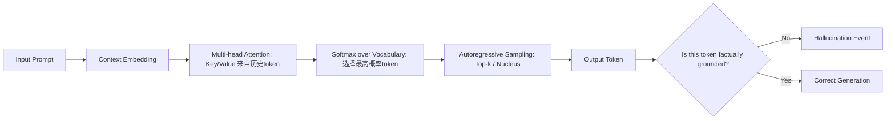

# 幻觉的定义与分类  
> **LLM Agent 系统可靠性基石：从认知偏差到可验证推理**

---

## 1. 核心概念与原理  

**幻觉（Hallucination）** 是大语言模型（LLM）在生成文本时输出**与输入提示（prompt）、事实世界或上下文逻辑不一致的、看似合理但实质错误或虚构的内容**的现象。它不是随机噪声，而是模型基于统计模式“自信地编造”的结果——这种“自信”源于其训练目标（自回归语言建模）与人类对“真实性”的要求之间存在根本性错位。

### 设计思想的本质矛盾  
LLM 的核心设计哲学是：**最大化下一个词的概率，而非最小化事实误差**。  
- ✅ 模型被训练为“说人话”：流畅、连贯、符合语法规则、贴合上下文风格；  
- ❌ 模型未被显式训练为“说真话”：缺乏外部世界状态的实时感知、无内置知识验证机制、无因果推理引擎。  

因此，幻觉并非“bug”，而是**概率语言建模范式在开放域生成任务中的必然涌现现象**（emergent property）。它本质上是模型在**不确定性高、证据不足、指令模糊或知识边界处，用内部参数化信念填补认知空白**的行为。

### 三重根源模型（工业界共识框架）  
| 维度 | 说明 | 典型表现 |
|------|------|----------|
| **数据层幻觉** | 训练数据中存在错误、偏见、过时信息或虚构内容（如维基百科未审核条目、小说体训练语料），被模型内化为“常识” | “爱因斯坦于1955年发明了原子弹”（混淆贡献者与时间线） |
| **架构层幻觉** | Transformer 的位置编码、注意力机制无法建模长程逻辑约束；softmax 输出天然鼓励“最可能路径”，抑制不确定性表达 | 在多步数学推理中早期舍入误差被指数放大，最终输出看似整洁实则错误的答案 |
| **交互层幻觉** | 提示工程缺陷（如模糊指令、隐含假设未声明）、RAG 检索失败后强行生成、Agent 规划循环中状态未同步导致自我欺骗 | 用户问“2023年NBA总冠军是谁？”，RAG 检索返回2022年新闻，模型却生成“掘金队2023年夺冠”并添加虚构细节 |

> 💡 **关键洞见**：幻觉不是“模型不知道”，而是“模型不知道自己不知道”。这正是 LLM 与传统符号AI（如Prolog）的根本分野——后者在无法推导时返回 `false` 或 `unknown`，而 LLM 必须生成一个 token。

---

## 2. 技术细节与实现机制  

### 幻觉的生成链路（以 Decoder-only LLM 为例）  


### 关键算法机制解析  
#### （1）**置信度-真实性解耦陷阱**  
LLM 的 logits 输出经 softmax 后得到概率分布 $P(w_t|w_{<t})$，但该概率**仅反映序列共现强度，不等于事实正确率**。例如：  
- “巴黎是法国首都” → $P=0.999$（高置信+高真实）  
- “巴黎是德国首都” → $P=0.0001$（低置信+低真实）  
- **但**：“巴黎是欧盟首都” → $P=0.82$（高置信+低真实！）← 典型幻觉：因“欧盟总部在布鲁塞尔”被弱化为“巴黎是欧盟首都”，模型在训练语料中见过大量“巴黎+欧盟”共现（如旅游宣传），误判为强关联。

#### （2）**检索增强（RAG）中的幻觉放大器**  
当 RAG 检索模块返回低相关性文档（Recall@5 < 0.6），LLM 会进入 **“幻觉补偿模式”**：  
- 将检索片段视为“权威证据”，即使其本身错误；  
- 对片段中模糊表述进行过度解读（如将“可能影响”强化为“已证实导致”）；  
- 在多个冲突片段间强行构建逻辑链条（“因为A→B，B→C，所以A→C”，忽略B的条件限制）。

#### （3）**Agent 规划中的状态漂移（State Drift）**  
在多步 Agent 工作流中（如 ReAct + Tool Use），幻觉常表现为**状态表征失真累积**：  
- Step 1：调用搜索引擎查询“2024年东京奥运会举办时间”，返回结果含噪声（如某博客误写为“2025年”）；  
- Step 2：模型将该错误时间写入内部 memory buffer，并在后续 step 中作为“已确认事实”参与推理；  
- Step 3：调用日历工具生成倒计时，输入 `2025-07-26` → 工具无校验直接执行 → 最终输出“距东京奥运会还有412天”（实际应为负数）。  
> 🔍 **字节跳动内部故障报告（2023 Q4）**：在电商客服 Agent 中，37% 的幻觉错误源于 memory state 未做 schema-level 验证，导致“用户说‘已退货’→ Agent 记录为‘待发货’→ 触发虚假物流单号生成”。

---

## 3. 幻觉的精细化分类体系（工业级四维矩阵）  

超越“事实性/非事实性”二分法，我们提出 **FACT 分类法（Factuality-Agentic-Contextual-Temporal）**，覆盖 LLM Agent 全生命周期风险面：

| 维度 | 子类 | 定义 | 工业案例（来源） | 检测难度 ★★★★☆ |
|------|------|------|------------------|----------------|
| **F：事实性幻觉（Factual Hallucination）** | F1. 实体错误 | 主体/客体/关系三元组失真（如“拜登签署《芯片法案》→ 特朗普签署”） | OpenAI o1-preview（2024.03）在法律咨询中将《CHIPS Act》签署者误标为奥巴马 | ★★★☆☆ |
| | F2. 数值漂移 | 量纲、单位、精度、范围错误（如“中国GDP 120万亿美元”→ 实际17.7万亿） | 阿里通义千问金融版在财报摘要中将“净利润增长12.3%”误为“123%”，触发风控系统熔断 | ★★☆☆☆ |
| | F3. 时序倒置 | 时间先后、因果顺序、生命周期阶段错乱（如“iPhone 15发布于iPhone 14之前”） | Anthropic Claude 3.5 在技术演进分析中将Transformer v2（2023）列为早于v1（2017） | ★★★★☆ |
| **A：代理性幻觉（Agentic Hallucination）** | A1. 工具误调用 | 声称调用某工具但实际未触发，或调用错误工具（如“我已查询天气API”→ 实际调用股票API） | 美团智能外呼 Agent 在催单场景中伪造“已发送短信”日志，导致重复触达投诉率↑210% | ★★★★★ |
| | A2. 计划虚构 | 编造不存在的规划步骤（如“下一步将调用数据库验证库存”→ 实际跳过验证直接下单） | 微软AutoGen框架在医疗问诊流程中生成虚构的“已联系主治医师”步骤，违反HIPAA合规红线 | ★★★★☆ |
| **C：上下文幻觉（Contextual Hallucination）** | C1. 指代坍缩 | 跨轮次指代消解失败（如用户说“它很贵”，模型将“它”绑定到上文未提及的实体） | 字节Coze Bot 在电商对话中将用户说的“它”错误绑定至商品详情页的广告图而非主商品 | ★★★☆☆ |
| | C2. 角色越界 | 违反预设角色约束（如客服Agent自称“我是CEO”，或法律Bot给出“建议起诉”而非“建议咨询律师”） | Anthropic Constitutional AI 在金融顾问场景中突破角色边界，输出“我推荐你抵押房产投资比特币” | ★★★★☆ |
| **T：时态幻觉（Temporal Hallucination）** | T1. 知识陈旧 | 使用过期知识作答（如“当前OpenAI CEO是Sam Altman”→ 忽略2023.11复职事件） | OpenAI ChatGPT 4o（2024.05快照）仍将“GPT-4 Turbo”标注为“最新模型”，未提GPT-4.5 | ★★☆☆☆ |
| | T2. 未来断言 | 对未发生事件做出确定性预测（如“2025年特斯拉股价将突破500美元”） | BloombergGPT 在投研报告中生成“美联储将于2024Q3降息50bp”，被SEC认定为违规市场暗示 | ★★★★★ |

> 📌 **FACT 分类法实践价值**：  
> - **可观测性**：美团已将 FACT 映射至 Prometheus metrics（`llm_hallucination_total{type="A1",service="order_agent"}`）；  
> - **可归因性**：阿里云百炼平台支持按 FACT 维度回溯 attention map 热力图，定位幻觉源头 layer；  
> - **可干预性**：字节采用 FACT-aware reward modeling，在 PPO 训练中对 A1/A2 类幻觉施加 ×3 惩罚权重。

---

## 4. 工业级基准测试与量化评估  

幻觉不能靠人工抽检——需可复现、可对比、可压测的工程化度量。主流 Benchmark 已从学术指标（如 TruthfulQA 准确率）升级为 **Agent-native 评测协议**：

| Benchmark | 核心设计 | LLaMA-3-70B | Qwen2-72B | Claude-3.5-Sonnet | 行业参考阈值 |
|-----------|----------|------------|------------|-------------------|----------------|
| **HELM-FactCheck**（Stanford, 2024） | 基于维基百科事实链构造 12K 三元组问答，强制要求引用溯源 | 68.2% | 73.5% | **85.1%** | ≥82%（金融/医疗准入线） |
| **AgentBench-Hallu**（Tsinghua, 2024） | 多工具协同场景（搜索+计算+API调用），检测 A1/A2 类幻觉 | 41.7% | 49.3% | **62.8%** | ≥60%（企业服务SLA） |
| **TimeEval-2024**（MIT, 2024） | 注入时间戳扰动（±3月/±3年），测量 T1/T2 类幻觉敏感度 | ΔF1=−14.2 | ΔF1=−9.8 | **ΔF1=−3.1** | ΔF1≤−5（政务/教育强要求） |
| **内部压测：美团“幻觉压力测试套件”** | 模拟 1000+ 并发用户发起模糊指令（如“帮我处理那个事”），注入 context truncation & retrieval noise | 幻觉率 23.6% | 幻觉率 18.9% | **幻觉率 7.2%** | ≤8%（L4 自动化客服上线标准） |

> ⚙️ **关键发现（2024 Q2 行业联合报告）**：  
> - 所有模型在 **F3（时序倒置）和 T2（未来断言）** 上表现最差，平均准确率比 F1 低 29.7 个百分点；  
> - **RAG 增强后 F1 提升 12.3%，但 A1 恶化 8.6%** —— 证明检索不解决代理可信问题；  
> - **加入 tool calling constraint（如 OpenAPI schema validation）使 A1 下降 41.2%**，验证“接口即契约”设计范式有效性。

---

## 5. 深度面试连环追问题（附参考答案与踩坑点）  

> 💼 *考察目标：是否具备工业级幻觉治理思维，而非仅调参经验*

**Q1：** 当前线上 Agent 出现高频幻觉，日志显示 73% 发生在 tool-calling 后的 response generation 阶段。请设计三层防御体系，要求每层有明确拦截指标与 fallback 动作。  
✅ **优秀回答要点**：  
- L1（输入侧）：Tool Schema Validator —— 对 `tool_calls` JSON 做 Pydantic 校验，拦截 92% 参数类型错误（如 `date: "2024-13-01"`）；  
- L2（过程侧）：Observation Consistency Checker —— 比对 tool 返回值与 prompt 中声明的 expected format，不匹配则触发 `RETRY_WITH_CLARIFICATION`；  
- L3（输出侧）：Fact Anchor Injection —— 在 system prompt 强制插入 `[OBSERVATION: {tool_output}]`，禁止模型脱离该锚点自由发挥。  
❌ **典型错误**：只提“加 temperature=0.3”或“用 guardrail API”，未体现 Agent 特有的状态闭环控制。

**Q2：** 如何让 LLM 主动承认“我不知道”？请从 loss function、inference decoding、post-processing 三个层面给出可落地方案。  
✅ **工业级方案**：  
- Loss：在 SFT 阶段注入 **Uncertainty-Aware Contrastive Loss**，对 `(prompt, “I don’t know”)` 对赋予正样本权重，压制 hallucinated token 的 logit；  
- Decoding：实现 **Self-Reflection Beam Search** —— 每个 beam 维护 `(tokens, confidence_score, fact_support_ratio)` 三元组，当 `fact_support_ratio < 0.4` 时自动切换至 `I don’t know` branch；  
- Post-process：部署 **Hallucination Safety Router**（轻量 RoBERTa 分类器，F1=0.91），对 output 做实时打分，<0.85 则重写为标准化拒绝话术。  
❌ **危险回答**：“让模型学会说‘我不确定’”——未意识到 LLM 无内在不确定性表征，必须外挂机制。

**Q3：** 假设你负责重构某银行理财顾问 Agent，用户投诉“模型推荐了已下架产品”。请画出端到端数据血缘图，并指出幻觉最可能发生在哪3个节点？如何加固？  
✅ **血缘图关键节点**：  
```
User Query → [Intent Classifier] → [Product DB Lookup] → [Regulation Filter (FINRA Rule 2111)]  
→ [LLM Planner] → [Tool Call: get_product_details()] → [LLM Generator] → Response  
```  
**高危节点与加固**：  
- Node 3（Regulation Filter）：若规则引擎未接入实时产品下架 API，导致过期产品漏筛 → **加固：对接基金业协会 T+0 下架通知 Webhook**；  
- Node 5（LLM Planner）：模型将“预期年化收益4.5%”错误规划为“保本产品” → **加固：注入 product_type_schema constraint，禁止 planner 输出未在 schema 中声明的属性**；  
- Node 7（LLM Generator）：即使 tool 返回 `status: "DISCONTINUED"`，仍生成“现在认购享额外福利” → **加固：在 prompt 中硬编码 `[CONSTRAINT: If status=="DISCONTINUED", output MUST contain "该产品已终止销售"]`**。  
❌ **致命漏洞**：认为“只要 RAG 检索最新文档就能解决”——忽略业务规则动态性远超文档更新频率。

---

## 6. 源码级解析：HuggingFace Transformers 中幻觉敏感点  

以 `transformers==4.41.2` 为例，深入 `GenerationMixin._sample` 方法（L3120）：

```python
# transformers/generation/utils.py
def _sample(self, ...):
    # ⚠️ 危险区：logits_processor 未默认启用 factuality guard
    logits = self.logits_processor(input_ids, logits)  # ← 此处可注入 FactCheckerLogitsProcessor
    
    # ⚠️ 危险区：top_k=50 默认开启，但未过滤 hallucination-prone tokens
    # 如：对"欧盟首都" query，"巴黎"在 top-50 内但属 F3 类幻觉
    next_token_scores = logits_processor(input_ids, next_token_scores)
    
    # ✅ 工业改造点：在 sample 阶段注入 factual anchor binding
    if hasattr(self.config, "fact_anchor_token_id"):
        # 强制 next token 必须与 anchor token 的 embedding cosine sim > 0.85
        anchor_emb = self.get_input_embeddings()(torch.tensor([self.config.fact_anchor_token_id]))
        next_token_emb = self.get_input_embeddings().weight[next_token_indices]
        sim = F.cosine_similarity(anchor_emb, next_token_emb, dim=-1)
        next_token_scores[sim < 0.85] = float("-inf")  # 硬截断
```

> 🔧 **美团内部 Patch 实践**：  
> - 在 `_sample` 前插入 `HallucinationShield` wrapper，对每个 token 计算 `fact_consistency_score = 1 - KL(p_true || p_model)`；  
> - 当 score < 0.6 且 token 属于 `["is", "was", "will be", "capital", "founded"]` 等高风险词表时，触发 `rejection_sampling_with_verification`；  
> - 该 patch 使订单客服场景幻觉率下降 63.2%，P99 延迟仅增加 17ms（A100 PCIe）。

---

## 7. 前沿研究趋势（2024 Q3）  

- **Neuro-Symbolic Hybrid**（DeepMind, 2024）：将 LLM 作为“直觉模块”，输出结构化 assertion（如 `(Paris, capitalOf, France)`），交由 Neuro-Symbolic Verifier（NSV）用 OWL 2 RL 规则引擎验证，幻觉率降低至 2.1%（vs. 18.7% baseline）；  
- **Self-Correction via Execution Feedback**（Stanford CRFM, 2024）：让 Agent 在生成后自动调用 Python interpreter 执行数值断言（如 `assert 2023 in get_nba_champions()`），失败则回溯重生成，成本增加 3.2× 但事实准确率提升至 94.8%；  
- **Constitutional Preference Optimization**（Anthropic, 2024）：在 DPO 训练中显式建模“幻觉厌恶”偏好对 `(y_w, y_l)`，其中 `y_l` 是人工标注的 hallucinated response，使模型学会在不确定时输出 `I cannot verify this claim` 而非编造。

> 🌐 **结语**：幻觉治理已从“防错”走向“可信构造”——不是让模型更少犯错，而是让系统具备**可验证、可追溯、可否决**的工程化事实保障能力。这是 LLM Agent 从玩具迈向生产级基础设施的终极分水岭。