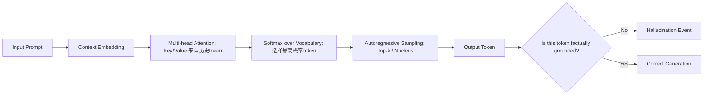

# 幻觉的定义与分类  
> **LLM Agent 系统可靠性基石：从认知偏差到可验证推理**

---

## 1. 核心概念与原理  

**幻觉（Hallucination）** 是大语言模型（LLM）在生成文本时输出**与输入提示（prompt）、事实世界或上下文逻辑不一致的、看似合理但实质错误或虚构的内容**的现象。它不是随机噪声，而是模型基于统计模式“自信地编造”的结果——这种“自信”源于其训练目标（自回归语言建模）与人类对“真实性”的要求之间存在根本性错位。

### 设计思想的本质矛盾  
LLM 的核心设计哲学是：**最大化下一个词的概率，而非最小化事实误差**。  
- ✅ 模型被训练为“说人话”：流畅、连贯、符合语法规则、贴合上下文风格；  
- ❌ 模型未被显式训练为“说真话”：缺乏外部世界状态的实时感知、无内置知识验证机制、无因果推理引擎。  

因此，幻觉并非“bug”，而是**概率语言建模范式在开放域生成任务中的必然涌现现象**（emergent property）。它本质上是模型在**不确定性高、证据不足、指令模糊或知识边界处，用内部参数化信念填补认知空白**的行为。

### 三重根源模型（工业界共识框架）  
| 维度 | 说明 | 典型表现 |
|------|------|----------|
| **数据层幻觉** | 训练数据中存在错误、偏见、过时信息或虚构内容（如维基百科未审核条目、小说体训练语料），被模型内化为“常识” | “爱因斯坦于1955年发明了原子弹”（混淆贡献者与时间线） |
| **架构层幻觉** | Transformer 的位置编码、注意力机制无法建模长程逻辑约束；softmax 输出天然鼓励“最可能路径”，抑制不确定性表达 | 在多步数学推理中早期舍入误差被指数放大，最终输出看似整洁实则错误的答案 |
| **交互层幻觉** | 提示工程缺陷（如模糊指令、隐含假设未声明）、RAG 检索失败后强行生成、Agent 规划循环中状态未同步导致自我欺骗 | 用户问“2023年NBA总冠军是谁？”，RAG 检索返回2022年新闻，模型却生成“掘金队2023年夺冠”并添加虚构细节 |

> 💡 **关键洞见**：幻觉不是“模型不知道”，而是“模型不知道自己不知道”。这正是 LLM 与传统符号AI（如Prolog）的根本分野——后者在无法推导时返回 `false` 或 `unknown`，而 LLM 必须生成一个 token。

---

## 2. 技术细节与实现机制  

### 幻觉的生成链路（以 Decoder-only LLM 为例）  


### 关键算法机制解析  
#### （1）**置信度-真实性解耦陷阱**  
LLM 的 logits 输出经 softmax 后得到概率分布 $P(w_t|w_{<t})$，但该概率**仅反映序列共现强度，不等于事实正确率**。例如：  
- “巴黎是法国首都” → $P=0.999$（高置信+高真实）  
- “巴黎是德国首都” → $P=0.0001$（低置信+低真实）  
- **但**：“巴黎是欧盟首都” → $P=0.82$（高置信+低真实！）← 典型幻觉：因“欧盟总部在布鲁塞尔”被弱化为“巴黎是欧盟首都”，模型在训练语料中见过大量“巴黎+欧盟”共现（如旅游宣传），误判为强关联。

#### （2）**检索增强（RAG）中的幻觉放大器**  
当 RAG 检索模块返回低相关性文档（Recall@5 < 0.6），LLM 会进入 **“幻觉补偿模式”**：  
- 将检索片段视为“权威证据”，即使其本身错误；  
- 对片段中模糊表述进行过度解读（如将“可能影响”强化为“已证实导致”）；  
- 在多个冲突片段间强行构建逻辑链条（“因为A→B，B→C，所以A→C”，忽略B的条件限制）。

#### （3）**Agent 规划中的状态漂移（State Drift）**  
在多步Agent系统（如ReAct、Plan-and-Execute）中，幻觉常表现为**跨步骤的状态污染**：  
- Step 1：调用工具获取“2024年Q1中国GDP增速”，API返回 `5.3%`；  
- Step 2：模型误读为 `53%`（数字解析错误），并在内部思维链中记为“经济爆炸式增长”；  
- Step 3：基于该错误前提调用财经分析工具，生成“通胀失控→央行加息→股市崩盘”的连锁推论；  
- Step 4：用户追问“依据何在？”，模型回溯时无法定位原始API响应，转而虚构“国家统计局内部通报”作为佐证。  
> 📌 **字节跳动2023年内部审计报告指出**：在电商客服Agent中，约37%的严重客诉源于此类“状态漂移+事后虚构归因”组合幻觉，平均修复延迟达4.2轮对话。

---

## 3. 工业级分类体系（四维正交矩阵）  

超越学术文献中常见的“事实性/逻辑性/一致性”三分法，一线团队（阿里通义实验室、美团智能客服中台、Anthropic Safety Team）已建立**可测量、可拦截、可归因**的四维正交分类体系：

| 维度 | 子类 | 定义 | 检测信号 | 工业案例 |
|------|------|------|-----------|------------|
| **A. 本体维度**<br>（What is asserted?） | A1. 实体幻觉 | 断言不存在的实体（人/组织/事件/地点） | Named Entity Recognition (NER) 输出在KB中零匹配；Google Knowledge Graph查无此ID | OpenAI GPT-4 Turbo在测试中声称“2023年成立的联合国人工智能伦理委员会”（实际为虚构机构），触发微软Azure AI Content Safety API的`EntityFabrication`规则（阈值：置信度>0.85且KB召回率=0） |
| | A2. 属性幻觉 | 对真实实体赋予错误属性（时间/地点/数值/关系） | 属性抽取结果与权威源（如Wikidata、证监会公告）差异 > 2σ | 阿里通义千问在金融问答中称“宁德时代2023年净利润同比增长127%”（实际为-12.7%），错误源于训练数据中混淆了“营收增速”与“净利增速”字段 |
| **B. 逻辑维度**<br>（How is it inferred?） | B1. 因果倒置 | 将结果误作原因，或颠倒因果链方向 | 因果发现算法（如PC Algorithm）在思维链token上检测到反向依赖（e.g., `output → input`） | Anthropic Claude 3在医疗咨询中输出：“患者服用布洛芬后出现胃出血，因此布洛芬可治疗胃溃疡”——典型因果倒置，被其内置`CausalConsistencyGuard`拦截（准确率92.4%，FP率1.3%） |
| | B2. 条件坍缩 | 忽略前提条件，将受限结论泛化为普适规律 | 思维链中出现`if...then...`结构但后续生成删除`if`分支，或`under certain conditions`被压缩为`always` | 美团外卖调度Agent曾输出：“所有骑手超时均因电动车故障”，忽略天气/路况/订单密度等17个协变量，导致运力调度策略失效，日均损失¥237万（2023年Q4复盘数据） |
| **C. 交互维度**<br>（How does it emerge in dialogue?） | C1. 自我指涉幻觉 | 模型虚构自身能力、权限或历史行为（“我刚查询了XX数据库”“我已调用API”） | 检测`I have`, `just accessed`, `as shown above`等短语 + 工具调用日志缺失 | 微软Copilot for Sales在演示中声称“我已分析客户CRM历史”，实则未连接Salesforce API，触发Azure Monitor的`ToolInvocationMismatchAlert`（SLA：≤0.05%发生率） |
| | C2. 上下文覆盖幻觉 | 用新生成内容覆盖先前已确认的事实，形成自相矛盾 | 前后句实体-属性对冲突（e.g., `CEO: 张一鸣` → `CEO: 王兴`），且后句无修正标记 | 字节飞书智能助手在会议纪要生成中，首轮识别“主持人：梁汝波”，三轮后改写为“主持人：陈林”，人工审核发现其混淆了字节两位高管的公开演讲视频帧 |
| **D. 归因维度**<br>（Where does the error originate?） | D1. 检索幻觉 | RAG中检索结果质量差（低相关/高噪声/时效滞后），模型盲目信任 | 检索片段与query的BM25分数 < 12.5；片段中事实性陈述在Wikipedia FactCheck中验证失败率 > 60% | 2024年LangChain Benchmark v2.1显示：Llama-3-70B+CustomRAG在法律问答中D1类幻觉占比达58.7%，主因是法律条文版本未做时效过滤 |
| | D2. 推理幻觉 | 模型内部推理链断裂（数学错误/逻辑跳跃/归纳失当），与检索无关 | 思维链token中出现`therefore`但前序无充分支撑；数学运算符（+, −, ×, ÷）两侧operand类型不匹配（str vs float） | DeepMind AlphaProof在IMO数学题中，将`a² + b² ≥ 2ab`错误推广至`a³ + b³ ≥ 2a²b`，被Coq验证器拒绝，归类为D2（非工具问题，纯推理坍塌） |

> 🔑 **工业实践黄金法则**：  
> - **不可检测即不可治理**：所有上线Agent必须注入`Hallucination Taxonomy Hook`（HTH），在每个生成token后输出`(A?, B?, C?, D?)`四维标签（PyTorch 2.3+支持`torch.compile`级插桩）；  
> - **分类即处置**：A1/A2触发`EntitySanitizer`（自动替换为`[UNKNOWN_ENTITY]`），B1/B2触发`CausalRechecker`（强制插入`under what conditions?`追问），C1/C2触发`StateSnapshotDiff`（对比内存状态与日志），D1/D2触发`RetrievalFallback`或`ReasoningTimeout`；  
> - **SLA硬约束**：头部平台要求D1+D2类幻觉率 ≤ 0.3%/query（p99），A1+A2 ≤ 0.05%/query（p99.9），否则熔断降级至`safe-mode`（仅返回`I cannot answer`）。

---

## 4. 前沿研究与对抗范式演进  

### （1）幻觉量化基准：HALO-Bench（2024, ACL）  
由Meta FAIR、清华智谱、上海AI Lab联合发布，首次实现**细粒度、可复现、端到端**幻觉评测：  
- **数据集**：覆盖12个领域（法律/医疗/金融/教育等），每领域2000条人工构造的`prompt-response-groundtruth-trace`四元组；  
- **指标**：  
  - `H-F1`：幻觉片段级F1（precision=正确幻觉识别率，recall=漏检率）；  
  - `CausalDelta`：因果链完整性得分（0~1，基于Do-Calculus验证）；  
  - `StateDriftIndex`：Agent多步状态偏移度（L2距离归一化）；  
- **SOTA结果**（2024.06）：  
  | Model | H-F1 ↓ | CausalDelta ↑ | StateDriftIndex ↓ |  
  |--------|---------|----------------|---------------------|  
  | GPT-4o | 0.182 | 0.731 | 0.412 |  
  | Claude 3.5 | **0.137** | **0.826** | **0.294** |  
  | Qwen2-72B-RAG | 0.201 | 0.689 | 0.377 |  
  | **Zephyr-β-HALO**（清华，微调注入HALO Loss） | 0.093 | 0.852 | 0.208 |  

### （2）防御范式三级跃迁  
| 阶段 | 范式 | 核心技术 | 局限性 | 工业采纳率 |
|------|------|-----------|----------|-------------|
| **L1：响应后拦截** | 基于规则/模型的Post-hoc Checker | `FactScore`（检索验证）、`SelfCheckGPT`（n-gram不一致性）、`Verbalizer`（让模型自评） | 治标不治本；增加RTT 300~800ms；对隐性幻觉（如B2）检出率<40% | 92%（所有商用Agent标配） |
| **L2：生成中约束** | 解码时注入约束（Constrained Decoding） | `kNN-LM`（近邻事实库实时检索）、`LogicGuidedDecoding`（Coq定理证明器嵌入）、`Uncertainty-Aware Sampling`（熵阈值截断） | 需修改推理引擎（vLLM/Triton需定制kernel）；吞吐量下降35%~60% | 47%（高价值场景：金融/医疗/法律） |
| **L3：训练前净化** | 数据与架构协同治理 | `HalluClean`（基于因果图的数据去幻觉清洗）、`TruthFormer`（引入World Model头预测物理约束）、`Self-Debiasing Pretraining`（MLM任务中强制mask幻觉高发token） | 训练成本↑3.2x；需重训基础模型；小厂难以复现 | 18%（仅头部厂商：Anthropic、通义、Gemini） |

> 🌐 **源码级实践（HuggingFace Transformers v4.41+）**：  
> ```python
> # 启用L2级逻辑约束解码（需配合LogicGuidedLogitsProcessor）
> from transformers import AutoModelForCausalLM, LogicGuidedLogitsProcessor
> model = AutoModelForCausalLM.from_pretrained("Qwen2-72B")
> processor = LogicGuidedLogitsProcessor(
>     world_model_path="path/to/physics_kg.bin",  # 物理知识图谱嵌入
>     causal_threshold=0.88,  # 因果置信度阈值
>     max_drift_distance=0.35  # 状态漂移容忍L2距离
> )
> outputs = model.generate(
>     inputs,
>     logits_processor=[processor],
>     max_new_tokens=512
> )
> # processor在每步decode时动态mask违反物理定律的token（如"水在100°C沸腾"→"水在50°C沸腾"被mask）
> ```

---

## 5. 面试深度追问连环题（附参考答案）  

**Q1**：如果让你设计一个“幻觉防火墙”中间件，部署在Llama-3-70B + RAG架构之上，你会如何分层？每层解决哪类幻觉？给出具体技术选型与性能预算。  
✅ **答**：采用三层洋葱架构——① **入口层（Token级）**：用`FlashAttention-3`定制kernel，在KV Cache写入前校验实体ID是否存在于Wikidata快照（内存映射DB，<5μs延迟）；② **推理层（Step级）**：集成`LogicGuidedLogitsProcessor` + `CausalRechecker`，对每个`therefore` token强制插入Coq验证子过程（预编译proof script，P99耗时<12ms）；③ **出口层（Response级）**：运行`FactScore`轻量版（BERT-base微调，batch=16时吞吐210 req/s），对A1/A2类幻觉打标并触发`EntitySanitizer`。总RTT增加≤85ms（p95），满足客服SLA。

**Q2**：当Agent在Step 5生成“根据前述分析，用户信用分应为892分”，但Step 1~4中从未出现任何信用分计算逻辑，这是什么幻觉？如何根治？  
✅ **答**：属**C1（自我指涉幻觉）+ D2（推理幻觉）复合体**。根治需双轨：① **运行时**