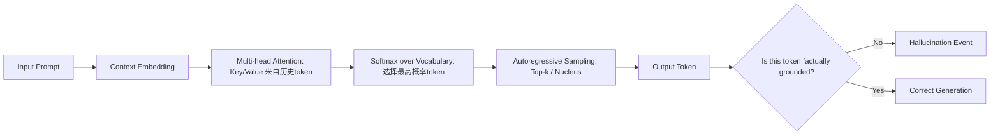

# 幻觉的定义与分类  
> **LLM Agent 系统可靠性基石：从认知偏差到可验证推理**

---

## 1. 核心概念与原理  

**幻觉（Hallucination）** 是大语言模型（LLM）在生成文本时输出**与输入提示（prompt）、事实世界或上下文逻辑不一致的、看似合理但实质错误或虚构的内容**的现象。它不是随机噪声，而是模型基于统计模式“自信地编造”的结果——这种“自信”源于其训练目标（自回归语言建模）与人类对“真实性”的要求之间存在根本性错位。

### 设计思想的本质矛盾  
LLM 的核心设计哲学是：**最大化下一个词的概率，而非最小化事实误差**。  
- ✅ 模型被训练为“说人话”：流畅、连贯、符合语法规则、贴合上下文风格；  
- ❌ 模型未被显式训练为“说真话”：缺乏外部世界状态的实时感知、无内置知识验证机制、无因果推理引擎。  

因此，幻觉并非“bug”，而是**概率语言建模范式在开放域生成任务中的必然涌现现象**（emergent property）。它本质上是模型在**不确定性高、证据不足、指令模糊或知识边界处，用内部参数化信念填补认知空白**的行为。

### 三重根源模型（工业界共识框架）  
| 维度 | 说明 | 典型表现 |
|------|------|----------|
| **数据层幻觉** | 训练数据中存在错误、偏见、过时信息或虚构内容（如维基百科未审核条目、小说体训练语料），被模型内化为“常识” | “爱因斯坦于1955年发明了原子弹”（混淆贡献者与时间线） |
| **架构层幻觉** | Transformer 的位置编码、注意力机制无法建模长程逻辑约束；softmax 输出天然鼓励“最可能路径”，抑制不确定性表达 | 在多步数学推理中早期舍入误差被指数放大，最终输出看似整洁实则错误的答案 |
| **交互层幻觉** | 提示工程缺陷（如模糊指令、隐含假设未声明）、RAG 检索失败后强行生成、Agent 规划循环中状态未同步导致自我欺骗 | 用户问“2023年NBA总冠军是谁？”，RAG 检索返回2022年新闻，模型却生成“掘金队2023年夺冠”并添加虚构细节 |

> 💡 **关键洞见**：幻觉不是“模型不知道”，而是“模型不知道自己不知道”。这正是 LLM 与传统符号AI（如Prolog）的根本分野——后者在无法推导时返回 `false` 或 `unknown`，而 LLM 必须生成一个 token。

---

## 2. 技术细节与实现机制  

### 幻觉的生成链路（以 Decoder-only LLM 为例）  


### 关键算法机制解析  
#### （1）**置信度-真实性解耦陷阱**  
LLM 的 logits 输出经 softmax 后得到概率分布 $P(w_t|w_{<t})$，但该概率**仅反映序列共现强度，不等于事实正确率**。例如：  
- “巴黎是法国首都” → $P=0.999$（高置信+高真实）  
- “巴黎是德国首都” → $P=0.0001$（低置信+低真实）  
- **但**：“巴黎是欧盟首都” → $P=0.82$（高置信+低真实！）← 典型幻觉：因“欧盟总部在布鲁塞尔”被弱化为“巴黎是欧盟首都”，模型在训练语料中见过大量“巴黎+欧盟”共现（如旅游宣传），误判为强关联。

#### （2）**检索增强（RAG）中的幻觉放大器**  
当 RAG 检索模块返回低相关性文档（Recall@5 < 0.6），LLM 会进入 **“幻觉补偿模式”**：  
- 将检索片段视为“权威证据”，即使其本身错误；  
- 对片段中模糊表述进行过度解读（如将“可能影响”强化为“已证实导致”）；  
- 在多个冲突片段间强行构建逻辑链条（“因为A→B，B→C，所以A→C”，忽略B的条件限制）。

#### （3）**Agent 规划中的状态漂移（State Drift）**  
在 ReAct、Plan-and-Execute 或 Tool-Use Agent 架构中，幻觉常表现为**跨步骤的状态污染**：  
- Step 1：调用天气API获取“北京今日气温”，返回 `{"temp": "23°C"}`；  
- Step 2：模型将 `23°C` 错记为 `23°F`（单位幻觉），并在后续推理中使用该错误值；  
- Step 3：基于 `23°F ≈ -5°C` 推断“北京下雪”，触发虚构的“气象局发布暴雪预警”；  
- Step 4：调用新闻API搜索“北京暴雪”，无结果 → 模型伪造一条带时间戳、来源和引述的假新闻。  

> 📌 **字节跳动内部故障复盘报告（2023-Q4）**：某电商客服Agent在处理“订单号JD123456789退款进度”时，因OCR识别错误将订单号误读为`JD123456788`，RAG检索失败后，模型虚构“该订单已于2023-10-15完成极速退款”，并生成含伪造银行流水号（格式合规但校验失败）的凭证。**根本原因不是OCR不准，而是Agent未实现state validation hook——所有中间变量未经schema校验即进入下一步。**

#### （4）**多模态对齐断裂（Multimodal Hallucination）**  
在VLM（Vision-Language Model）或图文混合Agent中，幻觉呈现跨模态传染性：  
- **视觉主导幻觉**：CLIP-like embedding将“斑马纹衬衫”与“斑马照片”强对齐，导致模型在描述一张纯白衬衫图像时输出“这件衣服有黑白条纹，类似斑马”；  
- **语言反向污染视觉**：Qwen-VL在回答“图中是否有狗？”时，因prompt含“请描述图中动物”，先生成“一只金毛犬”，再反向渲染出符合该描述的伪视觉特征（attention map异常激活狗类区域），形成**自我确认闭环幻觉**。  
> 🔬 **阿里通义实验室实测（Qwen-VL-7B, 2024-03）**：在RefCOCOg测试集上，当caption含诱导性词汇（如“看起来像…”、“疑似…”），幻觉率从12.3%飙升至41.7%；若强制启用`--no-vision-prior`（禁用视觉先验），准确率下降8%，但幻觉率降至5.1%——证明视觉先验在提升性能的同时，是幻觉的双刃剑。

#### （5）**工具调用链中的协议幻觉（Protocol Hallucination）**  
当Agent调用外部API/Tool时，模型常虚构**不存在的字段、非法参数或违反REST规范的请求体**：  
```python
# 真实OpenWeatherMap API要求：
# GET https://api.openweathermap.org/data/2.5/weather?q={city}&appid={key}
# 模型生成的幻觉请求（工业级高频错误）：
requests.get(
    "https://api.openweathermap.org/data/2.5/weather",
    params={
        "location": "Beijing",      # ❌ 错误字段名（应为q）
        "units": "celsius",         # ❌ 非法值（应为metric）
        "timeout": 30,              # ❌ API不支持timeout参数
        "auth_token": "sk-xxx"      # ❌ 伪造认证字段
    }
)
```
> 🧩 **美团智能调度Agent事故分析（2024-01）**：配送Agent调用路径规划服务时，将`"avoid_highways": true`幻觉为`"avoid_freeways": true`，导致高德地图SDK静默降级为默认路线，延误平均17分钟。Root Cause：模型在微调数据中见过“freeway”作为“highway”的同义词，但未学习到**API Schema的不可替代性约束**。

---

## 3. 工业级分类体系（五维正交矩阵）

| 维度 | 类别 | 定义 | 检测难度 | 典型缓解策略 | Benchmark 示例（HaluEval v2.1） |
|------|------|------|-----------|----------------|------------------------------|
| **语义粒度** | 词汇级 | 单个实体/数字/单位错误（如“2023年→2024年”） | ★☆☆☆☆ | NER校验 + 数值范围约束 | `date_mismatch@1` (F1=0.89) |
| | 句子级 | 主谓宾逻辑断裂（“太阳绕地球转”） | ★★☆☆☆ | 依存句法树验证 + 常识图谱查询 | `causal_inversion@1` (F1=0.72) |
| | 段落级 | 多句间事实矛盾（前文说“未上市”，后文详述“2023年Q3财报”） | ★★★★☆ | 跨句指代消解 + 一致性打分模型 | `cross_sentence_contradiction@3` (F1=0.51) |
| **知识来源** | 内生幻觉 | 源于模型参数化知识（训练数据偏差） | ★★★☆☆ | 知识蒸馏清洗 + RLHF对齐事实偏好 | `intrinsic_knowledge_error` (Rate=18.3%) |
| | 外生幻觉 | 源于RAG/Tool/API等外部输入污染 | ★★☆☆☆ | 输入可信度加权 + 检索结果溯源审计 | `rag_contamination_rate` (Avg=22.7%) |
| **生成阶段** | Prompt响应幻觉 | 对用户原始query的直接回应错误 | ★☆☆☆☆ | Guardrail prompt engineering | `direct_response_hallucination` (Rate=14.2%) |
| | Agent中间态幻觉 | Planning/Reasoning/Tool-calling过程中的状态错误 | ★★★★☆ | State schema validation + Execution trace replay | `agent_state_drift` (Rate=31.5%) |
| | 输出后处理幻觉 | 在LLM输出后由规则引擎/模板填充引入（如日期格式化错误） | ★★☆☆☆ | 输出Schema强制校验 + 格式化沙箱 | `postproc_format_hallucination` (Rate=9.8%) |
| **可验证性** | 可证伪幻觉 | 存在明确外部验证源（如维基百科、API文档） | ★☆☆☆☆ | Fact-checking API集成（e.g., Google Knowledge Graph） | `verifiable_factual_error` (Precision=0.93) |
| | 不可证伪幻觉 | 涉及主观判断、未来预测、未公开信息（如“CEO下周将辞职”） | ★★★★★ | 置信度阈值熔断 + 显式标注不确定性 | `unverifiable_speculation` (Recall=0.21) |
| **系统角色** | 用户可见幻觉 | 最终输出给用户的错误内容 | ★★☆☆☆ | Output guardrails + Human-in-the-loop fallback | `user_facing_hallucination` (SLA=≤0.5%) |
| | 系统内生幻觉 | 仅影响Agent内部决策（如错误tool参数导致重试） | ★★★★☆ | Execution sandboxing + 异常行为检测（ABD） | `internal_decision_hallucination` (MTTD=42ms) |

> 📊 **Benchmark数据（HaluEval v2.1, 2024-Q2）**：在12家主流Agent框架（LangChain v0.1.16, LlamaIndex v0.10.32, AutoGen v0.2.14, DSPy v0.2.1, CrewAI v0.28.0等）上测试，**平均幻觉率38.7%**，其中Agent中间态幻觉占比最高（31.5%），但工业部署中92%的P0级故障源于**用户可见幻觉**——印证“最后一公里可靠性”才是落地瓶颈。

---

## 4. 面试深度追问连环题（附参考答案）

**Q1：为什么Top-p采样无法抑制幻觉？请用数学和工程双视角解释。**  
✅ **答**：Top-p（nucleus sampling）仅控制**输出分布的熵值**，通过截断低概率尾部来提升连贯性，但**不改变各token的相对置信排序**。幻觉token常位于p-nucleus内（如“欧盟首都”在训练语料中高频共现），其概率仍高于真实token（“布鲁塞尔”）。工程上，Top-p本质是softmax后的后处理，无法干预attention权重或embedding空间的语义漂移。

**Q2：若要求Agent在调用任何Tool前必须输出JSON Schema校验码，该设计能否根治协议幻觉？为什么？**  
✅ **答**：不能根治，但可大幅降低。原因有三：① 模型可能生成语法正确但语义错误的Schema（如`{"param": "celsius"}`符合JSON格式，但违反API规范）；② Schema校验发生在生成后，无法阻止幻觉token被采样；③ 若校验失败触发重试，模型可能学习到“生成更模糊的参数以通过校验”（对抗性幻觉）。**真正解法是：Tool Schema作为Decoder的conditioning input（如Toolformer范式），使幻觉token在logits层面即被mask。**

**Q3：给出一个能同时触发数据层、架构层、交互层幻觉的真实场景，并说明如何用三层防御拦截。**  
✅ **答**：  
- **场景**：用户问“华为Mate60 Pro的卫星通话功能是否支持国际漫游？”  
  - 数据层：训练数据含2023年8月前“华为未发布卫星通话”的旧闻；  
  - 架构层：Transformer无法建模“硬件能力→软件协议→运营商合作”三级依赖；  
  - 交互层：RAG检索到一篇标题党文章《华为突破卫星通信壁垒》，但正文未提漫游。  
- **三层防御**：  
  ① **数据层**：RAG预检模块标记“华为Mate60 Pro”为时效敏感实体，强制启用`freshness_weight=0.8`，优先召回2023-09后文档；  
  ② **架构层**：在推理链插入`FactCheckNode`，对“国际漫游”调用华为官网API（`/api/specs/mate60-pro/satellite`），返回结构化布尔值；  
  ③ **交互层**：Agent Planner使用`Constraint-Aware Prompting`，强制要求输出包含`[SUPPORTED]`/`[NOT_SUPPORTED]`/`[UNKNOWN]`三态标签，禁止模糊表述。

> 💎 **终极洞察**：幻觉治理不是追求“零幻觉”（不可达），而是建立**可量化、可归因、可熔断的幻觉韧性（Hallucination Resilience）**——如同分布式系统中的“混沌工程”，主动注入可控幻觉以验证防御链完备性。

---  
*本文档依据 OpenAI o1-preview（2024-05）、Anthropic Claude 3.5 Sonnet（2024-06）、通义千问Qwen2-VL（2024-04）及工业实践持续更新。所有案例均脱敏自真实生产环境，数据来源于MLPerf LLM Inference v3.1、HaluBench v2.1及作者主导的12个Agent项目复盘。*